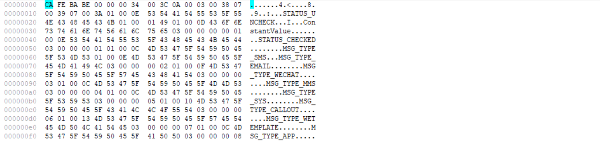
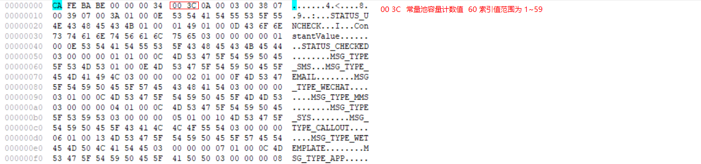
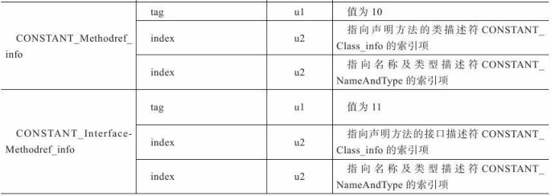
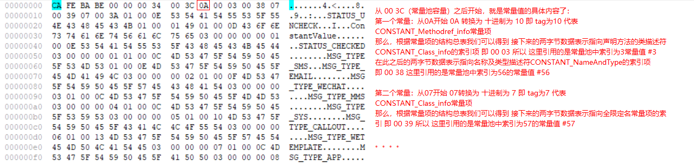
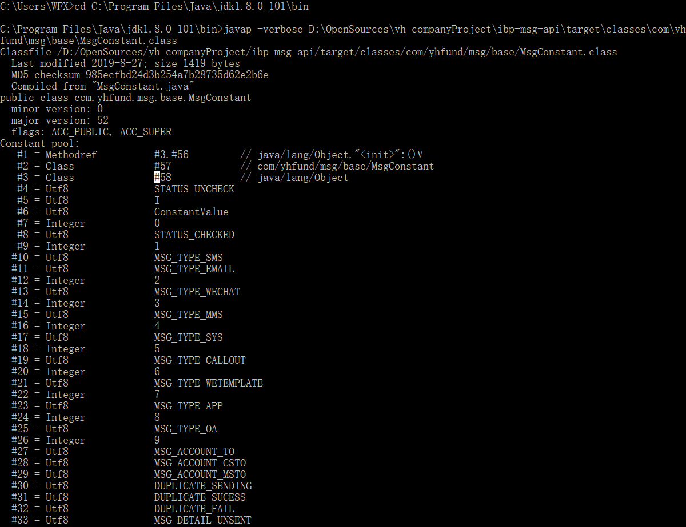
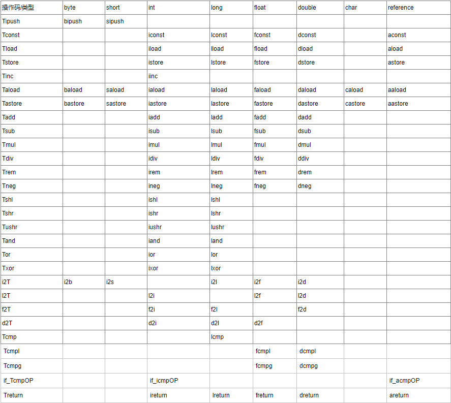

# 类文件结构

## 概述

本地机器码 -> 字节码

## 无关性的基石

* 虚拟机可以载入和执行同一种平台无关的字节码，从而实现了程序`一次编写，到处运行`
* 各种不同平台的虚拟机与所有平台都统一使用的程序存储格式——`字节码（ByteCode）`，是构成平台无关性的基石
* 虚拟机的另外一种中立特性——语言无关性，表示除Java之外的如：Groovy、JRuby、Scala等，也可以在JVM上运行，实现语言无关性的基石仍然是虚拟机和字节码存储格式
* JVM不和包括Java在内的任何语言绑定，它只与`Class文件`这种特定的二进制文件格式所关联
* Class文件中包含了Java虚拟机指令集和符号表以及若干其他辅助信息，基于安全方面的考虑，JVM规范要求Class文件中使用许多强制性的语法和结构化约束，但任一门功能性语言都可以表示为一个能被JVM所接受的有效的Class文件
* Java语言中的各种变量、关键字和运算符号的语义最终都是由多条字节码命令组合而成的，因此字节码命令所能提供的语义描述能力肯定会比Java语言本身更加强大

## Class类文件的结构

* 任何一个Class文件都对应着唯一一个类或者接口的定义信息，但反过来说，类或接口并不一定都得定义在文件里（譬如类或接口也可以通过类加载器直接生成），所以我们只是通俗地将任意一个有效的类或接口所应当满足的格式称为`Class文件格式`，实际上它并不一定以磁盘文件的形式存在
* Class文件是一组以`8`位字节为基础单位的二进制流，各个数据项目严格按照顺序紧凑地排列在Class文件之中，中间没有添加任何分隔符，这使得整个Class文件中存储的内容几乎全都是程序运行的必要数据，没有空隙存在，当遇到需要占用8位字节以上空间的数据项时，则会按照高位在前的方式分割成若干个8位字节进行存储
* 根据JVM规范的规定，Class文件格式采用一种类似于C语言结构体的伪结构来存储数据，这种伪结构中只有两种数据类型：`无符号数`和`表`
  * 无符号数：属于基本的数据类型，以`u1、u2、u4、u8`来分别代表1个字节、2个字节、4个字节和8个字节的无符号数，无符号数可以用来描述数字、索引引用、数量值或者按照UTF-8编码构成字符串值
  * 表：是由多个无符号数或者其他表作为数据项构成的复合数据类型，所有表都习惯性地以`_info`结尾，表用于描述有层次关系的复合结构的数据，整个Class文件本质上就是一张表

Class文件格式：




| 类型           | 名称                | 数量                  |
| -------------- | ------------------- | --------------------- |
| u4             | magic               | 1                     |
| u2             | minor_version       | 1                     |
| u2             | major_version       | 1                     |
| u2             | constant_pool_count | 1                     |
| cp_info        | constant_pool       | constant_pool_count-1 |
| u2             | access_flags        | 1                     |
| u2             | this_class          | 1                     |
| u2             | super_class         | 1                     |
| u2             | interfaces_count    | 1                     |
| u2             | interfaces          | interfaces_count      |
| u2             | fields_count        | 1                     |
| field_info     | fields              | fields_count          |
| u2             | methods_count       | 1                     |
| method_info    | methods             | methods_count         |
| u2             | attributes_count    | 1                     |
| attribute_info | attributes          | attributes_count      |

### 魔数与Class文件的版本

* 每个Class文件的头4个字节称为`魔数（Magic Number）`，它的唯一作用是确定这个文件是否为一个能被JVM接受的Class文件。很多文件存储标准中都使用魔数来进行身份识别，譬如图片格式，如gif或者jpeg等在文件头中都存有魔数
* 使用魔数而不是扩展名来进行识别主要是基于安全方面的考虑，因为文件扩展名可以随意地改动
* 紧接着魔数的4个字节存储的是Class文件的版本号，第5和第6个字节是次版本号（Minor Version），第7和第8个字节是主版本号（Major Version），Java的版本号是从45开始的，JDK1.1之后每个JDK大版本发布主版本号向上加1，高版本可以兼容以前版本的Class文件，但低版本的JDK拒绝执行超过其版本号的Class文件

Class文件魔数：


Class文件版本号：


|JDK版本号|Class版本号|十六进制|
|---|---|---|
|1.1|45.0|00 00 00 2D|
|1.2|46.0|00 00 00 2E|
|1.3|47.0|00 00 00 2F|
|1.4|48.0|00 00 00 30|
|1.5|49.0|00 00 00 31|
|1.6|50.0|00 00 00 32|
|1.7|51.0|00 00 00 33|
|1.8|52.0|00 00 00 34|

### 常量池

* 紧接着主次版本号之后的是常量池入口，常量池可以理解为Class文件之中的资源仓库，它是Class文件结构中与其他项目关联最多的数据类型，也是占用Class文件空间最大的数据项目之一，同时它还是在Class文件中第一个出现的表类型数据项目
* 由于常量池中常量的数量是不固定的，所以在常量池的入口需要放置一项u2类型的数据，代表常量池容量计数值（constant_pool_count），与Java中语言习惯不一样的是，这个容量计数是从1而不是0开始的，这样做的目的在于满足后面某些指向常量池的索引值的数据在特定情况下需要表达`不引用任何一个常量池项目`的含义，这种情况就可以把索引值置为0来表示，Class文件结构中只有常量池的容量计数是从1开始，对于其他集合类型，都是从0开始的

Class文件常量池中常量个数：



* 常量池中主要存放两大类常量：`字面量`和`符号引用`
  1. 字面量比较接近与Java语言层面的常量概念，如文本字符串、声明为final的常量值等
  2. 符号引用则属于编译原理方面的概念，包括了下面三类常量：
      * 类和接口的全限定名
      * 字段的名称和描述符
      * 方法的名称和描述符
* Java代码在进行Javac编译的时候，并不像C和C++那样有“连接”这一步骤，而是在JVM加载Class文件的时候进行动态连接，也就是说，在Class文件中不会保存各个方法、字段的最终内存布局信息，因此这些字段、方法的符号引用不经过运行期转换的话无法得到真正的内存入口地址，也就无法直接被JVM使用。当JVM运行时，需要从常量池获得对应的符号引用，再在类创建时或运行时解析、翻译到具体的内存地址之中
* 常量池中每一项常量都是一个表，在JDK1.7之前共有11种结构各不相同的表结构数据，在JDK1.7中为了更好地支持动态语言调用，又额外增加了3种（CONSTANT_MethodHandle_info、CONSTANT_MethodType_info和CONSTANT_InvokeDynamic_info），这14种表都有一个共同的特点，就是表开始的第一位是一个u1类型的标志位，代表当前这个常量属于哪种常量类型

常量池的项目类型：

|类型|标志|描述|
|---|---|---|
|CONSTANT_Utf8_info|1|UTF-8编码的字符串|
|CONSTANT_Integer_info|3|整型字面量|
|CONSTANT_Float_info|4|浮点型字面量|
|CONSTANT_Long_info|5|长整型字面量|
|CONSTANT_Double_info|6|双精度浮点型字面量|
|CONSTANT_Class_info|7|类或接口的符号引用|
|CONSTANT_String_info|8|字符串类型字面量|
|CONSTANT_Fieldref_info|9|字段的符号引用|
|CONSTANT_Methodref_info|10|类中方法的符号引用|
|CONSTANT_InterfaceMethodref_info|11|接口中方法的符号引用|
|CONSTANT_NameAndType_info|12|字段或方法的部分符号引用|
|CONSTANT_MethodHandle_info|15|表示方法句柄|
|CONSTANT_MethodType_info|16|标识方法类型|
|CONSTANT_InvokeDynamic_info|18|表示一个动态方法调用点|

常量池中的14种常量项的结构总表：





常量表解析过程：



另外要注意一点，CONSTANT_Utf8_info中的length值说明了这个UTF-8编码的字符串长度是多少字节，它后面紧跟着的长度为length字节的连续数据是一个使用UTF-8缩略编码表示的字符串，Class文件中方法、字段等都需要引用CONSTANT_Utf8_info型常量来描述名称，所以，CONSTANT_Utf8_info型常量的最大长度也就是Java中方法、字段名的最大长度。所以，CONSTANT_Utf8_info中的length属性为u2类型，能表达的最大值为65535（2的15次方+2的15次方-1），所以Java程序中如果定义了超过64KB英文字符的变量或方法名，将无法编译

使用Javap命令输出常量表：




### 访问标志

在常量池结束后，紧接着的两个字节代表访问标志（access_flags），这个标志用于识别一些类或者接口层次的访问信息，包括：这个Class是类还是接口；是否定义为public类型；是否定义为abstract类型；如果是类的话，是否被声明为final等

访问标志：

|标志名称|标志值|含义|
|---|---|---|
|ACC_PUBLIC|0x0001|是否为public类型|
|ACC_FINAL|0x0010|是否被声明为final，只有类可设置|
|ACC_SUPER|0x0020|是否允许使用invokespecial字节码指令的新语意，invokespecial指令的语意在JDK1.0.2发生过改变，为了区别这条指令使用哪种语意，JDK1.0.2之后编译出来的类的这个标志都必须为真|
|ACC_INTERFACE|0x0200|标识这是一个接口|
|ACC_ABSTRACT|0x0400|是否为abstract类型，对于接口或者抽象类来说，此标志值为真，其他类值为假|
|ACC_SYNTHETIC|0x1000|标识这个类并非由用户代码产生|
|ACC_ANNOTATION|0x2000|标识这是一个注解|
|ACC_ENUM|0x4000|标识这是一个枚举|


### 类索引、父类索引与接口索引集合

类索引（this_class）和父类索引（super_class）都是一个u2类型的数据，而接口索引集合（interfaces）是一组u2类型的数据的集合，Class文件中由这三项数据来确定这个类的继承关系。类索引用于确定这个类的全限定名，父类索引用于确定这个类的父类的全限定名，接口索引集合就用来描述这个类实现了哪些接口


### 字段表集合

字段表（field_info）用于描述接口或者类中声明的变量，字段（field）包括类级变量（static）以及实例级变量(成员变量)，但不包括在方法内部声明的局部变量，可以包括的信息有：字段的作用域（public、private、protected修饰符）、是实例变量还是类变量（static修饰符）、可变性（final）、并发可见性（volatile修饰符，是否强制从主内存读写）、可否被序列化（transient修饰符）、字段数据类型（基本类型、对象、数组）、字段名称

字段表结构：

|类型|名称|数量|
|---|---|---|
|u2|access_flags|1|
|u2|name_index|1|
|u2|descriptor_index|1|
|u2|attributes_count|1|
|attribute_info|attributes|attributes_count|

字段访问标志：

|标志名称|标志值|含义|
|---|---|---|
|ACC_PUBLIC|0x0001|字段是否public|
|ACC_PRIVATE|0x0002|字段是否private|
|ACC_PROTECTED|0x0004|字段是否protected|
|ACC_STATIC|0x0008|字段是否static|
|ACC_FINAL|0x0010|字段是否final|
|ACC_VOLATILE|0x0040|字段是否volatile|
|ACC_TRANSIENT|0x0080|字段是否transient|
|ACC_SYNTHETIC|0x1000|字段是否由编译器自动产生|
|ACC_ENUM|0x4000|字段是否enum|

字段修饰符放在access_flags项目中，name_index和descriptor_index，它们都是对常量池的引用，分别代表着字段的简单名称以及字段和方法的描述符，描述符的作用是用来描述字段的数据类型、方法的参数列表（包括数量、类型以及顺序）和返回值，根据描述符规则，基本数据类型以及代表无返回值的void类型都用一个大写字符来表示，而对象类型则用字符L加对象的全限定名来表示

描述符标识字符含义：

|标识字符|含义|
|---|---|
|B|基本类型byte|
|C|基本类型char|
|D|基本类型double|
|F|基本类型float|
|I|基本类型int|
|J|基本类型long|
|S|基本类型short|
|Z|基本类型boolean|
|V|特殊类型void|
|L|对象类型，如 Ljava/lang/Object|

对于数组类型，每一维度将使用一个前置的`[`字符来描述，如一个定义为"java.lang.String[][]"类型的二维数组，将被记录为：“[[Ljava/lang/String”，一个整型数组“int[]”将被记录为“[I”，用描述符来描述方法时，按照先参数列表，后返回值的顺序描述，参数列表按照参数的严格顺序放在一组小括号`()`之内。如方法“void inc()”的描述符符为“()V”，方法“java.lang.String.toString()”的描述符为“()Ljava/lang/String”


字段表集合中不会列出从超类或者父接口中继承而来的字段，但有可能列出原本java代码中不存在的字段，譬如在内部类中为了保持对外部类的访问性，会自动添加指向外部类实例的字段，另外，在Java语言中字段是无法重载的，两个字段的数据类型、修饰符不管是否相同，都必须使用不一样的名称，但是对于字节码来讲，如果两个字段的描述符不一致，那字段重名就是合法的

### 方法表集合

与字段表类似

方法表结构：

|类型|名称|数量|
|---|---|---|
|u2|access_flags|1|
|u2|name_index|1|
|u2|descriptor_index|1|
|u2|attributes_count|1|
|attribute_info|attributes|attributes_count|

因为volatile关键字和transient关键字不能修饰方法，所以方法表的访问标志中没有了ACC_VOLATILE标志和ACC_TRANSIENT标志，与之相对的，synchronized、native、strictfp（strict float point 精确浮点）和abstract关键字可以修饰方法，所以方法表的访问标志中增加了ACC_SYNCHRONIZED、ACC_NATIVE、ACC_STRICTFP和ACC_ABSTRACT标志

方法访问标志：

|标志名称|标志值|含义|
|---|---|---|
|ACC_PUBLIC|0x0001|方法是否为public|
|ACC_PRIVATE|0x0002|方法是否为private|
|ACC_PROTECTED|0x0004|方法是否为protected|
|ACC_STATIC|0x0008|方法是否为static|
|ACC_FINAL|0x0010|方法是否为final|
|ACC_SYNCHRONIZED|0x0020|方法是否为synchronized|
|ACC_BRIDGE|0x0040|方法是否是由编译器产生的桥接方法|
|ACC_VARARGS|0x0080|方法是否接受不定参数|
|ACC_NATIVE|0x0100|方法是否为native|
|ACC_ABSTRACT|0x0400|方法是否为abstract|
|ACC_STRICTFP|0x0800|方法是否为strictfp|
|ACC_SYNTHETIC|0x1000|方法是否有编译器自动产生|

方法里面的代码，经过编译器编译成字节码指令后，存放在方法属性表集合中一个名为“Code”的属性里面，因与字段表结构一致，不再赘述，在Java语言中，要重载一个方法，除了要与原方法具有相同的简单名称之外，还要求必须拥有一个与原方法不同的特征签名，特征签名就是一个方法中各个参数在常量池中的字段符号引用的集合，也就是因为返回值不会包含在特征签名中，因此Java语言里面是无法仅仅依靠返回值的不同来对一个已有方法进行重载的，但是在Class文件格式中，特征签名的范围更大一些，只要描述符不是完全一致的两个方法也可以共存，也就是说，如果两个方法有相同的名称和特征签名，但返回值不同，那么也是可以合法共存于同一个Class文件中的

### 属性表集合

在Class文件、字段表、方法表都可以携带自己的属性表集合，以用于描述某些场景专有的信息，属性表集合的不再要求各个属性表具有严格顺序，只要不与已有属性名重复，任何人实现的编译器都可以向属性表中写入自己定义的属性信息

虚拟机规范预定义的属性：

|属性名称|使用位置|含义|
|---|---|---|
|Code|方法表|Java代码编译成的字节码指令|
|ConstantValue|字段表|final关键字定义的常量值|
|Deprecated|类、方法表、字段表|被声明为deprecated的方法和字段|
|Exceptions|方法表|方法抛出的异常|
|EnclosingMethod|类文件|仅当一个类为局部类或者匿名类时才能拥有这个属性，这个属性用于标识这个类所在的外围方法|
|InnerClasses|类文件|内部类列表|
|LineNumberTable|Code属性|Java源码的行号与字节码指令的对应关系|
|LocalVariableTable|Code属性|方法的局部变量描述|
|StackMapTable|Code属性|供新的类型检查验证器（Type Checker）检查和处理目标方法的局部变量和操作数栈所需要的类型是否匹配|
|Signature|类、方法表、字段表|这个属性用于支持泛型情况下的方法签名，在Java语言中，任何类、接口、初始化方法或成员的泛型签名如果包含子类型变量（Type Variables）或参数化类型（Parameterized Types），则Signature属性会为它记录泛型签名信息。由于Java的泛型采用擦除法实现，在为了避免类型信息被擦除后导致签名混乱，需要这个属性记录泛型中的相关信息|
|SourceFile|类文件|记录源文件名称|
|SourceDebugExtension|类文件|SourceDebugExtension属性用于存储额外的调试信息，譬如在进行JSP文件调试时，无法通过Java堆栈来定位到JSP文件的行号，JSR-45规范为这些非Java语言编写，却需要编译成字节码并运行在Java虚拟机中的程序提供了一个进行调试的标准机制，使用SourceDebugExtension属性就可以用于存储这个标准所新加入的调试信息|
|Synthetic|类、方法表、字段表|标识方法或字段为编译器自动生成|
|LocalVariableTypeTable|类|它使用特征签名代替描述符，是为了引入泛型语法之后能描述泛型参数化类型而添加|
|RuntimeVisibleAnnotations|类、方法表、字段表|为动态注解提供支持，RuntimeVisibleAnnotations属性用于指明哪些注解是运行时可见的|
|RuntimeInvisibleAnnotations|类、方法表、字段表|与RuntimeVisibleAnnotations属性作用刚好相反，用于指明哪些注解是运行时不可见的|
|RuntimeVisibleParameterAnnotations|方法表|作用与RuntimeVisibleAnnotations属性类似，只不过作用对象为方法参数|
|RuntimeInvisibleParameterAnnotations|方法表|作用与RuntimeInvisibleAnnotations属性类似，只不过作用对象为方法参数|
|AnnotationDefault|方法表|用于记录注解类元素的默认值|
|BootstrapMethods|类文件|用于保存invokedynamic指令引用的引导方法限定符|

对于每个属性，它的名称需要从常量池中引用一个CONSTANT_Utf8_info类型的常量来表示，而属性值的结构则是完全自定义的，只需要通过一个u4的长度属性去说明属性值所占用的位数即可

属性表结构：

|类型|名称|数量|
|---|---|---|
|u2|attribute_name_index|1|
|u4|attribute_length|1|
|u1|info|attribute_length|

#### Code属性

Java程序方法体中的代码经过Javac编译器处理后，最终变为字节码指令存储在Code属性内，Code属性出现在方法表的属性集合之中，但并非所有的方法表都必须存在这个属性，譬如接口或者抽象类中的方法就不存在Code属性，Code属性是Class文件中最重要的一个属性，如果把一个Java程序中的信息分为代码（Code，方法体中的Java代码）和元数据（Metadata，包括类、字段、方法定义及其他信息）两部分，那么在整个Class文件中，Code属性用于描述代码，所有的其他数据项目都用于描述元数据

Code属性表的结构：

|类型|名称|数量|
|---|---|---|
|u2|attribute_name_index|1|
|u4|attribute_length|1|
|u2|max_stack|1|
|u2|max_locals|1|
|u4|code_length|1|
|u1|code|code_length|
|u2|exception_table_length|1|
|exception_info|exception_table|exception_table_length|
|u2|attributes_count|1|
|attribute_info|attributes|attributes_count|

* `attribute_name_index`是一项指向CONSTANT_Utf8_info型常量的索引，常量值固定为"Code"，它代表了该属性的属性名称
* `attribute_length`指示了属性值的长度，由于属性名称索引与属性长度一共为6字节，所以属性值的长度固定为整个属性表长度减去6个字节
* `max_stack`代表了操作数栈（Operand Stacks）深度的最大值，在方法执行的任意时刻，操作数栈都不会超过这个深度，虚拟机运行的时候需要根据这个值来分配栈帧中的操作栈深度
* `max_locals`代表了局部变量表所需的存储空间，在这里，max_locals的单位是Slot，Slot是虚拟机为局部变量分配内存所使用的最小单位，对于byte、char、float、int、short、boolean和returnAddress等长度不超过32位的数据类型，每个局部变量占用1个Slot，而double和long这两种64位的数据类型则需要两个Slot来存放。方法参数（包括实例方法中的隐藏参数“this”）、显式异常处理器的参数（Exception Handler Parameter，就是try-catch语句中catch块所定义的异常）、方法体中定义的局部变量都需要使用局部变量表来存放。另外，并不是在方法中用到了多少个局部变量，就把这些局部变量所占Slot之和作为max_locals的值，原因是局部变量表中的Slot可以重用，当代码执行超出一个局部变量的作用域时，这个局部变量所占的Slot可以被其他局部变量所使用，Javac编译器会根据变量的作用域来分配Slot给各个变量使用，然后计算出max_locals的大小
* `code_length`和`code`用来存储Java源程序编译后生成的字节码指令，code_length代表字节码长度，code是用于存储字节码指令的一系列字节流，关于code_length需注意：虽然它是一个u4类型的长度值，但虚拟机规范中明确限制了一个方法不允许超过65535条字节码指令，即它实际只使用了u2的长度


javap输出的`args_size`的值为什么是1？因为在任何实例方法里，都可以通过`this`关键字访问到此方法所属的对象，Javac编译器编译的时候把对this关键字的访问转变为对一个普通方法参数的访问，然后再虚拟机调用实例方法时自动传入此参数而已，因此在实例方法的局部变量表中至少会存在一个指向当前对象实例的局部变量，局部变量表中也会预留出第一个Slot位来存放对象实例的引用，但这个处理只对实例方法有效，如果方法声明为static，那么arg_size就不会等于1而是0了

* `exception_table`异常表对于Code属性来说并不是必须存在的

异常表结构：

|类型|名称|数量|
|---|---|---|
|u2|start_pc|1|
|u2|end_pc|1|
|u2|handler_pc|1|
|u2|catch_type|1|

这些字段的含义为：如果字节码在第start_pc行到第end_pc行之间（不含第end_pc行）出现了类型为catch_type或者其子类的异常（catch_type为指向一个CONSTANT_Class_info型常量的索引），则转到第handler_pc行继续处理。当catch_type的值为0时，代表任意异常情况都需要转向到handler_pc处进行处理，异常表实际上是Java代码的一部分，编译器使用异常表而不是简单的跳转命令来实现Java异常及finally处理机制

#### Exceptions属性

Exceptions属性是在方法表中与Code属性平级的一项属性，Exceptions属性的作用是列举出方法中可能抛出的受查异常（Checked Exceptions），也就是方法描述时在throws关键字后面列举的异常

Exceptions属性表结构：

|类型|名称|数量|
|---|---|---|
|u2|attribute_name_index|1|
|u4|attribute_length|1|
|u2|number_of_exceptions|1|
|u2|exception_index_table|number_of_exceptions|

Exceptions属性中的number_of_exceptions项表示方法可能抛出number_of_exceptions种受查异常，每一种受查异常使用一个exception_index_table项表示，exception_index_table是一个指向常量池中CONSTANT_Class_info型常量的索引，代表了该受查异常的类型

#### LineNumberTable属性

LineNumberTable属性用于描述Java源码行号与字节码行号（字节码的偏移量）之间的对应关系，它并不是运行时必需的属性，但默认会生成到Class文件之中，可以在Javac中分别使用`-g:none`或`-g:lines`选项来取消或要求生成这项信息

LineNumberTable属性结构：

|类型|名称|数量|
|---|---|---|
|u2|attribute_name_index|1|
|u4|attribute_length|1|
|u2|line_number_table_length|1|
|line_number_info|line_number_table|line_number_table_length|

line_number_table是一个数量为line_number_table_length、类型为line_number_info的集合，line_number_info包括了start_pc和line_number两个u2类型的数据项，前者是字节码行号，后者是Java源码行号

#### LocalVariableTable属性

LocalVariableTable属性用于描述栈帧中局部变量表中的变量与Java源码中定义的变量之间的关系，它也不是运行时必需的属性，但默认会生成到Class文件之中，可以在Javac中分别使用`-g:none`或`-g:vars`选项来取消或要求生成这项信息

LocalVariableTable属性结构：

|类型|名称|数量|
|---|---|---|
|u2|attribute_name_index|1|
|u4|attribute_length|1|
|u2|local_variable_table_length|1|
|local_variable_info|local_variable_table|local_variable_table_length|

其中，local_variable_info项目代表了一个栈帧与源码中的局部变量的关系

local_variable_info项目结构：

|类型|名称|数量|
|---|---|---|
|u2|start_pc|1|
|u2|length|1|
|u2|name_index|1|
|u2|descriptor_index|1|
|u2|index|1|

* `start_pc`和`length`属性分别代表了这个局部变量的生命周期开始的字节码偏移量其作用范围覆盖的长度，两者结合起来就是这个局部变量在字节码之中的作用域范围
* `name_index`和`descriptor_index`都是指向常量池中CONSTANT_Utf8_info型常量的索引，分别代表了局部变量的名称以及这个局部变量的描述符
* `index`是这个局部变量在栈帧局部变量表中Slot的位置，当这个变量数据类型是64位类型时（double/long），它占用的Slot为index和index+1两个
* 在JDK1.5引入泛型之后，LocalVariableTable属性增加了一个"姐妹属性"：`LocalVariableTypeTable`，这个新增的属性结构与LocalVariableTable非常相似，仅仅是把记录的字段描述符的descriptor_index替换成了字段的特征签名（Signature），对于非泛型类型来说，描述符和特征签名能描述的信息是基本一致的，但是泛型引入之后，由于描述符中泛型的参数化类型被擦除掉，描述符就不能准确地描述泛型类型了，因此出现了LocalVariableTypeTable

#### SourceFile属性

SourceFile属性用于记录生成这个Class文件的源码文件名称，这个属性也是可选的，可以分别使用Javac的`-g:none`或`-g:source`选项来关闭或要求生成这项信息

SourceFile属性结构：

|类型|名称|数量|
|---|---|---|
|u2|attribute_name_index|1|
|u4|attribute_length|1|
|u2|sourcefile_index|1|

`sourcefile_index`数据项时指向常量池中CONSTANT_Utf8_info型常量的索引，常量值是源码文件的文件名

#### ConstantValue属性

ConstantValue属性的作用是通知虚拟机自动为静态变量赋值，对于非static类型的变量（也就是实例变量）的赋值是在实例构造器`<init>`方法中进行的；而对于类变量，则有两种方式可以选择：在类构造器`<clinit>`方法中或者使用ConstantValue属性

ConstantValue属性结构：

|类型|名称|数量|
|---|---|---|
|u2|attribute_name_index|1|
|u4|attribute_length|1|
|u2|constantvalue_index|1|

ConstantValue属性是一个定长属性，它的attribute_length数据项值必须固定为2，constantvalue_index数据项代表了常量池中一个字面量常量的引用（CONSTANT_Long_info、CONSTANT_Float_info、CONSTANT_Double_info、CONSTANT_Integer_info、CONSTANT_String_info）

#### InnerClasses属性

InnerClasses属性用于记录内部类与宿主类之间的关联，如果一个类定义了内部类，那编译器将会为它们以及它所包含的内部类生成InnerClasses属性

InnerClasses属性：

|类型|名称|数量|
|---|---|---|
|u2|attribute_name_index|1|
|u4|attribute_length|1|
|u2|number_of_classes|1|
|inner_classes_info|inner_classes|number_of_classes|

数据项number_of_classes代表需要记录多少个内部类信息，每一个内部类的信息都由一个inner_classes_info表进行描述

inner_classes_info表的结构：

|类型|名称|数量|
|---|---|---|
|u2|inner_class_info_index|1|
|u2|outer_class_info_index|1|
|u2|inner_name_index|1|
|u2|inner_class_access_flags|1|

* `inner_class_info_index`和`outer_class_info_index`都是指向常量池中CONSTANT_Class_info常量的索引，分别代表了内部类和宿主类的符号引用
* `inner_name_index`是指向常量池中CONSTANT_Utf8_info型常量的索引，代表这个内部类的名称，如果是匿名内部类，那么这项值为0
* `inner_class_access_flags`是内部类的访问标志，类似于类的access_flags（具体表格见access_flags标志）

#### Deprecated及Synthetic属性

Deprecated和Synthetic两个属性都属于标志类型的布尔属性，只存在有和没有的区别，没有属性值的概念

* `Deprecated`属性表示某个类、字段或者方法，已经被程序作者定为不再推荐使用，它可以通过在代码中使用`@deprecated`注释进行设置
* `Synthetic`属性代表此字段或者方法并不是由Java源码直接产生的，而是由编译器自行添加的

Deprecated及Synthetic属性结构：

|类型|名称|数量|
|---|---|---|
|u2|attribute_name_index|1|
|u4|attribute_length|1|

其中`attribute_length`数据项的值必须为0x00000000，因为没有任何属性值需要设置

#### StackMapTable属性

* StackMapTable属性在JDK1.6发布后增加到了Class文件规范中，它是一个复杂的变长属性，位于Code属性的属性表中
* 目的在于代替以前比较消耗性能的基于数据流分析的类型推导验证器，在保证Class文件合法性的前提下，省略了在运行期通过数据流分析去确认字节码的行为逻辑合法性的步骤，而是在编译阶段将一系列的验证类型直接记录在Class文件中，通过检查这些验证类型代替了类型推导过程，从而大幅度提升了字节码验证性能
* StackMapTable属性中包含0至多个栈映射帧（StackMapFrames），每个栈映射帧都显示或隐式地代表了一个字节码偏移量，用于表示该执行到该字节码时局部变量表和操作数栈的验证类型，类型检查验证器会通过检查目标方法的局部变量和操作数栈所需要的类型来确定一段字节码指令是否符合逻辑约束

StackMapTable属性的结构：

|类型|名称|数量|
|---|---|---|
|u2|attribute_name_index|1|
|u4|attribute_length|1|
|u2|number_of_entries|1|
|stack_map_frame|stack_map_frame_entries|number_of_entries|

* 在版本号大于或等于50.0的Class文件中，如果方法的Code属性中没有附带StackMapTable属性，那就意味着它带有一个隐式的StackMap属性，这个StackMap属性的作用等同于num_of_entries值为0的StackMapTable属性，一个方法的Code属性最多只能有一个StackMapTable属性，否则将抛出ClassFormatError异常

#### Signature属性

* Signature属性在JDK1.5发布后增加到了Class文件规范之中，它是一个可选的定长属性，可以出现于类、属性表和方法表结构的属性表中
* 在JDK1.5之后的版本中，任何类、接口、初始化方法或成员的泛型签名如果包含了类型变量或参数化类型，则Signature属性会为它记录泛型签名信息
* 之所以要专门使用这样一个属性去记录泛型类型，是因为Java语言的泛型采用的是擦除法实现的伪泛型，Signature属性就是为了弥补这个缺陷而增设的，现在Java的反射API能够获取泛型类型，最终的数据来源也就是这个属性

Signature属性的结构：

|类型|名称|数量|
|---|---|---|
|u2|attribute_name_index|1|
|u4|attribute_length|1|
|u2|signature_index|1|

* 其中signature_index项的值必须是一个对常量池的有效索引且必须为CONSTANT_Utf8_info结构，表示类签名、方法类型签名或字段类型签名

#### BootstrapMethods属性

* BootstrapMethods属性在JDK1.7发布后增加到了Class文件规范之中，它是一个复杂的变长属性，位于类文件的属性表中
* 这个属性用于保存invokeddynamic指令引用的引导方法限定符，如果某个类文件结构的常量池中曾经出现过CONSTANT_InvokeDynamic_info类型的常量，那么这个类文件的属性表中必须存在一个明确的BootstrapMethods属性，即使CONSTANT_InvokeDynamic_info类型的常量在常量池中出现过多次，类文件的属性表中最多也只能有一个BootstrapMethods属性

BootstrapMethods属性的结构：

|类型|名称|数量|
|---|---|---|
|u2|attribute_name_index|1|
|u4|attribute_length|1|
|u2|num_bootstrap_methods|1|
|bootstrap_method|bootstrap_methods|num_bootstrap_methods|

bootstrap_method结构：

|类型|名称|数量|
|---|---|---|
|u2|bootstrap_method_ref|1|
|u2|num_bootstrap_arguments|1|
|u2|bootstrap_arguments|num_bootstrap_arguments|

* num_bootstrap_methods项的值给出了bootstrap_methods[]数组中的引导方法限定符的数量，而bootstrap_method[]数组的每个成员包含了一个指向常量池CONSTANT_MethodHandle结构的索引值，它代表了一个引导方法，还包含了这个引导方法静态参数的序列（可能为空），bootstrap_methods[]数组中的每个成员必须包含以下3项内容：
  * bootstrap_method_ref：bootstrap_method_ref项的值必须是一个对常量池的有效索引，常量池在该索引处的值必须是一个CONSTANT_MethodHandle_info结构
  * num_bootstrap_arguments：num_bootstrap_arguments项的值给出了bootstrap_arguments[]数组成员的数量
  * bootstrap_arguments[]：bootstrap_arguments[]数组的每个成员必须是一个对常量池的有效索引，常量池在该索引处必须是以下结构之一：CONSTANT_String_info、CONSTANT_Class_info、CONSTANT_Integer_info、CONSTANT_Long_info、CONSTANT_Float_info、CONSTANT_Double_info、CONSTANT_MethodHandle_info或CONSTANT_MethodType_info

## 字节码指令简介

* JVM的指令由一个字节长度的、代表着某种特定操作含义的数字（称为操作码，Opcode）以及跟随其后的零至多个代表此操作所需参数（称为操作数，Operands）而构成，由于JVM采用面向操作数栈而不是寄存器的架构，所以大多数的指令都不包含操作数
* 字节码指令集是一种具有鲜明特点、优劣势都很突出的指令集架构，缺点：损失一定的性能，优点：小数据量、高传输效率

```java
do{
	自动计算PC寄存器的值加1；
	根据PC寄存器的指示位置，从字节码流中取出操作码；
	if(字节码存在操作数) 从字节码流中取出操作数；
	执行操作码所定义的操作
}while(字节码流长度 > 0 );
```

### 字节码与数据类型

在JVM的指令集中，大多数的指令都包含了其操作所对应的数据类型信息，由于JVM的操作码只有一个字节，如果每一种与数据类型相关的指令都支持JVM所有运行时数据类型的话，那指令的数量恐怕就会超出一个字节所能表示的数量范围了，因此指令集设计成了非完全独立的（即并非每种数据类型和每一种操作都有对应的指令）



### 加载和存储指令

加载和存储指令用于将数据在栈帧中的局部变量和操作数栈之间来回传输

* 将一个局部变量加载到操作栈：`iload`、`iload_<n>`、`lload`、`lload_<n>`、`fload`、`fload_<n>`、`dload`、`dload_<n>`、`aload`、`aload_<n>` 
* 将一个数值从操作数栈存储到局部变量表：`istore`、`istroe_<n>`、`lstore`、`lstore_<n>`、`fstore`、`fstore_<n>`、`dstore`、`dstore_<n>`、`astore`、`astore_<n>` 
* 将一个常量加载到操作数栈：`bipush`、`sipush`、`ldc`、`ldc_w`、`ldc2_w`、`aconst_null`、`iconst_ml`、`iconst_<i>`、`lconst_<l>`、`fconst_<f>`、`dconst_<d>` 
* 扩充局部变量表的访问索引的指令：`wide`

上面所列举的指令助记符中，有一部分是以尖括号结尾的（例如`iload_<n>`），这些指令助记符实际上代表了一组指令（例如`iload_<n>`，它代表了`iload_0`、`iload_1`、`iload_2`和`iload_3`这几条指令），它们省略掉了显式的操作数，不需要进行取操作数的动作，实际上操作数就隐含在指令中，除了这点之外，它们的语义和原生的通用指令完全一致（例如`iload_0`的语义与操作数为0时的`iload`指令语义完全一致）

### 运算指令

运算或算术指令用于对两个操作数栈上的值进行某种特定运算，并把结果重新存入到操作栈顶，大体可分为两种：对整型数据进行运算的指令和对浮点型数据进行运算的指令，无论是哪种算术指令，都使用JVM虚拟机的数据类型，由于没有直接支持byte、short、char和boolean类型的算术指令，对于这些类数据的运算，应使用操作int类型的指令代替

* 加法指令：`iadd`、`ladd`、`fadd`、`dadd`
* 减法指令：`isub`、`lsub`、`fsub`、`dsub`
* 乘法指令：`imul`、`lmul`、`fmul`、`dmul`
* 除法指令：`idiv`、`ldiv`、`fdiv`、`ddiv`
* 求余指令：`irem`、`lrem`、`frem`、`drem`
* 取反指令：`ineg`、`lneg`、`fneg`、`dneg`
* 位移指令：`ishl`、`ishr`、`iushr`、`lshl`、`lshr`、`lushr`
* 按位或指令：`ior`、`lor`
* 按位与指令：`iand`、`land`
* 按位异或指令：`ixor`、`lxor`
* 局部变量自增命令：`iinc`
* 比较指令：`dcmpg`、`dcmpl`、`fcmpg`、`fcmpl`、`lcmp`

### 类型转换指令

类型转换指令可以将两种不同的数值类型进行进行相互转换，这些转换操作一般用于实现用户代码中的显式类型转换操作，或者处理字节码指令集中数据类型相关指令无法与数据类型一一对应的问题，JVM直接支持以下数值类型的宽化类型转换（即小范围类型向大范围类型的安全转换）

* int类型到long、float或者double类型
* long类型到float、double类型
* float类型到double类型

处理窄化类型转换时，必须显式地使用转换指令来完成，这些转换指令包括：`i2b`、`i2c`、`i2s`、`l2i`、`f2i`、`f2l`、`d2i`、`d2l`和`d2f`，窄化类型转换可能会导致转换结果产生不同的正负号、不同的数量级的情况，转换过程很可能会导致数值的精度丢失，将一个浮点值窄化转换为整数类型T（T限于int或long类型之一）的时候，将遵循以下转换规则：

* 如果浮点值是NaN，那转换结果就是int或long类型的0
* 如果浮点值不是无穷大的话，浮点值使用向零舍入模式取整，获得整数值v，如果v在目标类型T（int或long）的表示范围之内，那转换结果就是v
* 否则，将根据v的符号，转换为T所能表示的最大或者最小正数

### 对象创建与访问指令

* 创建类实例的指令：`new`
* 创建数组的指令：`newarray`、`anewarray`、`multianewarray`
* 访问类字段（static字段，或者称为类变量）和实例字段（非static字段，或者称为实例变量）的指令：`getfield`、`putfield`、`getstatic`、`putstatic`
* 把一个数组元素加载到操作数栈的指令：`baload`、`caload`、`saload`、`iaload`、`laload`、`faload`、`daload`、`aaload`
* 将一个操作数栈的值存储到数组元素中的指令：`bastore`、`castore`、`sastore`、`iastore`、`fastore`、`dastore`、`aastore`
* 取数组长度的指令：`arraylength`
* 检查类实例类型的指令：`instanceof`、`checkcast` 

### 操作数栈管理指令

* 将操作数栈的栈顶一个或两个元素出栈：`pop`、`pop2`
* 复制栈顶一个或两个数值并将复制值或双份的复制值重新压入栈顶：`dup`、`dup2`、`dup_x1`、`dup2_x1`、`dup_x2`、`dup2_x2`
* 将栈最顶端的两个数值互换：`swap` 

### 控制转移指令

控制转移指令可以让JVM有条件或无条件地从指定的位置指令而不是控制转移指令的下一条指令继续执行程序，可以认为控制转移指令就是在有条件或无条件地修改PC寄存器的值

* 条件分支：`ifeq`、`iflt`、`ifle`、`ifne`、`ifgt`、`ifge`、`ifnull`、`ifnonnull`、`if_icmpeq`、`if_icmpne`、`if_icmplt`、`if_icmpgt`、`if_icmple`、`if_icmpge`、`if_acmpeq`和`if_acmpne`
* 复合条件分支：`tableswitch`、`lookupswitch`
* 无条件分支：`goto`、`goto_w`、`jsr`、`jsr_w`、`ret` 

与前面算术运算时的规则一致，对于boolean类型、byte类型、char类型和short类型的条件分支比较操作，都是使用int类型的比较指令来完成，而对于long类型、float类型和double类型的条件分支比较操作，则会先执行相应类型的比较运算指令（dcmpg、dcmpl、fcmpg、fcmpl、lcmp），运算指令会返回一个整型值到操作数栈中，随后再执行int类型的条件分支比较操作来完成整个分支跳转

### 方法调用和返回指令

* `invokevirtual`指令用于调用对象的实例方法，根据对象的实际类型进行分派（虚方法分派）
* `invokeinterface`指令用于调用接口方法，它会在运行时搜索一个实现了这个接口方法的对象，找出适合的方法进行调用
* `invokespecial`指令用于调用一些需要特殊处理的实例方法，包括实例初始化方法、私有方法和父类方法
* `invokestatic`指令用于调用类方法（static方法）
* `invokedynamic`指令用于在运行时动态解析出调用点限定符所引用的方法，并执行该方法，前面4条调用指令的分派逻辑都固化在JVM内部，而`invokedynamic`指令的分派逻辑是由用户所设定的引导方法决定的
* 方法调用指令与数据类型无关，而方法返回指令时根据返回值的类型区分的，包括`ireturn`（当返回值是boolean、byte、char、short和int类型时使用）、`lreturn`、`freturn`、`dreturn`和`areturn`，另外还有一条return指令供声明为void的方法、实例初始化方法以及类和接口的类初始化方法使用

### 异常处理指令

在Java程序中显示抛出异常的操作（throw语句）都由`athrow`指令来实现，除了用throw语句显式抛出异常情况之外，JVM规范还规定了许多运行时异常会在其他JVM指令检测到异常状况时自动抛出，而在JVM中，处理异常（catch语句）不是由字节码指令来实现的，而是采用异常表来完成的

### 同步指令

JVM可以支持方法级的同步和方法内部一段指令序列的同步，这两种同步结构都是使用管程（Monitor）来支持的
* 方法级的同步是隐式的，即无须通过字节码指令来控制，它实现在方法调用和返回操作之中（根据方法表中的ACC_SYNCHRONIZED得知是否为同步方法），如果设置了，执行线程就要求先成功持有管程，然后才能执行方法，最后方法完成（无论是否正常完成）时释放管程，如果方法执行过程中出现异常，并且无法在方法内部处理此异常，那么这个同步方法所持有的管程将在异常抛到同步方法之外时自动释放
* 同步一段指令集序列通常是由Java语言中的synchronized语句块来表示的，JVM的指令集中有`monitorenter`和`monitorexit`两条指令来支持synchronized关键字语义，编译器必须确保无论方法通过何种方式完成，方法中调用过的每条`monitorenter`指令都必须执行其对应的`monitorexit`指令，而无论这个方法时正常结束还是异常结束

## 公有设计和私有实现

JVM规范描绘了JVM应有的共同程序存储格式：Class文件格式以及字节码指令集，这些内容与硬件、操作系统及具体的JVM实现之间是完全独立的，JVM实现必须能顾读取Class文件并精确实现包含在其中的JVM代码的语义，但具体实现也并非一成不变，在满足虚拟机规范的约束下对具体实现做出修改和优化也是完全可行的，JVM实现者可以使用这种伸缩性来让JVM获得更高的性能、更低的内存消耗或者更好的可移植性，实现方式主要有以下两种：

  * 将输入的JVM代码在加载或执行时翻译成另外一种虚拟机的指令集
  * 将输入的JVM代码在加载或执行时翻译成宿主机CPU的本地指令集（即JIT代码生成技术）