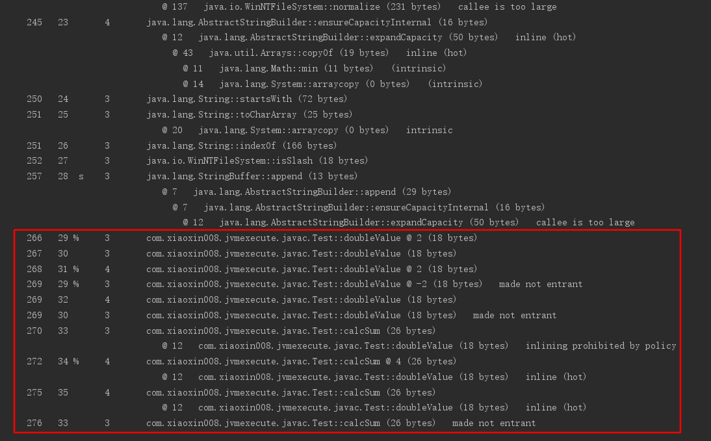

# 程序编译与代码优化

## 编译期优化

### 概述

Java语言的“编译期”其实是一段“不确定”的操作过程：

* 可能指一个`前端编译器`把`*.java`文件转变成`*.class`文件的过程，前端编译器：Sun的Javac、EclipseJDT中的增量式编译器（ECJ）
* 也可能是指虚拟机的后端运行期编译器（`JIT编译器`，Just In Time Compiler）把字节码转变成机器码的过程，JIT编译器：HotSpot VM的C1、C2编译器
* 还可能是指使用静态提前编译器（AOT编译器，Ahead Of Time Compiler）直接把`*.java`文件编译成本地机器代码的过程，AOT编译器：GNU Compiler for the Java（GCJ）、Excelsior JET

而这里指的“编译期”和“编译器”都仅限于第一类编译过程，首先，Javac这类编译器对代码的运行效率几乎没有任何优化措施，设计团队把性能的优化集中到了后端的即时编译器中，这样可以让那些不是由Javac产生的Class文件也能同样能享受到编译器优化所带来的好处

但是Javac做了许多针对Java语言编码过程的优化措施来改善程序员的编码风格和提高编码效率，相当多新生的Java语法特性，都是靠编译器的“语法糖”来实现，而不是依赖虚拟机的底层改进来支持

所以，Java中即时编译器在运行期的优化过程对于程序来说更重要，而前端编译器在编译期的优化过程对于程序编码来说关系更加密切

### javac编译器

Javac的编译过程大致可以分为3个过程：

* 解析与填充符号表过程
* 插入式注解处理器的注解处理过程
* 分析与字节码生成过程 


#### 解析与填充符号表

* 解析步骤包括了经典程序编译原理中的词法分析和语法分析两个过程：
  * 词法分析：是将源代码的字符流转变为标记（Token）集合，单个字符是程序编写过程的最小元素，而标记则是编译过程的最小元素，关键字、变量名、字面量、运算符都可以成为标记，如“int a = b + 2”这句代码包含了6个标记，分别是int、a、=、b、+、2
  * 语法分析：是根据Token序列构造抽象语法树的过程，抽象语法树（Abstract Syntax Tree，AST）是一种用来描述程序代码语法结构的树形表示方式，语法树的每一个节点都代表着程序代码的一个语法结构，例如：包、类型、修饰符、运算符、接口、返回值甚至代码注释等都可以是一个语法结构
* 填充符号表：完成了词法分析和语法分析之后，下一步就是填充符号表的过程，符号表（Symbol Table）是由一组符号地址和符号信息构成的表格，符号表中所登记的信息在编译的不同阶段都要用到，在语义分析中，符号表所登记的内容将用于语义检查和产生中间代码，在目标代码生成阶段，当对符号名进行地址分配时，符号表示地址分配的依据 

#### 注解处理器

在JDK1.5之后，Java语言提供了对注解的支持，这些注解与普通的Java代码一样，是在运行期间发挥作用的，在JDK1.6中，提供了一组插入式注解处理器的标准API在编译期间对注解进行处理，可以把它看作是一组编译器插件，在这些插件里面，可以读取、修改、添加抽象语法树中的任意元素，如果这些插件在处理注解期间对语法树进行了修改，编译器将回到解析及填充符号表的过程重新处理，直到所有插入式注解处理器都没有再对语法树进行修改为止，每一次循环称为一个`Round`，也就是编译过程图中的回环过程，有了编译器注解处理的标准API后，我们的代码才有可能干涉编译器的行为

#### 语义分析与字节码生成

语法分析之后，编译器获得了程序代码的抽象语法树表示，语法树能表示一个结构正确的源程序的抽象，但无法保证源程序是符合逻辑的，而语义分析的主要任务是对结构上正确的源程序进行上下文有关性质的审查

* 在Javac的编译过程中，语义分析过程分为标注检查以及数据及控制流分析两个步骤：
  * 标注检查：标注检查步骤检查的内容包括诸如变量使用前是否已被声明、变量与赋值之间的数据类型是否能够匹配等，在标注检查步骤中，还有一个重要的动作称为常量折叠，如果我们在代码中写了如下定义：`int a = 1 + 2;`，经过常量折叠之后，它们将会被折叠为字面量`3`
  * 数据及控制流分析：数据及控制流分析是对程序上下文逻辑更进一步的验证，它可以检查出诸如程序局部变量在使用前是否有赋值、方法的每条路径是否都有返回值、是否所有的受查异常都被正确处理了等问题，编译时期的数据及控制流分析与类加载的数据及控制流分析的目的基本上是一致的，但校验范围有所区别，有一些校验项只有在编译期或运行期才能进行，比如：`final`修饰符，将局部变量声明为final，对运行期是没有影响的，变量的不变性仅仅由编译器在编译期间保障
* 解语法糖：语法糖（Syntacic Sugar），也成糖衣语法，指在计算机语言中添加的某种语法，这种语法对语言的功能并没有影响，但是更方便程序员使用，通常来说，使用语法糖能够增加程序的可读性，从而减少程序代码出错的机会，Java中最常用的语法糖：泛型、变长参数、自动装箱/拆箱，虚拟机运行是不支持这些语法，它们在编译阶段还原回简单的基础语法结构，这个过程称为语法糖
* 字节码生成：字节码生成是Javac编译过程的最后一个阶段，字节码生成阶段不仅仅是把前面各个步骤所生成的信息（语法树、符号表）转化成字节码写到磁盘中，编译器还进行了少量的代码添加和转换工作，实例构造器`<init>()`方法和类构造器`<clinit>()`方法就是在这个阶段添加到语法树之中的（注意：这里的实例构造器并不是指默认构造函数，如果代码中没有提供任何构造函数，那编译器将会添加一个没有参数的、访问性与当前类一致的默认构造函数，这个工作在填充符号表阶段就已经完成），这两个构造器的产生过程实际上是一个代码收敛的过程，编译器会把语句块（对实例构造器而言是`{}`块，对于类构造器而言是`static{}`块）、变量初始化（实例变量和类变量）、调用父类的实例构造器（仅仅是实例构造器，类构造器无须调用父类，虚拟机会自动保证父类构造器的执行）等操作收敛到`<init>()`和`<clinit>()`方法之中，并且保证一定是按先执行父类的实例构造器，然后初始化变量，最后执行语句块的顺序进行，除了生成构造器以外，还有其他的一些代码替换工作用于优化程序的实现逻辑，如：把字符串的加操作替换为`StringBuffer`或`StringBuilder`的`append()`操作等，完成了对语法树的遍历和调整之后，就会把填充了所有所需信息的符号表交给`com.sun.tools.javac.jvm.ClassWrite`类，由这个类的`writeClass()`方法输出字节码，生成最终的Class文件，到此整个编译过程宣告结束

### java语法糖

#### 泛型和类型擦除

* 泛型是JDK1.5的一项新增特性，它的本质是参数化类型（Parametersized Type）的应用，也就是说所操作的数据类型被指定为一个参数，这种参数类型可以用在类、接口和方法的创建中，分别称为泛型类、泛型接口和泛型方法，由于Java语言里面所有的类型都继承于`java.lang.Object`，所以Object转型为任何对象都是有可能的，但是也因为有无限的可能性，在编译期间，编译器无法检查这个Object的强制转型是否成功，许多`ClassCastException`的风险就会转嫁到程序运行期之中
* 泛型技术在C#和Java之中的使用方式看似相同，但实现上却有着根本性的分歧，C#里面泛型无论在程序源码中、编译后的IL中，或是在运行期的CLR中，都是切实存在的，`List<int>`与`List<String>`就是两个不同的类型，它们在系统运行期生成，有自己的虚方法表和类型数据，这种实现称为类型膨胀，基于这种方法实现的泛型称为真实泛型
* Java语言中的泛型规则不一样，它只在程序源码中存在，在编译后的字节码文件中，就已经替换为原来的原生类型，并且在响应的地方插入了强制转型代码，因此，对于运行期的Java语言来说，`ArrayList<int>`与`ArrayList<String>`就是同一个类，Java语言中的泛型实现方法称为类型擦除，基于这种方法实现的泛型称为伪泛型
* 由于Java泛型的引入，各种场景（虚拟机解析、反射等）下的方法调用都可能对原有的基础产生影响和新的需求，因此，JCP组织对虚拟机规范做出了响应的修改，引入了诸如`Signature`、`LocalVariableTypeTable`等新的属性用于解决伴随泛型而来的参数类型的识别问题，`Signature`是其中最重要的一项属性，它的作用就是存储一个方法在字节码层面的特征签名，这个属性中保存的参数类型并不是原生类型，而是包括了参数化类型的信息，从`Signature`属性的出现我们可以得出结论，擦除法所谓的擦除，仅仅是对方法的`Code`属性中的字节码进行擦除，实际上元数据中还是保留了泛型信息，这也是我们能通过反射手段取得参数化类型的根本依据

#### 自动装箱、拆箱与遍历循环

```java
public static void main(String[] args) {
    Integer a = 1;
    Integer b = 2;
    Integer c = 3;
    Integer d = 3;
    Integer e = 321;
    Integer f = 321;
    Long g = 3L;

    System.out.println(c == d);
    System.out.println(e == f);
    System.out.println(c == (a+b));
    System.out.println(c.equals(a+b));
    System.out.println(g == (a+b));
    System.out.println(g.equals(a+b));
}
```

运行结果：

```txt
true
false
true
true
true
false
```

自动装箱、拆箱编译之后：

```java
public static void main(String[] args){
    Integer a = Integer.valueOf(1);
    Integer b = Integer.valueOf(2);
    Integer c = Integer.valueOf(3);
    Integer d = Integer.valueOf(3);
    Integer e = Integer.valueOf(321);
    Integer f = Integer.valueOf(321);
    Long g = Long.valueOf(3L);

    System.out.println(c == d);
    System.out.println(e == f);
    System.out.println(c.intValue() == a.intValue() + b.intValue());
    System.out.println(c.equals(Integer.valueOf(a.intValue() + b.intValue())));
    System.out.println(g.longValue() == a.intValue() + b.intValue());
    System.out.println(g.equals(Integer.valueOf(a.intValue() + b.intValue())));
}
```

结果分析：

* 首先`==`与`equals`的区别：
  * 针对于String类型， `==`比较的是内存地址，`equals`比较字符串中所包含的内容是否相同
  * 针对于基本类型，只能使用`==`进行比较，比较的是数值
  * 针对于基本类型的包装类，`==`比较的是内存地址，`equals`比较的是包装类中所包含的内容（前提是类型一致）
  * 针对于其他对象，`==`比较的是内存地址，`equals`比较的是对象内容
* 题目分析：
  * c，d都是Integer包装类对象，`==`比较的是内存地址，而二者均引用常量池中值为3的常量的内存地址，所以结果为`true`
  * e，f都是Integer包装类对象，`==`比较的是内存地址，但是引用的值为`321`，JVM会自动维护八种基本类型的常量池，int常量池中初始化-128~127的范围，所以当为Integer i=127时，在自动装箱过程中是取自常量池中的数值，而当Integer i=128时，128不在常量池范围内，所以在自动装箱过程中需new 128，所以地址不一样，结果为`false`
  * c，a，b都是Integer包装类对象，`==`比较的是内存地址，但是根据编译后的结果，c，a，b均被自动拆箱为基本类型，此时`==`比较的是数值，所以结果为`true`
  * c，a，b都是Integer包装类对象，`equals`比较的是对象中的内容，根据编译后结果，a，b对象先被拆箱，然后做相加操作后再进行装箱，然后与对象c比较对象中的内容，因二者内容相同，固为`true`
  * a，b都是Integer包装类对象，g为Long包装类对象，`==`比较的是内存地址，但是根据编译后的结果，a，b，g均被自动拆箱为基本类型，此时`==`比较的是数值，所以结果为`true`
  * a，b都是Integer包装类对象，g为Long包装类对象，`equals`比较的是对象中的内容，根据编译后结果，a，b对象先被拆箱，然后做相加操作后再进行装箱，然后与对象g比较对象中的内容，但是g是Long类型，a+b之后装箱的对象为Integer类型，虽然二者内容相同，但是类型不同，返回`false` 
  * 总结：
    * 当包装类对象做基本运算时，编译器会将其自动拆箱为对应的基本类型，再进行运算
    * 当包装类与基本类型做`equals`比较时，编译器会将基本类型装箱为对应的包装类型后再进行比较
    * 当包装类与基本类型做`==`比较时，编译器会将包装类型拆箱为对应的基本类型后再进行比较

#### 条件编译

许多程序设计语言都提供了条件编译的途径，如C、C++中使用预处理器指示符（#ifdef）来完成条件编译，Java语言之中没有使用预处理器，因为Java语言天然的编译方式（编译器并非一个个地编译Java文件，而是将所有编译单元的语法树顶级节点输入到待处理列表后再进行编译，因此各个文件之间能够互相提供符号信息）无须使用预处理器，Java使用条件编译的方式就是使用条件为常量的`if语句`，如下面的代码，它在编译阶段就会进行逻辑判断，生成的字节码只包括条件成立后的语句：`System.out.println("block 1");`

```java
public static void main(String[] args){
	if(true){
		System.out.println("block 1");
	}else{
		System.out.println("block 2");
	}
}
```

反编译结果：

```java
public static void main(String[] args){
    System.out.println("block 1");
}
```

但只能使用条件为常量的`if语句`才能达到上述效果，如果使用常量与其他带有条件判断能力的语句搭配，如：`while`，则可能在控制流分析中提示错误，被拒绝编译

Java语言中条件编译的实现，也是Java语言的一颗语法糖，根据布尔常量值的真假，编译器将会把分支中不成立的代码块消除掉，这一工作将在编译器解除语法糖阶段完成，由于这种条件呢编译的实现方式使用了if语句，所以它必须遵循最基本的Java语法，只能写在方法内部，因此它只能实现语句基本块（Block）级别的条件编译，而没有办法实现根据条件调整整个Java类的结构

内部类、枚举类、断言语句、对枚举和字符串的switch支持、try语句中定义和关闭资源等，都是Java的语法糖

## 运行期优化

### 概述

* Java程序最初是通过解释器（Interpreter）进行解释执行的，当虚拟机发现某个方法或代码块的运行特别频繁时，就会把这些代码认定为"热点代码"，为了提高热点代码的执行效率，在运行时，虚拟机将会把这些代码编译成与本地平台相关的机器码，并进行各种层次的优化，完成这个任务的编译器称为即时编译器（Just In Time Compiler，JIT编译器）
* 即时编译器编译性能的好坏、代码优化程度的高低是衡量一款商用虚拟机优秀与否的最关键的指标之一，它也是虚拟机中最核心且最能体现虚拟机技术水平的部分

### hotspot虚拟机内的即时编译器

#### 解释器与编译器

许多主流的商用虚拟机都同时包含解释器与编译器，解释器与编译器两者各有优势：

  * 解释器：
    * 当程序需要迅速启动和执行的时候，解释器可以首先发挥作用，省去编译的时间，立即执行
    * 当程序运行环境中内存资源限制较大，可以使用解释器执行节约内存
    * 解释器可以作为编译器激进优化时的一个“逃生门”，让编译器根据概率选择一些大多数时候都能提升运行速度的优化手段，当激进优化的假设不成立，如加载了新类后类型继承结构出现变化、出现“罕见陷阱”时可以通过逆优化退回到解释状态继续执行（部分没有解释器的虚拟机中也会采用不进行激进优化的C1编译器担任“逃生门”的角色）
  * 编译器：
    * 程序运行后，随着时间的推移，编译器逐渐发挥作用，把越来越多的代码编译成本地代码之后，可以获取更高的执行效率
    * 当程序运行环境中内存资源限制较小，可以使用编译执行来提升效率 

因此，整个虚拟机执行架构中，解释器与编译器经常配合工作


Hotspot虚拟机中内置了两个即时编译器，分别称为`Client Compiler`和`Server Compiler`或者简称为`C1编译器`和`C2编译器`（也叫Opto编译器），虚拟机默认采用解释器与其中一个编译器直接配合的方式工作，程序使用哪个编译器，取决于虚拟机运行的模式，虚拟机会根据自身版本与宿主机器的硬件性能自动选择运行模式，用户也可以使用`-client`或`-server`参数去强制指定虚拟机在Client模式或Server模式

无论采用的编译器是Client Compiler还是Server Comiler，解释器与编译器搭配使用的方式在虚拟机中称为“混合模式”，用户可以使用参数`-Xint`强制虚拟机运行于`解释模式（Interpreted Mode）`，这是编译器完全不介入工作，全部代码都使用解释方式执行，另外，也可以使用参数`-Xcomp`强制虚拟机运行于`编译模式(Compiled Mode)`，这时将优先采用编译方式执行程序，但是解释器仍然要在编译无法进行的情况下介入执行过程，可以通过虚拟机的`-version`命令的输出结果显示出这3中模式

由于即时编译器编译本地代码需要占用程序运行时间，为了在程序启动响应速度与运行效率之间达到最佳平衡，虚拟机还会逐渐启用`分层编译`的策略，它在JDK1.7的Server模式虚拟机中作为默认编译策略被开启，分层编译根据编译器编译、优化的规模与耗时，划分出不同的编译层次，其中包括：

  * 第0层，程序解释执行，解释器不开启性能监控功能（Profiling），可触发第1层编译
  * 第1层，也称为C1编译，将字节码编译为本地代码，进行简单、可靠的优化的激进优化，如有必要将加入性能监控的逻辑
  * 第2层（或2层以上），也称C2编译，也是将字节码编译为本地代码，但是会启用一些编译耗时较长的优化，甚至会根据性能监控信息进行一些不可靠的激进优化

实时分层编译后，Client Compiler和Server Compiler将会同时工作，许多代码都可能会被多次编译，用Client Compiler获取更高的编译速度，用Server Compiler来获取更好的编译质量，在解释执行的时候也无须再承担收集性能监控信息的任务

#### 编译对象与触发条件

在运行过程中会被即时编译器编译的“热点代码”有两类，即：被多次调用的方法，被多次执行的循环体，对于第一种情况，由于是由方法调用触发的编译，因此编译器理所当然地会以整个方法作为编译对象，这种编译也是虚拟机中标准的JIT编译方式，而后一种情况，尽管编译动作是由循环体所触发的，但编译器依然会以整个方法（而不是单独的循环体）作为编译对象，这种编译方式因为编译发生在方法执行过程之中，因此形象地称之为栈上替换（简称为OSR编译，即方法栈帧还在栈上，方法就被替换了）

判断一段代码是不是热点代码，是不是需要触发即时编译，这样的行为成为热点探测：

* 基于采样的热点探测：采用这种方法的虚拟机会周期性地检查各个线程的栈帧，如果发现某个（或某些）方法经常出现在栈顶，那这个方法就是“热点方法”。这种方式实现简单、高效，还可以很容易地获取方法调用关系（将调用堆栈展开即可），缺点是很难精确地确认一个方法的热度，容易因为受到线程阻塞或别的外界因素的影响而扰乱热点探测
* 基于计数器的热点探测：采用这种方法的虚拟机会为每个方法（甚至是代码块）建立计数器，统计方法的执行次数，如果执行次数超过一定的阈值就认为它是“热点方法”，这种统计方法实现起来麻烦一些，需要为每个方法建立并维护计数器，而且不能直接获取到方法的调用关系，但是它的统计结果相对来说更加精确和严谨

HotSpot虚拟机中使用的是第二种——基于计数器的热点探测方法，因此它为每个方法准备了两类计数器：方法调用计数器和回边计数器，在确定虚拟机运行参数的前提下，这两个计数器都有一个确定的阈值，当计数器超过阈值溢出了，就会触发JIT编译

方法调用计数器：这个计数器就用于统计方法被调用的次数，它的默认阈值在Client模式下是1500次，在Server模式下是10000次，这个阈值可以通过虚拟机参数`-XX:CompileThreshold`来人为设定。


执行引擎并不会同步等待编译请求完成，而是继续进入解释器按照解释方式执行字节码，直到提交的请求被编译器编译完成，当编译工作完成之后，这个方法的调用入口地址就会被系统自动改写成新的，下一次调用该方法时就会使用已编译的版本

如果不做任何设置，方法调用计数器统计的并不是方法被调用的绝对次数，而是一个相对的执行频率，当超过一定的时间限度，如果方法的调用次数仍然不足以让它提交给即时编译器编译，那这个方法的调用计数器就会被减少一半，这个过程称为方法调用计数器热度的衰减，而这段时间就称为此方法统计的半衰周期，进行热度衰减的动作是在虚拟机进行GC时顺便进行的，可以使用虚拟机参数`-XX:-UseCounterDecay`来关闭热度衰减，让方法计数器统计方法调用的绝对次数，这样，只要系统运行时间足够长，绝大部分方法都会被编译成本地代码，另外，可以使用`-XX:CounterHalfLifeTime`参数设置半衰周期的时间，单位是s

回边计数器：它的作用是统计一个方法中循环体代码执行的次数，在字节码中遇到控制流向后跳转的指令称为“回边（Back Edge）”，显然，建立回边计数器统计的目的就是为了触发OSR编译，使用`-XX:OnStackReplacePercentage`参数来间接设置回边计数器阈值，计算公式如下：

  * 虚拟机运行在Client模式下，回边计数器阈值计算公式为：`方法调用计数器阈值（CompileThreshold） * OSR比率(OnStackReplacePercentage) /100`，其中OnStackReplacePercentage默认值为933，如果都去默认值，那Client模式虚拟机的回边计数器的阈值为13995
  * 虚拟机运行在Server模式下，回边计数器阈值的计算公式为：`方法调用计数器阈值（CompileThreshold） * (OSR比率（OnStackReplacePercentage）- 解释器监控比率（InterpreterProfilePercentage))/100` ，其中OnStackReplacePercentage默认值为140，InterpreterProfilePercentage默认值为33，如果都取默认值，那Server模式虚拟机回边计数器的阈值为10700


与方法计数器不同，回边计数器没有计数热度衰减过程，因此这个计数器统计的就是该方法循环执行的绝对次数，当计数器溢出的时候，它还会把方法计数器的值也调整到溢出状态，这样下次再进入该方法的时候就会执行标准编译过程

最后，上面的两个流程图仅描述了Client VM的即时编译方式，对于Server VM来说，执行情况会比上面的描述更复杂一些

#### 编译过程

在默认设置下，无论方法调用产生的即时编译请求，还是OSR编译请求，JVM在代码编译器还未完成之前，都仍然将按照解释方式继续执行，而编译动作则在后台的编译线程中进行，用户可以通过参数`-XX:-BackgroundCompilation`来禁止后台编译，在禁止后台编译后，一旦达到JIT的编译条件，执行线程向虚拟机提交编译请求后将会一直等待，直到编译过程完成后再开始执行编译器输出的本地代码

后台编译过程

* Client Compiler：


  * HIR：高级中间代码表示
  * SSA：静态单分配
  * LIR：低级中间代码表示

* Server Compiler：

  * 充分优化过的高级编译器，除执行上图的所有优化动作外，还会实施一些与Java语言特性密切相关的优化技术，如：范围检查消除、空值检查消除等
  * 另外还有可能根据解释器或Client Compiler提供的性能监控信息，进行一些不稳定的激进优化，如：守护内联、分支频率预测等
  * Server Compiler的寄存器分配器是一个全局图着色分配器，它可以充分利用某些处理器架构（如RISC）上的大寄存器集合
  * Server Compiler具有额外的编译时间开销，但相对于Client Compiler编译输出的代码质量有所提高，可以减少本地代码的执行时间，从而抵消了额外的编译时间开销

#### 查看及分析即时编译结果

```java
/**
 * VM args：-XX:+UnlockDiagnosticVMOptions(解锁诊断虚拟机参数) -XX:+PrintCompilation（打印JIT编译日志） -XX:+PrintInlining（打印方法内联日志）
 *
 * @author xiaoxin008(313595055 @ qq.com)
 * @since 1.0.0
 */
public class CompilePrintLog {

    public static final int NUM = 15000;

    public static int doubleValue(int i) {
        for (int j = 0; j<100000;j++ );
        return i*2;
    }

    public static long calcSum(){
        long sum = 0;
        for(int i = 1;i<=100;i++){
            sum += doubleValue(i);
        }
        return sum;
    }

    public static void main(String[] args) {
        for(int i = 0;i<NUM;i++){
            calcSum();
        }
    }
}
```

JIT编译日志：



选项-XX:+PrintCompilation可以打开编译日志，当JVM对方法进行编译的时候，都会打印一行信息，什么方法被编译了。具体格式如下：

`timestamp compilation_id attributes (tiered_level) method_name size deopt`

* `timestamp`：是编译时相对于JVM启动的时间戳
* `compilation_id`：是内部编译任务的ID，一般都是递增的
* `attributes`：由5个字符组成，用来显示代码被编译的状态：
  * `%`：编译时OSR
  * `s`：方法是`synchronized`的
  * `!`：方法有异常处理
  * `b`：编译线程不是后台运行的，而是同步的（当前版本的JVM应该不会打印这个状态了）
  * `n`：表示JVM产生了一些辅助代码，以便调用`native`方法
* `tiered_level`：编译等级，1、2、3表示由C1编译，4由C2编译，0表示解释器
* `method_name`：被编译方法名称，格式是：`classname::method`
* `@ 4`：表示`osr_bci`，Java方法中的“位置”由其字节码索引（BCI）定义，而触发OSR编译的位置称为`osr_bci`。 OSR编译方法只能从其`osr_bci`中输入。只要它们的`osr_bci`不同，就可以同时存在同一方法的多个OSR编译版本
* `size`：是以字节码表示的编译单元的大小（单位：byte）
* `deoptimization`（逆优化）：表示一个方法是否是逆优化和逆优化的类型
  * `made not entrant`：表示之前的优化都变得无效，JVM会对原来编译的代码进行反优化，即：丢弃原来编译的代码，并对代码重新进行编译，然后替换原来编译的代码
  * `made zombie`：标识为`zombie`之后，通过GC，代码占用空间随之被释放 

### 编译优化技术

#### 优化技术概览

1.编译器策略(compiler tactics)：延迟编译(delayed compilation)、分层编译(tiered compilation)、栈上替换(on-stack replacement)、延迟优化(delayed reoptimization)、静态单赋值表示(static single assignment representation)

2.基于性能监控的优化技术(profile-based techniques)：乐观空值断言(optimistic nullnuess assertions)、乐观类型断言(optimistic type assertions)、乐观类型增强(optimistic type strengthening)、乐观数组长度增强（optimistic array length strengthening）、裁剪未被选择的分支（untaken branch pruning）、乐观的多态内联（optimistic N-morphic inlining）、分支频率预测（branch frequency prediction）、调用频率预测(call frequency prediction)

3.基于证据的优化技术(proof-based techniques)：精确类型推断(exact type inference)、内存值推断（memory value inference）、内存值跟踪（memory value tracking）、常量折叠（constant folding）、重组（reassociation）、操作符退化(operator strength reduction)、空值检查消除（null check elimination）、类型检测退化(type test strength reduction)、类型检测消除(type test climination)、代数简化(algebraic simplification)、公共子表达式消除(common subexpression elimination)

4.数据流敏感重写(flow-sensitive rewrites)：条件常量传播(conditional constant propagation)、基于流承载的类型缩减转换(flow-carried type narrowing)、无用代码消除(dead code elimination)

5.语言相关的优化技术(language-specific techniques)：类型继承关系分析(class hicrarchy analysis)、去虚拟化(devirtualization)、符号常量传播(symbolic constant propagation)、自动装箱消除(autobox elimination)、逃逸分析(escape analysis)、锁消除(lock elision)、锁膨胀(lock coarsening)、消除反射(de-reflection)

6.内存及代码位置变换(memory and placement transformation)：表达式提升(expression hoisting)、表达式下沉(expression sinking)、冗余存储消除(redundant store elimination)、相邻存储合并(adjacent store fusion)、交汇点分离(merge-point splitting)

7.循环变换(loop transformations)：循环展开(loop unrolling)、循环剥离(loop peeling)、安全点消除(safepoint elimination)、迭代范围分离(iteration range splitting)、范围检查消除(range check elimination)、循环向量化(loop vectorization)

8.全局代码调整(global code shaping)：内联(inlining)、全局代码外提(global code motion)、基于热度的代码布局(heat-based code layout)、Switch调整（switch balancing）

9.控制流图变换(control flow graph transformation)：本地代码编排(local code scheduling)、本地代码封包(local code bundling)、延迟槽填充(delay slot filling)、着色图寄存器分配(graph-coloring register allocation)、线性扫描寄存器分配(linear scan register allocation)、复写聚合(copy coalescing)、常量分裂(constant splitting)、复写移除(copy removal)、地址模式匹配(address mode matching)、指令窥空优化(instruction peepholing)、基于确定有限状态机的代码生成(DFA-based code generator)

#### 语言无关的经典优化技术之一：公共子表达式消除

如果一个表达式E已经计算过了，并且从先前的计算到现在E中所有变量的值都没有发生变化，那么E的这次出现就成为了公共子表达式，对于这种表达式，没有必要花时间再对它进行计算，只需要直接用前面计算过的表达式结果代替E就可以了，如果这种优化仅限于程序基本块内，便称为局部公共子表达式消除，如果这种优化的范围涵盖了多个基本块，称为全局公共子表达式消除

#### 语言无关的经典优化技术之一：数组范围检查消除

为了开发方便和避免大部分溢出攻击，数组边界检查必须做，但数组边界检查并非在运行期间一次不漏地进行，如果编辑器只要通过数据数据流分析就可以判定循环变量的取值范围永远在区间[0,arr.length)之内，那在整个循环中就可以把数组的上下界检查消除，这可以节省很多次的条件判断操作，除此之外的消除操作还有：自动装箱消除、安全点消除、消除反射等

#### 最重要的优化技术之一：方法内联

方法内联是编译器最重要的优化手段之一，除了消除方法调用的成本之外，它更重要的意义是为其他优化手段建立良好的基础，它的优化行为看起来很简单，不过是把目标方法的代码“复制”到发起调用的方法之中，避免发生真实的方法调用而已，但JVM的内联过程远远没有那么简单，对于一个虚方法，编译期内联的时候根本无法确定应该使用哪个方法版本，所以，JVM设计团队引入了一种名为`类型继承关系分析（CHA）`的技术，这是一种基于整个应用程序的类型分析技术，它用于确定在目前已加载的类中，某个接口是否有多于一种的实现，某个类是否存在子类、子类是否为抽象类等信息

编译器在进行内联时：

  * 如果是非虚方法：直接进行内联，这时候的内联是由稳定前提保障的
  * 如果是虚方法：则会向CHA查询此方法在当前程序下是否有多个目标版本可供选择
    * 如果查询结果只有一个版本，那也可以进行内联，不过这种内联就属于激进优化，需要预留一个“逃生门”，称为守护内联，如果程序的后续执行过程中，虚拟机一直没有加载到会令这个方法的接收者的继承关系发生变化的类，那这个内联优化的代码就可以一直使用下去，但如果加载了导致继承关系发生变化的新类，那就需要抛弃已经编译的代码，退回到解释状态执行，或者重新进行编译
    * 如果向CHA查询出来的结果是有多个版本的目标方法可供选择，则编译器还将会进行最后一次努力，使用内联缓存来完成方法内联，这是一个建立在目标方法正常入口之前的缓存，它的工作原理大致是：在未发生方法调用之前，内联缓存状态为空，当第一次调用发生后，缓存记录下方法接收者的版本信息，并且每次进行方法调用时都比较接收者版本，如果以后进来的每次调用的方法接收者版本都是一样的，那这个内联还可以一直用下去，如果发生了方法接收者不一致的情况，就说明程序真正使用了虚方法的多态特性，这时才会取消内联，查询虚方法表进行方法分派
  * 许多情况下虚拟机进行的内联都是一种激进优化，除了内联之外，对于出现概率很小（通过经验数据或解释器收集到的性能监控信息确定概率大小）的隐式异常、使用概率很小的分支等都可以被激进优化“移除”，如果真的出现了小概率时间，这是才会从“逃生门”回到解释状态重新执行 

#### 最前沿的优化技术之一：逃逸分析

逃逸分析，它与类型继承关系分析一样，并不是直接优化代码的手段，而是为其他优化手段提供依据的分析技术，逃逸分析的基本行为就是分析对象动态作用域：当一个对象在方法中被定义后，它可能被外部方法所引用，例如作为调用参数传递到其他方法中，称为方法逃逸，甚至还有可能被外部线程访问到，譬如赋值给类变量或可以在其他线程中访问的实例变量，称为线程逃逸

如果能证明一个对象不会逃逸到方法或线程之外，也就是别的方法或线程无法通过任何途径访问到这个对象，则可能为这个变量进行一些高效的优化：

  * 栈上分配：如果确定一个对象不会逃逸出方法之外，那么这个对象将在栈上被分配内存，对象所占用的内存空间也可以随栈帧出栈而销毁，在一般应用中，不会逃逸的局部对象所占的比例很大，如果能使用栈上分配，那大量的对象就会随着方法的结束而自动销毁了，垃圾收集系统的压力将会小很多
  * 同步消除：线程同步本身是一个相对耗时的过程，如果逃逸分析能够确定一个变量不会逃逸出线程，无法被其他线程访问，那这个变量的读写肯定就不会有竞争，对这个变量实施的同步措施也就可以消除掉
  * 标量替换：标量是指一个数据已经无法再分解成更小的数据来表示了，Java虚拟机中的原始数据类型（int、long等数值类型以及reference类型等）都不能再进一步分解，它们就可以称为标量，相对的，如果一个数据可以继续分解，那它就称作聚合量，Java中的对象就是最典型的聚合量，如果把一个Java对象拆散，根据程序访问的情况，将其使用到的成员变量恢复原始类型来访问就叫做标量替换，如果逃逸分析证明一个对象不会被外部访问，并且这个对象可以被拆散的话，那程序真正执行的时候将可能不创建这个对象，而改为直接创建它的若干个被这个方法使用到的成员变量来代替，除了可以让对象的成员变量在栈上分配和读写之外，还可以为后续进一步的优化手段创建条件

因逃逸分析效果不稳定，且影响性能，所以默认是关闭状态的，用户可以使用参数`-XX:+DoEscapeAnalysis`来手动开启，开启之后可以通过参数`-XX:+PrintEscapeAnalysis`来查看分析结果，有了逃逸分析支持之后，用户可以使用参数`-XX:+EliminateAllocations`来开启标量替换，使用`+XX：+EliminateLocks`来开启同步消除，使用参数`-XX:+PrintEliminateAllocations`查看标量的替换情况

### java与c/c++的编译器对比

Java与C/C++的编译器对比实际上代表了最经典的即时编译器与静态编译器的对比：

* Java即时编译器运行占用的是用户程序的运行时间，具有很大的时间压力
* Java语言是动态的类型安全语言，这就意味着需要有虚拟机来确保程序不会违反语言语义或访问非结构化内存
* Java语言中使用虚方法的频率远远大于C/C++语言，这意味着即时编译器在进行一些优化时的难度要远大于C/C++的静态优化编译器
* Java语言是可以动态扩展的语言，运行时加载新的类可能改变程序类型的继承关系，这使很多全局的优化都难以进行，许多都只能以激进优化的方式来完成，编译器不得不时刻注意并随着类型的变化而在运行时撤销或重新进行一些优化
* Java语言中对象的内存分配都是在堆上进行的，只有方法中的局部变量才能在栈上分配，而C/C++的对象有多种内存分配方式，另外，C/C++中主要由用户程序代码来回收分配的内存，这就不存在无用对象筛选的过程，因此效率上也比GC要高
* Java语言性能上的劣势都是为了换区开发效率上的优势而付出的代价，动态安全、动态扩展、垃圾回收这些特性都为Java语言的开发效率做出了很大贡献
* 许多优化时Java的即时编译器能做而C/C++的静态优化编译器不能做或者不好做的，如：别名分析
* Java编译器另外一个红利是由它的动态性所带来的，由于C/C++编译器所有优化都在编译期完成，以运行期性能监控为基础的优化措施它都无法进行，如：调用频率预测、分支频率预测、裁剪未被选择的分支等，这些都会成为Java语言独有的性能优势