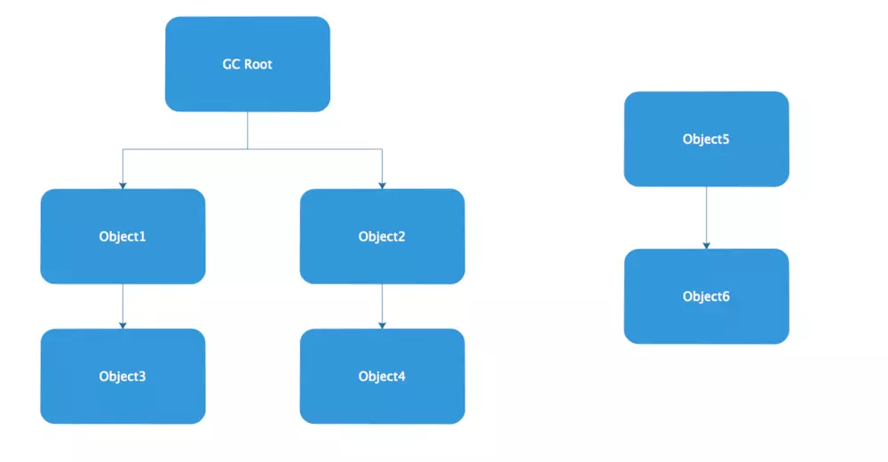
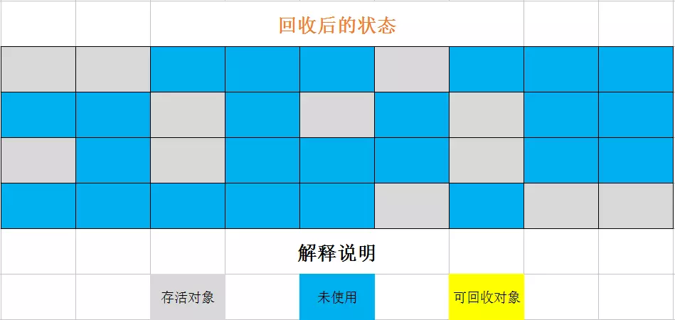
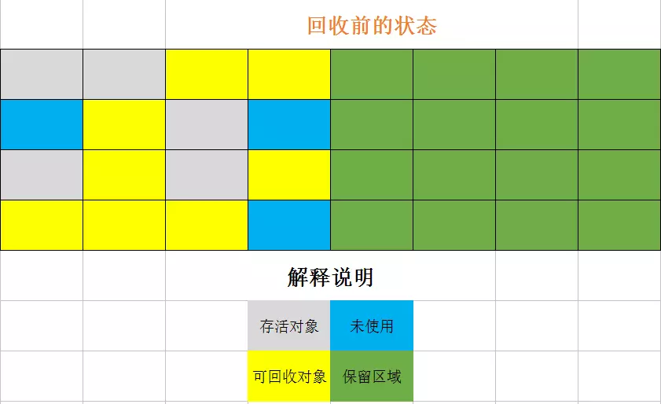
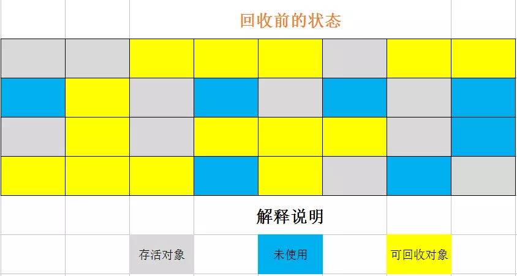
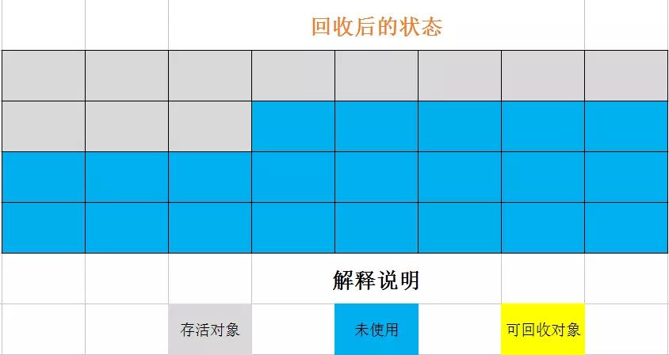
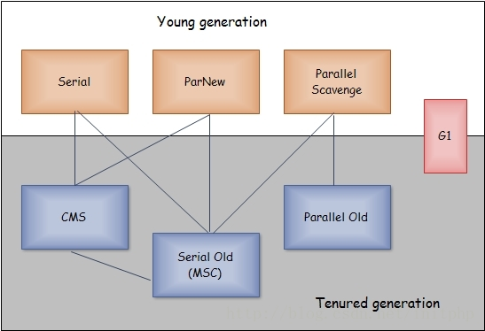
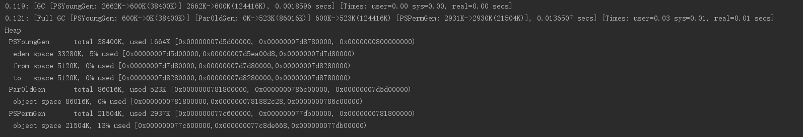
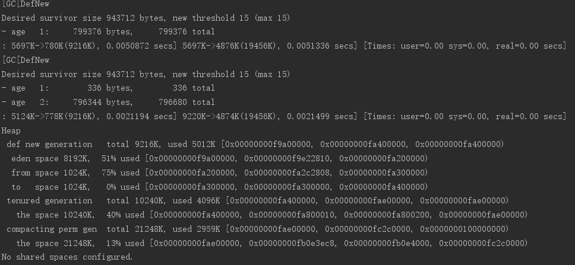
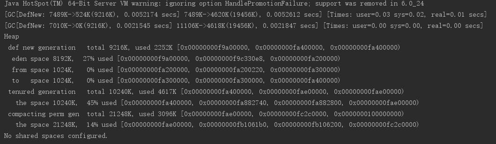

# GC与内存分配策略

## 简介

GC主要管理的是Java堆和方法区中的内存空间

## 判断对象是否存活

### 判断对象是否存活-基本算法

* 引用计数法（Reference Counting）：给对象添加一个引用计数器，每当有一个地方引用它时，计数器就加一，引用失效时，计数器值就减一，当计数器为0时，即可回收。缺陷：当两个对象互相循环引用，则无法被回收，但测试后GC可以回收，说明虚拟机并不是通过引用计数法来判断对象是否存活的
* 可达性分析算法（Reachability Analysis）：通过一系列的称为`GC Roots`的对象作为起始点，从这些节点开始向下搜索，搜索走过的路径称为引用链（Reference Chain），从GC Roots到这个对象不可达时，证明此对象不可用

GC Roots的对象包括以下几种：
  * 虚拟机栈（栈帧中的本地变量表）中引用的对象
  * 方法区中类静态属性引用的对象
  * 方法区中常量引用的对象
  * 本地方法栈中JNI（Native方法）引用的对象

### 引用

* 强引用（Strong Reference）：程序代码中普通存在的，如`Object obj = new Object()`这类的引用，只要强引用还存在，GC就永远不会回收掉被引用的对象
* 软引用（Soft Reference）：描述一些还有用但非必需的对象，对于软引用关联着的对象，在系统将要发生OOM异常之前，会把这些对象列进回收范围之中进行第二次回收，如果这次回收还没有足够的内存，才会抛出内存溢出异常，使用`SoftReference`类来实现软引用
* 弱引用（Weak Reference）：用来描述非必需对象的，强度比软引用更弱一些，被弱引用关联的对象只能生存到下一次垃圾收集发生之前，当GC工作时，无论当前内存是否足够，都会回收掉只被弱引用关联的对象，使用`WeakReference`类来实现弱引用
* 虚引用（Phantom Reference）：最弱的一种引用关系，一个对象是否有虚引用的存在，完全不会对其生存时间构成影响，也无法通过虚引用来取得一个对象实例，为一个对象设置虚引用关联的唯一目的就是能在这个对象被GC回收时收到一个系统通知，使用`PhantomReference`类来实现虚引用

### 判断过程

即使在可达性分析算法中不可达的对象，也并非是“非死不可”的。要真正宣告一个对象死亡，至少要经历两次标记过程：


```java
/**
 * 1.对象可以在被GC时自我拯救
 * 2.这种自救机会只有一次，因为一个对象的finalize()方法最多只会被系统自动调用一次
 * 3.不推荐此方法
 *
 * @author xiaoxin008(313595055 @ qq.com)
 * @since 1.0.0
 */
public class FinalizeEscapeGC {

    public static FinalizeEscapeGC SAVE_HOOK = null;

    public void isAlive(){
        System.out.println("yes，i am still alive !");
    }

    @Override
    protected void finalize() throws Throwable {
        super.finalize();
        System.out.println(" finalize method executed ");
        //重新与引用链上的任何一个对象建立关系即可，
        // 如：把自己（this）赋值给某个类变量或者对象的成员变量
        FinalizeEscapeGC.SAVE_HOOK = this;
    }

    public static void main(String[] args) throws Exception{
        SAVE_HOOK = new FinalizeEscapeGC();
        SAVE_HOOK = null;
        System.gc();
        Thread.sleep(500);
        if(SAVE_HOOK != null){
            SAVE_HOOK.isAlive();
        }else{
            System.out.println("no，i am dead !");
        }
        SAVE_HOOK = null;
        System.gc();
        Thread.sleep(500);
        if(SAVE_HOOK != null){
            SAVE_HOOK.isAlive();
        }else{
            System.out.println("no，i am dead !");
        }
    }
}
```

运行结果：

```txt
finalize method executed
yes，i am still alive !
no，i am dead !
```

### 回收方法区

方法区的垃圾收集主要回收两部分内容：废弃常量和无用的类。

* 废弃常量：没有任何对象引用常量池中的目标常量
* 无用的类：
  * 该类所有的实例都已经被回收，也就是Java堆中不存在该类的任何实例
  * 加载该类的`ClassLoader`已经被回收
  * 该类对应的`java.lang.Class`对象没有在任何地方被引用，无法在任何地方通过反射访问该类的方法
无用类的回收，并不是和对象一样，不使用了就必然会回收，是否对类进行回收，虚拟机提供了`-Xnoclassgc`（取消回收无用类）参数来进行控制，还可以使用`-verbose:class`、`-XX:+TraceClassLoading`及`-XX:+TraceClassUnLoading`查看类加载和卸载信息  

## 垃圾收集算法

### 垃圾收集-基本算法

* 标记-清除算法（Mark-Sweep）：首先标记出所有需要回收的对象，然后在标记完成后统一回收所有被标记的对象，缺陷：效率差，会产生大量不连续的内存碎片


* 复制算法（Copying）：将可用内存按容量划分为大小相等的两块，每次只使用其中的一块。当这一块的内存用完了，就将还存活着的对象复制到另外一块上面，然后再把已使用过的内存空间一次清理掉，实现简单，运行高效，缺陷：将内存缩小为原来的一半。现在的商用虚拟机都采用这种收集算法来回收新生代，堆内存不是按照1:1的比例来划分的，而是将其分为一块较大的Eden空间和两块较小的Survivor空间（8:1:1），每次使用Eden和其中一块Survivor。回收时，将Eden和Survivor中还存活的对象一次性地复制到另一块Survivor空间上（当此Survivor空间不够使，需要依赖老年代进行分配担保），最后清理掉Eden和刚才用过的Survivor空间，这样的话只有10%的内存被浪费


* 标记-整理算法（Mark-Compact）：这种收集算法来回收老年代，标记过程与`标记-清除`算法一样，但后续步骤不是直接对可回收对象进行清理，而是让所有存活的对象都向一端移动，然后直接清理掉端边界以外的内存，因不会产生大量不连续的内存空间，适合老年代的大对象存储


* 分代收集算法（Generational Collection）：根据对象存活周期的不同将内存划分为几块，一般是把Java堆分为新生代和老生代，这样就可以根据各个年代的特点采用最适当的收集算法。
* 新生代：大量回收，少量存活，选用复制算法
* 老生代：大量存活，没有额外空间对其进行分配担保，使用`标记-整理`算法来回收

### 判定算法和垃圾收集算法的具体实现

算法 -> 具体实现：

* 枚举`GC Roots`，操作消耗时间较多
* 可达性分析对执行时间敏感，因为这项分析工作必须在一个能确保一致性的快照中进行

解决方案：
使用一组称为OopMap的数据结构来解决枚举`GC Roots`消耗时间较多的问题，在类加载完成的时候，虚拟机就把对象的偏移量、类型数据计算出来，在JIT编译过程中，也会在特定的位置记录下栈和寄存器中哪些位置是引用。这样，GC在扫描时就可以直接获取这些信息了，但如果引用关系变化，每条指令都生成对应的OopMap，GC的空间成本又会变高。所以，GC就只是在`安全点（Safepoint）`记录了这些信息，即程序执行时并非在所有地方都能停顿下来开始GC，只有到达Safepoint时才能暂停,Safepoint，选定基本上是以程序`是否具有让程序长时间执行的特征`为标准进行选定的,而另一个需要考虑的问题是如何在GC发生时让所有线程都“跑”到最近的Safepoint上再停顿下来，有两种方案：`抢先式中断（Preemptive Suspension）和主动式中断（Voluntary Suspension）`

* 抢占式中断（几乎没有虚拟机实现使用）：GC发生时，把所有线程全部中断，如有线程中断的地方不在Safepoint上，就恢复线程，让其“跑”到Safepoint上
* 主动式中断：GC设置一个标志，让各个线程执行时主动去轮询这个标志，发现中断标志为`true`时就自己中断挂起，轮询标志的地方与Safepoint重合

使用Safepoint理论上可以解决如何进入GC的问题，但实际情况并不一定，Safepoint机制保证了程序执行时，在不太长的时间内就会遇到可进入GC的Safepoint，但线程处于`Sleep`状态或者`Blocked`状态，这时候无法“跑”进Safepoint，这种情况就需要`安全区域（Safe Region）`来解决

`Safe Region`是指在一段代码片段中，引用关系不会发生变化，在这个区域中的任意地方开始GC都是安全的，在线程执行到Safe Region中的代码时，首先标识自己已经进入了Safe Region，那样，当在这段时间里JVM要发起GC时，就不用管标识自己为Safe Region状态的线程了。在线程要离开Safe Region时，要检查是否已经完成了整个GC过程，如果完成，线程就继续进行，否则，它就必须等待直到收到可以安全离开Safe Region的信号为止

## 垃圾收集器



### 新生代垃圾收集器

* Serial收集器：

||工作区域|单线程/多线程|垃圾收集算法||
|---|---|---|---|---|
|Serial收集器（Stop the World）|新生代|单线程|复制算法|Client模式下的默认新生代收集器。进行垃圾收集时，必须阻塞除垃圾收集线程外所有的工作线程，直至垃圾收集完毕。`-XX:+UseSerialGC`|

* ParNew收集器：

||工作区域|单线程/多线程|垃圾收集算法||
|---|---|---|---|---|
|ParNew收集器（Serial收集器的多线程版）|新生代|多线程并发|复制算法|Server模式下的默认新生代收集器。垃圾收集多线程并行，但也必须阻塞所有工作线程，直至完毕。`-XX:+UseParNewGC`|

* Parallel Scavenge收集器：

||工作区域|单线程/多线程|垃圾收集算法||
|---|---|---|---|---|
|Parallel Scavenge收集器|新生代|多线程并发|复制算法|`吞吐量优先`（吞吐量=运行用户代码时间/（运行用户代码时间+垃圾收集时间））收集器，吞吐量越高，说明CPU利用率越高。`-XX:+UseParallelGC`，控制最大垃圾收集停顿时间：`-XX:MaxGCPauseMillis`，设置吞吐量大小：`-XX:GCTimeRatio`，`-XX:+UseAdaptiveSizePolicy`

`-XX:+UseAdaptiveSizePolicys`是个开关参数，当这个参数打开之后，就不需要手工指定新生代的大小、Eden与Survivor区的比例、晋升老年代对象年龄等细节参数了，虚拟机会根据当前系统的运行情况收集性能监控信息，动态调整这些参数以提供最合适的停顿时间或者最大的吞吐量，这种调节方式称为GC自适应的调节策略（GC Ergonomics）。只需要把基本的内存数据设置好（如-Xmx设置最大堆），然后使用MaxGCPauseMillis参数（最大停顿时间）或GCTimeRatio（吞吐量）参数给虚拟机设立一个优化目标，具体细节参数的调节工作就有虚拟机完成了

### 老年代垃圾收集器

* Serial Old收集器：

||工作区域|单线程/多线程|垃圾收集算法||
|---|---|---|---|---|
|Serial Old收集器|老年代|单线程|标记-整理|在JDK1.5以及之前的版本与Parallel Scavenge收集器搭配使用，另一种是作为CMS收集器的后备预案，在并发收集发生`Concurrent Mode Failure`时使用|

* Parallel Old收集器：

||工作区域|单线程/多线程|垃圾收集算法||
|---|---|---|---|---|
|Parallel Old收集器|老年代|多线程并发|标记-整理|Parallel Old 是Parallel Scavenge收集器的老年代版本。这个收集器在1.6中才开始提供。在JDK1.5以及之前的版本中，Parallel Scavenge+Serial Old（单线程），无法充分利用多CPU的处理能力。1.6之后，终于有了名副其实的“吞吐量优先”收集器组合：Parallel Scavenge + Parallel Old。|

* CMS（Concurrent Mark Sweep）收集器：

||工作区域|单线程/多线程|垃圾收集算法||
|---|---|---|---|---|
|CMS收集器|老年代|多线程并发|标记-清除|目标：获取最短回收停顿时间，优点：并发收集，低停顿，缺点：1.CMS收集器对CPU资源非常敏感，因为垃圾收集线程与用户工作线程并发，会导致吞吐量降低，解决方案：增加CPU个数 2.CMS收集器无法处理浮动垃圾，可能出现`Concurrent Mode Failure`失败而导致另一次Full GC的产生。由于CMS并发清理阶段用户线程还在运行着，这一部分垃圾出现在标记过程之后，CMS无法再当次收集中处理它们，只能留待下一次GC时再清理掉，这一部分垃圾就称为`浮动垃圾`，因此CMS不能像其他收集器那样等到老年代几乎完全被填满了再进行收集，需要预留一部分空间提供并发收集时的程序运作使用，当预留内存不够时，就会出现一次`Concurrent Mode Failure`失败，解决方案：1.调低参数`-XX:CMSInitiatingOccupancyFraction`的值来降低触发百分比 2.系统会启动后备预案：临时启用Serial Old收集器来重新进行老年代的垃圾收集 3.“标记-清除”算法会产生大量空间碎片产生，解决方案：开启`-XX:+UseCMSCompactAtFullCollection`参数，开启内存碎片的整理合并和`-XX:CMSFullGCsBeforeCompaction`用于设置执行多少次不压缩的Full GC后，跟着来一次带压缩的（默认值为0，表示每次进入Full GC时都进行碎片整理）|

### G1收集器（Garbage-First）

是当今收集器技术发展的最前沿成果之一。G1是一款面向服务端应用的垃圾收集器，G1的特点：

* 并行与并发：G1能充分利用多CPU、多核环境下的硬件优势，使用多个CPU来缩短`Stop The World`停顿时间，G1收集器可以通过并发的方式让其它工作线程继续执行
* 分代收集：G1可以不需要其他收集器配合就能独立管理整个GC对，但它能够采用不同的方式去处理不同状态的对象
* 空间整合：G1从整体来看是基于`标记-整理`算法来实现的收集器，从局部看上是基于`复制`算法实现的，这两种算法都意味着G1运行期间不会产生内存空间碎片，收集后能提供规整的可用内存，有利于程序长时间运行，分配大对象时不会因为无法找到连续内存空间而提前触发下一次GC
* 可预测的停顿：G1除了追求低停顿外，还能建立可预测的停顿时间模型，能让使用者明确指定在一个长度为M毫秒的时间片段内，消耗在垃圾收集上的时间不得超过N毫秒

使用G1收集器时，与之前其他收集器进行收集的范围都是整个新生代或者老年代所不同，它会将整个Java堆规划为多个大小相等的独立区域（Region）,虽然还保留有新生代和老年代的概念，但新生代和老年代不再是物理隔离的了，它们都是一部分Region（不需要连续）的集合。G1收集器之所以能建立可预测的停顿时间模型，是因为它可以有计划地避免在整个Java堆中进行全区域的垃圾收集。G1跟踪各个Region里面的垃圾堆积的价值大小（回收所获得的空间大小以及回收所需时间的经验值），在后台维护一个优先列表，每次根据允许的收集时间，优先回收价值最大的Region,保证其在有限的时间内可以获取尽可能高的收集效率

在G1收集器中，Region之间的对象引用以及其他其他收集器中的新生代与老年代之间的对象引用，都是使用`Remembered Set`来避免全堆扫描的，G1中每个Region都有一个与之对应的Remembered Set，虚拟机发现程序对Reference类型的数据进行写操作时，会产生一个`Write Barrier`暂时中断写操作，检查Reference引用的对象是否处于不同的Region之中，如果是，便通过`CardTable`把相关引用信息记录到被引用对象所属的Region的Remembered Set之中，当进行内存回收时，在GC根节点的枚举范围中加入Remembered Set即可保证不对全堆扫描也不会有遗漏。

如果不计算维护Remembered Set的操作，G1收集器的运作大致可划分为以下几个步骤：

* 初始标记（Initial Marking）：标记以下`GC Roots`能直接关联到的对象并修改`TAMS（Next Top at Mark Start）`的值，让下一阶段用户程序并发运行时，能在正确可用的Region中创建新对象，需短暂停顿工作线程
* 并发标记（Concurrent Marking）：从`GC Roots`开始对堆中对象进行可达性分析，找出存活对象，耗时较长，但可与工作线程并发进行
* 最终标记（Final Marking）：为了修正在并发标记期间因用户程序继续运作而导致标记产生变动的那一部分标记记录，虚拟机将这段时间对象变化记录在线程`Remembered Set Logs`里面，最终标记阶段需要把`Remembered Set Logs`的数据合并到`Remembered Set`中，这阶段需停顿线程，但是可`并行`执行
* 筛选回收（Live Data Counting and Evacuation）：首先对各个Region的回收价值和成本进行排序，根据用户所期望的GC停顿时间来制定回收计划，可与工作线程并发执行

### GC日志

JVM的GC日志的主要参数包括如下几个：

* -XX:+PrintGC 输出GC日志
* -XX:+PrintGCDetails 输出GC的详细日志
* -XX:+PrintGCTimeStamps 输出GC的时间戳（以基准时间的形式）
* -XX:+PrintGCDateStamps 输出GC的时间戳（以日期的形式，如：2013-05-04T21:53:59.234+0800）
* -XX:+PrintHeapAtGC 在进行GC的前后打印出堆的信息
* -XX:+PrintGCApplicationStoppedTime // 输出GC造成应用暂停的时间
* -Xloggc:../logs/gc.log 日志文件的输出路径



* 前面的数字`0.119，0.121`代表了GC发生事件，这个数字含义是从Java虚拟机启动以来经过的秒数
* GC日志开头`[GC`和`[Full GC`表示触发了`Minor GC`和`Full GC`
  * 新生代GC（Minor GC）：指发生在新生代的垃圾收集动作，因为Java对象大多都具备朝生夕灭的特性，所以Minor GC非常频繁，一般回收速度也比较快
    1. Eden区域满了，或者新建对象的大小 > Eden所剩空间
    2. CMS设置了CMSScavengeBeforeRemark参数，这样在CMS的Remark之前会做一次Minor GC来清理新生代，加速之后的Remark的速度，这样整体的`Stop The World`时间反而短
    3. Full GC的时候会先触发Minor GC
  * 老年代GC（Major GC/Full GC）：指发生在老年代的GC，出现了Major GC，经常会伴随至少一次的Minor GC（但非绝对），Major GC的速度一般会比Minor GC慢10倍以上
    1. 老年代空间不足：`java.lang.OutOfMemoryError:java heap space`
    2. 方法区空间不足：`java.lang.OutOfMemoryError:PermGen space`
    3. CMS GC出现`promotion failed`和`concurrent mode failure`
    4. 统计得到的Minor GC晋升到老年代的平均大小大于老年代的剩余空间
    5. 主动触发Full GC来避免碎片问题
    6. 调用`System.gc时`，系统建议执行Full GC，但是不必然执行，`-XX:+DisableExplicitGC` 禁用System.gc()调用
* 接下来的`[PSYoungGen`表示GC发生的区域，Serial收集器新生代名为：`DefNew`，ParNew收集器新生代名为：`ParNew`，Parallel Scavenge收集器新生代名为：`PSYoungGen`
* 后方括号内部的`2662K-600K(38400K)`含义是`GC前该内存区域已使用容量->GC后该内存区域已使用容量（该内存区域总容量）`
* 方括号之外的`2662K-600K(124416K)`表示`GC前Java堆已使用容量->GC后Java堆已使用容量（Java堆总容量）`
* 再往后，`0.0018596 secs`表示该内存区域GC所占用时间，单位是s
* 最后，`[Times：user=0.00 sys=0.00 real=0.00 secs]`分别表示：用户态消耗的CPU时间，内核态消耗的CPU时间和操作从开始到结束所经过的墙钟时间，CPU时间与墙钟时间的区别是，墙钟时间包括各种非运算的等待耗时，所以real时间超过user或sys时间是完全正常的

### 垃圾收集器参数总结

|参数|描述|
|---|---|
|UseSerialGC|虚拟机运行在Client模式下的默认值，打开此开关后，使用`Serial + Serial Old`的收集器组合进行内存回收|
|UseParNewGC|打开此开关后，使用`ParNew + Serial Old`的收集组合进行内存回收|
|UseConcMarkSweepGC|打开此开关后，使用`ParNew + CMS + Serial Old`的收集组合进行内存回收。Serial Old收集器将作为CMS收集器出现`Concurrent Mode Failure`失败后的后备收集器使用|
|UseParallelGC|虚拟机运行在Server模式下的默认值，打开此开关后，使用`Parallel Scavenge + Serial Old（PS MarkSweep）的收集器组合进行内存回收`|
|UseParallelOldGC|打开此开关后，使用`Parallel Scavenge + Parallel Old`的收集器组合进行内存回收|
|UseG1GC|使用G1垃圾收集器|
|SurvivorRatio|新生代中Eden区域与Survivor区域的容量壁纸，默认为8，代表Eden:Survivor=8:1|
|PretenureSizeThreshold|直接晋升到老年代的对象大小，设置这个参数后，大于这个参数的对象将直接在老年代分配|
|MaxTenuringThreshold|晋升到老年代的对象年龄，每个对象在坚持过一次Minor GC之后，年龄就会增加1，当超过这个参数值时就会进入老年代|
|UseAdaptiveSizePolicy|动态调整Java堆中各个区域的大小以及进入老年代的年龄|
|HandlePromotionFailure|是否允许分配担保失败，即老年代的剩余空间不足以应付新生代的整个Eden和Survivor区的所有对象都存活的极端情况|
|ParallelGCThreads|设置并行GC时进行内存回收的线程数|
|GCTimeRatio|GC时间占总时间的比率，默认值为99，即允许1%的GC时间，仅在使用Parallel Scavenge收集器时生效|
|MaxGCPauseMillis|设置GC的最大停顿时间，仅在使用Parallel Scavenge收集器时生效|
|CMSInitiatingOccupancyFraction|设置CMS收集器在老年代空间被使用多少后触发垃圾收集，默认值为68%，仅在使用CMS收集器时生效|
|UseCMSCompactAtFullCollection|设置CMS收集器在完成垃圾收集后是否要进行一次内存碎片整理，仅在使用CMS收集器时生效|
|CMSFullGCsBeforeCompaction|设置CMS收集器在进行若干次垃圾收集后再启动一次内存碎片整理，仅在使用CMS收集器时生效|

## 内存分配与回收策略

Java技术体系中所提倡的自动内存管理最终可以归结为自动化地解决了两个问题：给对象分配内存以及回收分配给对象的内存

### 对象优先在Eden分配

多数情况下，对象在新生代Eden区分配，当Eden区没有足够空间分配时，虚拟机将发起一次Minor GC

```java
/**
 * 测试新对象优先分配在Eden区
 * VM Args: -Xms20M -Xmx20M -Xmn10M -XX:+PrintGCDetails -XX:SurvivorRatio=8 -XX:+UseSerialGC
 *
 * @author xiaoxin008(313595055 @ qq.com)
 * @since 1.0.0
 */
public class EdenAllocation {

    public static int _1MB = 1024 * 1024;

    public static void main(String[] args) {
        byte[] allocation1,allocation2,allocation3,allocation4;
         allocation1 = new byte[2*_1MB];
         allocation2 = new byte[2*_1MB];
         allocation3 = new byte[2*_1MB];
         allocation4 = new byte[4*_1MB]; //这里发生一次Minor GC
    }
}
```

运行结果：


结果分析：
从结果上看，虚拟机进行过一次Minor GC，具体时机是为`allocation4`对象在Eden区分配内存时，发现Eden区的内存不足，因此发生Minor GC。GC期间虚拟机有发现仍旧存活的3个2MB大小的对象无法放入Survior to空间，所以只好通过分配担保机制提前转移到老年代内存空间去。这次GC结束后，4MB的allocation4对象被分配在Eden中，Survivor空闲，老年代占用6MB

### 大对象直接进入老年代

所谓的大对象是指：需要大量连续内存空间的Java对象，如：很长的字符串以及数组，针对于大对象，虚拟机提供了一个`-XX:PretenureSizeThreshold`参数，令大于这个设置值的对象直接在老年代分配，这样做是为了避免在Eden区以及两个Survivor区之间发生大量的内存复制
`-XX:PretenureSizeThreshold`参数只对Serial和ParNew两款收集器有效，Parallel Scavenge收集器一般并不需要设置

```java
/**
 * 测试大对象直接放入老年代内存区
 * VM Args: -Xms10M -Xmx10M -Xmn5M -XX:+PrintGCDetails -XX:SurvivorRatio=8 -XX:+UseSerialGC -XX:PretenureSizeThreshold=3145728
 *
 * @author xiaoxin008(313595055 @ qq.com)
 * @since 1.0.0
 */
public class TestPretenureSizeThreshold {

    private static int _1M = 1024 * 1024;

    public static void main(String[] args) {
        byte[] pretenureSizeThreshold;
        pretenureSizeThreshold = new byte[4*_1M];
    }
}
```

运行结果：


结果分析：
从配置我们可以看出，超过3M的大对象就会被分配到老年代，现日志打印，老年代有5M内存空间，现占用80%，即：pretenureSizeThreshold这个4M的大对象已被分配在老年代内存区域中

### 长期存活的对象将进入老年代

为了执行分代收集，虚拟机给每个对象定义了一个对象年龄（Age）计数器：


```java
/**
 * JVM会把长期存活的对象放入老年代
 * VM Args: -Xms20M -Xmx20M -Xmn10M -XX:+PrintGCDetails -XX:SurvivorRatio=8 -XX:+UseSerialGC
 * -XX:TargetSurvivorRatio=90 -XX:+PrintTenuringDistribution -XX:MaxTenuringThreshold=1(15)
 *
 * @author xiaoxin008(313595055 @ qq.com)
 * @since 1.0.0
 */
public class TestAge {

    private static int _1MB = 1024 * 1024;

    public static void main(String[] args) {
        byte[] allocation1,allocation2,allocation3;
        allocation1 = new byte[_1MB / 4];
        allocation2 = new byte[4*_1MB];
        allocation3 = new byte[4*_1MB];
        allocation3 = null;
        allocation3 = new byte[4*_1MB];
    }
}
```

运行结果：

* 当`-XX:MaxTenuringThreshold=1`时：

* 当`-XX:MaxTenuringThreshold=15`时：


结果分析：（前提：allocation1对象大小小于Survivor空间的一半）

* 当`-XX:MaxTenuringThreshold=1`时：第一次Minor GC时，对象GC时，对象allocation1存活，大小为256KB，可存入Survivor区且Age+1，第二次Minor GC时，对象allocation1 Age=1，大小为256KB，存放在Survivor区中，此时满足条件`MaxTenuringThreshold的值==Age`，此对象从Survivor区晋升到老年代内存区域中，Survivor区域清空
* 当`-XX:MaxTenuringThreshold=15`时：情况与上述一致，此时不满足条件`MaxTenuringThreshold的值==Age`，此对象无法从Survivor区晋升到老年代内存区域中，所以此对象仍在Survivor区中且Age继续+1

### 动态对象年龄判定

如果在Survivor空间中相同年龄所有对象大小的总和大于Survivor空间的一半，年龄大于或等于该年龄的对象就可以直接进入老年代，无须等到`MaxTenuringThreshold`中要求的年龄

```java
/**
 * JVM会把长期存活的对象放入老年代(动态)
 * VM Args: -Xms20M -Xmx20M -Xmn10M -XX:+PrintGCDetails -XX:SurvivorRatio=8 -XX:+UseSerialGC
 * -XX:TargetSurvivorRatio=90 -XX:+PrintTenuringDistribution -XX:MaxTenuringThreshold=15
 *
 * @author xiaoxin008(313595055 @ qq.com)
 * @since 1.0.0
 */
public class TestAge2 {

    private static int _1MB = 1024 * 1024;

    public static void main(String[] args) {
        byte[] allocation1,allocation2,allocation3,allocation4;
        allocation1 = new byte[_1MB / 4];
        allocation2 = new byte[_1MB / 4];
        allocation3 = new byte[4*_1MB];
        allocation4 = new byte[4*_1MB];
        allocation4 = null;
        allocation3 = new byte[4*_1MB];
    }
}
```

运行结果：


结果分析：
allocation1，allocation2对象的Age均为1，远远小于`-XX:MaxTenuringThreshold=15`的年龄要求，但二者加起来的大小刚好为Survivor区的一半，所以这两个对象可直接进入老年代

### 空间分配担保


“有风险”是指：新生代使用复制收集算法，但为了内存利用率，只使用其中一个Survivor空间来做轮换备份，当Minor GC后仍有大量对象存活的情况下，就需要老年代进行`分配担保`，把Survivor无法容纳的对象直接放入老年代，前提是老年代本身还有容纳这些对象的剩余空间，但在回收之前，到底有多少对象需要回收是无法明确知道的，所以只好取之前每一次回收晋升到老年代对象容量的平均大小值作为经验值，与老年代的剩余空间进行比较，决定是否进行Full GC来让老年代腾出更多空间。但取平均值进行比较其实仍然不够准确，如果某次Minor GC存活后的对象突增，远远高于平均值，会导致担保失败（Handle Promotion Failure），如果出现了`HandlePromotionFailure`失败，就只好在失败后重新发起一次Full GC。大部分情况下都还是将`HandlePromotionFailure`开关打开，避免Full GC过于频繁。在JDK Update24之后，`HandlePromotionFailure`参数不会再影响到虚拟机的空间分配担保策略，规则变为只要老年代的连续空间大于新生代对象总大小或者历次晋升的平均大小就会进行Minor GC，否则将进行Full GC

```java
/**
 * HandlePromotionFailure参数机制
 * VM Args: -Xms20M -Xmx20M -Xmn10M -XX:+PrintGCDetails -XX:SurvivorRatio=8 -XX:+UseSerialGC
 *
 * @author xiaoxin008(313595055 @ qq.com)
 * @since 1.0.0
 */
public class TestHandlePromotionFailure {

    private static int _1MB = 1024 * 1024;

    public static void main(String[] args) {
        byte[] allocation1,allocation2,allocation3,allocation4,allocation5,
        allocation6,allocation7;
        allocation1 = new byte[2 * _1MB];
        allocation2 = new byte[2 * _1MB];
        allocation3 = new byte[2 * _1MB];
        allocation1 = null; //第一次Minor GC 老年代空间>当前存活对象大小  进行 Minor GC
        allocation4 = new byte[2 * _1MB];
        allocation5 = new byte[2 * _1MB];
        allocation6 = new byte[2 * _1MB];
        allocation4 = null;
        allocation5 = null;
        allocation6 = null; //第二次Minor GC 老年代空间<当前存活对象大小 但 老年代空间>历代晋升到老年代对象的平均大小 所以进行 Minor GC
        allocation7 = new byte[2 * _1MB];
    }
}
```

运行结果：



```java
/**
 * HandlePromotionFailure参数机制
 * VM Args: -Xms20M -Xmx20M -Xmn10M -XX:+PrintGCDetails -XX:SurvivorRatio=8 -XX:+UseSerialGC
 *
 * @author xiaoxin008(313595055 @ qq.com)
 * @since 1.0.0
 */
public class TestHandlePromotionFailure {

    private static int _1MB = 1024 * 1024;

    public static void main(String[] args) {
        byte[] allocation1,allocation2,allocation3,allocation4,allocation5,
        allocation6,allocation7,allocation8;
        allocation1 = new byte[2 * _1MB];
        allocation2 = new byte[2 * _1MB];
        allocation3 = new byte[2 * _1MB];
        allocation1 = null; //第一次Minor GC 老年代空间>当前存活对象大小  进行 Minor GC
        allocation4 = new byte[2 * _1MB];
        allocation5 = new byte[2 * _1MB];
        allocation6 = new byte[2 * _1MB];
        allocation8 = new byte[2 * _1MB];
        allocation4 = null;
        allocation5 = null;
        allocation6 = null; //第二次Minor GC 老年代空间<当前存活对象大小 但 老年代空间>历代晋升到老年代对象的平均大小
                            //进行 Minor GC，但存活对象总大小大于老年代剩余空间，所以此次Minor GC发生(promotion failed),这时需要手动进行Full GC
        System.gc();
        allocation7 = new byte[2 * _1MB];
    }
}
```

运行结果：
