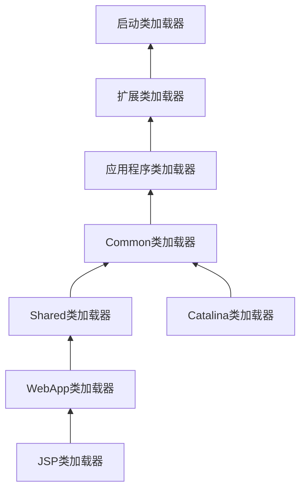

# 类加载及执行子系统的案例

## 概述

* 字节码文件以何种格式存储，类型何时加载、如何连接，以及虚拟机如何执行字节码指令等都是由虚拟机直接控制的行为，用户程序无法对其进行改变
* 能通过程序进行操作的，主要是字节码生成与类加载器这两部分的功能

## 案例分析

### Tomcat：正统的类加载器架构

一个功能健全的Web服务器，要解决的问题：

  * 部署在同一个服务器上的两个web applications所使用的Java类库可以实现相互隔离
  * 部署在同一个服务器上的两个web applications所使用的Java类库可以互相共享（比如：Spring）
  * 服务器需要尽可能地保证自身的安全不受部署的web applications影响
  * 支持JSP应用的Web服务器，大多数都需要支持HotSwap功能（热部署）

服务器的解决方案：Web服务器提供了好几个`ClassPath`路径供用户存放第三方类库，被放置到不同路径中的类库，具备不同的访问范围和服务对象，通常，每一个目录都会有一个相应的自定义类加载器去加载放置在里面的Java类库

在Tomcat目录结构中，有三组目录（`/common/*`、`/server/*`、`/shared/*`）可以存放Java类库，另外还可以加上Web应用程序自身的目录`/WEB-INF/*`，一共四组：

  * `/common/*`：类库可以被Tomcat和所有web applications共同使用
  * `/server/*`：类库可被Tomcat使用，对所有的web applications都不可见
  * `/shared/*`：类库可被所有的web applications共同使用，但对Tomcat自己不可见
  * `/WebApp/WEB-INF/*`：类库仅仅可以被此web application使用，对Tomcat和其他web application都不可见

为了支持这套目录结构，并对目录里面的类库进行加载和隔离，Tomcat自定义了多个类加载器，这些加载器按照经典的双亲委派模型来实现：



但被加载CommonClassLoader或SharedClassLoader加载的Spring如何访问并不在其加载范围内的用户程序呢？可以使用上下文类加载器，破坏双亲委派模型，实现从上而下的类加载方式

### OSGi：灵活的类加载器架构

* OSGi（Open Service Gateway Initiative）是OSGi联盟制定的一个基于Java语言的动态模块化规范，目的是使服务提供商通过住宅网关为各种家用智能设备提供各种服务，现在已经成为Java世界中“事实上”的模块化标准
* OSGi中的每个模块被成为`Bundle`，与普通的Java类库区别并不太大

  * 相同点：都以Jar格式进行封装，并且内部存储的都是Java Package和Class
  * 不同点： Bundle可以声明它所依赖的Java Package，也可以声明它允许导出发布的Java Package

* 在OSGi里面，Bundle之间的依赖关系从传统的上层模块依赖底层模块转变为平级模块之间的依赖，类加载器之间只有规则，没有固定的委派关系，这样做可以

  * 实现更精确的模块划分和可见性控制
  * 很可能可以实现模块级的热插拔功能 

* 在OSGi里面，加载器之间的关系不再是双亲委派模型的树形结构，而是已经进一步发展成了一种更为复杂的、运行时才能确定的网状结构，这种网状的类加载器架构在带来更好的灵活性的同时，也可能产生许多新的隐患：

  * 引入额外的复杂度
  * 带来了线程死锁和内存泄漏的风险 

### 字节码生成技术和动态代理的实现

字节码生成方式：javac、字节码类库、JSP编译器、编译时植入的AOP框架、动态代理技术、使用反射的时候JVM都有可能会在运行时生成字节码来提高执行速度

动态代理：实现了可以在原始类和接口还未知的时候，就确定代理类的代理行为，当代理类与原始类脱离直接联系后，就可以很灵活地重用于不同的应用场景之中

```java
package com.xiaoxin008.jvmexecute.loader;

/**
 * 动态代理(在程序运行时运用反射机制动态创建字节码文件而成)
 *
 * @author xiaoxin008(313595055 @ qq.com)
 * @since 1.0.0
 */
public class DynamicProxyTest {

    interface IHello{
        void sayHello();
    }

    static class Hello implements IHello{
        @Override
        public void sayHello() {
            System.out.println("hello world!");
        }
    }

    static class DynamicProxy implements InvocationHandler{

        Object originalObj;

        Object bind(Object originalObj){
            this.originalObj = originalObj;
            return Proxy.newProxyInstance(originalObj.getClass().getClassLoader(),originalObj.getClass().getInterfaces(),this);
        }

        @Override
        public Object invoke(Object proxy, Method method, Object[] args) throws Throwable {
            System.out.println("welcome!");
            return method.invoke(originalObj,args);
        }
    }

    public static void main(String[] args) {
        IHello hello = (IHello)new DynamicProxy().bind(new Hello());
        hello.sayHello();
    }

}

```

### Retrotranslator：跨越JDK版本

Retrotranslator作用是将JDK1.5编译出来的Class文件转变为可以在JDK1.4或1.3上部署的版本