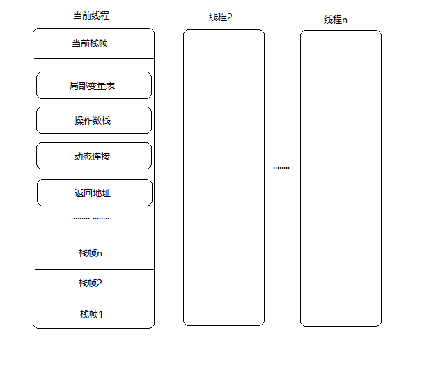
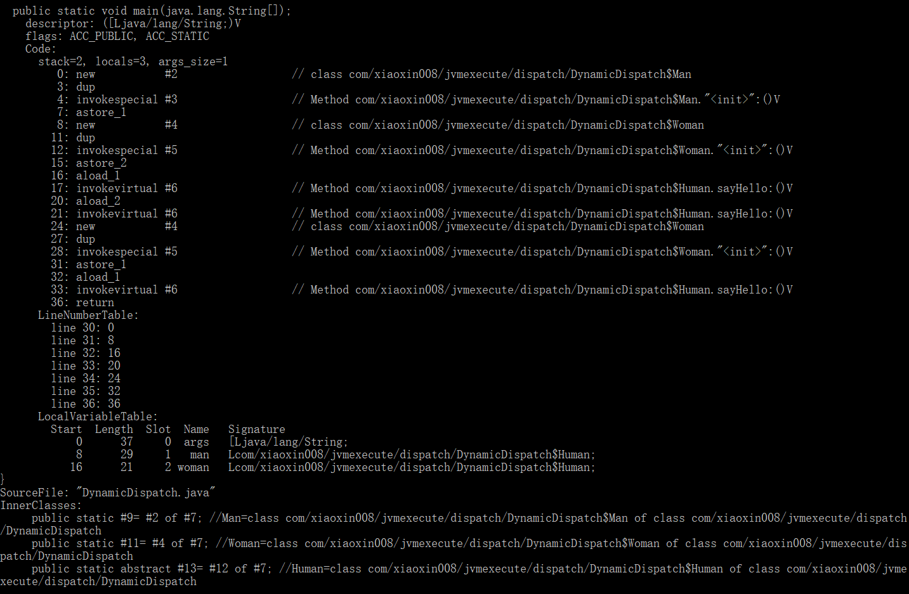
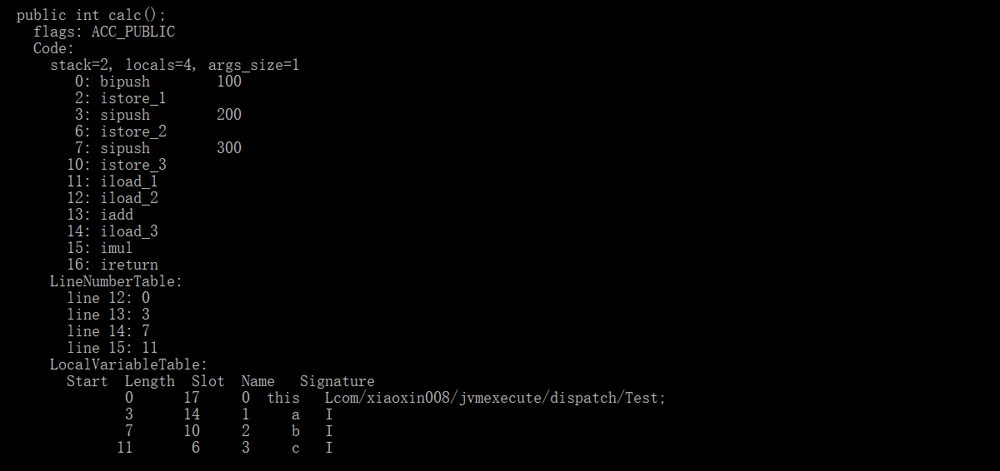
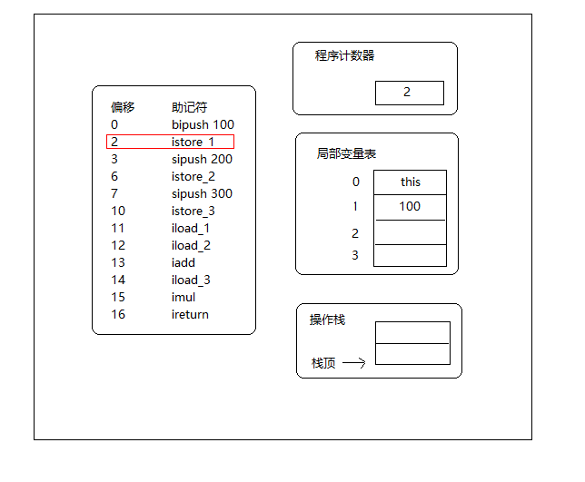
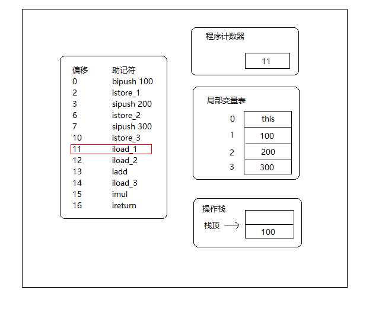
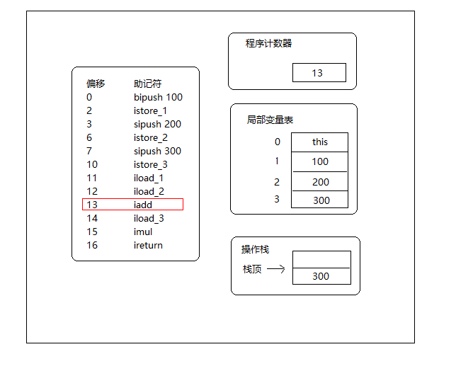
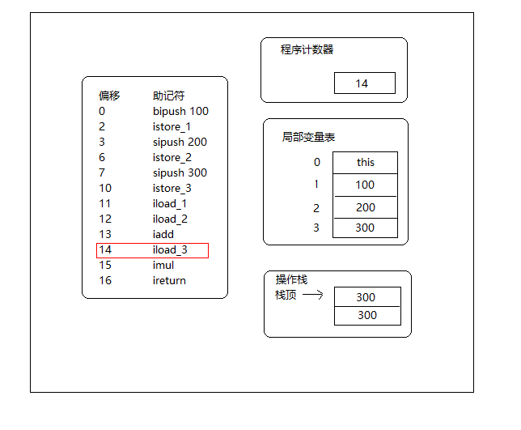

# 虚拟机字节码执行引擎

## 概述

* 执行引擎是JVM最核心的组成部分之一
* 在JVM规范中制定了虚拟机字节码执行引擎的模型，这个概念模型成为各种虚拟机执行引擎的统一外观
* 在不同的虚拟机实现里面，执行引擎在执行Java代码的时候可能会有解释执行（通过解释器执行）和编译执行（通过即时编译器产生本地代码执行）两种选择，也可能两者兼备，甚至还可能会包含几个不同级别的编译器执行引擎
* 所有的JVM的执行引擎都是一致的：输入的是字节码文件，处理过程是字节码解析的等效过程，输出的是执行结果

## 运行时栈帧结构

* 栈帧（Stack Frame）是用于支持虚拟机进行方法调用和方法执行的数据结构，它是虚拟机运行时数据区中的虚拟机栈的栈元素，栈帧存储了方法的局部变量表、操作数栈、动态连接和方法返回地址等信息，每一个方法从调用开始至执行完成的过程，都对应着一个栈帧在虚拟机栈里面从入栈到出栈的过程
* 在编译程序代码的时候，栈帧中需要多大的局部变量表，多深的操作数栈都已经完全确定了，并且写入到方法表的`Code`属性之中，因此一个栈帧需要分配多少内存，不会受到程序运行期变量数据的影响，而仅仅取决于具体的虚拟机实现
* 对于执行引擎来说，在活动线程中，只有位于栈顶的栈帧才是有效的，称为当前栈帧，与这个栈帧相关联的方法称为当前方法，执行引擎运行的所有字节码指令都只针对当前栈帧进行操作



### 局部变量表

* 局部变量表（Local Variable Table）是一组变量值存储空间，用于存放方法参数和方法内部定义的局部变量，在Java程序编译为Class文件时，就在方法的Code属性的max_locals数据项中确定了该方法所需要分配的局部变量表的最大容量
* 局部变量表的容量以变量槽（Variable Slot）为最小单位，虚拟机规范中并没有明确指明一个Slot应占用的内存空间大小，但一个Slot可以存放一个32位以内的数据类型（boolean、byte、char、short、int、float、reference和returnAddress）
  * 前六种可按照Java语言中基本数据类型的概念去理解
  * reference类型：表示对一个对象实例的引用，虚拟机规范没有定义它的长度和结构，但能通过这个引用做到：一是从此引用中直接或间接地查找到对象在Java堆中的数据存放的起始地址索引，二是此引用中直接或间接地查找到对象所属数据类型在方法区中的存储的类型信息
  * returnAddress：它是为字节码指令`jsr`、`jsr_w`和`ret`服务的，指向了一条字节码指令的地址，很古老的JVM曾使用这几条指令来实现异常处理，现已经由异常表代替
  * 对于64位的数据类型（long和double），虚拟机会以高位对齐的方式为其分配两个连续的Slot空间，由于局部变量表线程私有，无论读写两个连续的Slot是否为原子操作，都不会引起数据安全问题
* 虚拟机通过索引定位的方式使用局部变量表，索引值的范围是从0开始至局部变量表最大的Slot数量
  * 如果访问的是32位数据类型的变量：索引n就代表了使用第n个Slot
  * 如果是64位数据类型的变量，则说明会同时使用n和n+1两个Slot，对于两个相邻的共同存放一个64位数据的两个Slot，不允许采用任何方式单独访问其中的某一个
* 在方法执行时，虚拟机是使用局部变量表完成参数值到参数变量列表的传递过程的，如果执行的是实例方法，那局部变量表中第0位索引的Slot默认是用于传递方法所属对象实例的引用 ，在方法中可以通过关键字`this`来访问到这个隐含的参数，其余参数按照参数表顺序排列，占用1开始的局部变量Slot，参数表分配完毕后，再根据方法体内部定义的变量顺序和作用域分配其余的Slot
* 为了尽可能节省栈帧空间，局部变量表中的Slot是可以重用的，方法体中定义的变量，其作用域并不一定会覆盖整个方法体，如果当前字节码PC计数器的值已经超出了某个变量的作用域，那这个变量对应的Slot就可以交给其他变量使用，但某些情况下，Slot的复用会直接影响到系统的垃圾收集行为

### 操作数栈

* 操作数栈（Operand Stack）也常称为操作栈，它是一个后入先出（LIFO）栈，操作数栈的最大深度也在编译的时候写入到Code属性的max_stacks数据项中，操作数栈的每一个元素可以是任意的Java数据类型，包括long和double，32位数据类型所占的栈容量为1，64位数据类型所占的栈容量为2，在方法执行的任何时候，操作数栈的深度都不会超过在max_stacks数据项中设定的最大值
* 当一个方法刚刚开始执行的时候，这个方法的操作数栈是空的，在方法的执行过程中，会有各种字节码指令往操作数栈中写入和提取内容，也就是出栈/入栈操作
* 操作数栈中元素的数据类型必须与字节码指令的序列严格匹配，在编译程序代码的时候，编译器要严格保证这一点
* 另外，在概念模型中，两个栈帧作为虚拟机栈的元素，是完全互相独立的，但在大多虚拟机的实现里都会做一些优化处理，令两个栈帧出现一部分重叠，让下面栈帧的部分操作数栈与上面栈帧的部分局部变量表重叠在一起，这样在进行方法调用时就可以公用一部分数据，无须进行额外的参数复制传递


* JVM的解释执行引擎称为`基于栈的执行引擎`，其中所指的`栈`就是操作数栈

### 动态连接

每个栈帧都包含一个指向运行时常量池中该栈帧所属方法的引用，持有这个引用是为了支持方法调用过程中的动态连接

### 方法返回地址

* 当一个方法开始执行后，只有两种方式可以退出这个方法：
  * 第一种方式是执行引擎遇到任意一个方法返回的字节码指令，这时候可能会有返回值传递给上层的方法调用者（调用当前方法的方法称为调用者），是否有返回值和返回值的类型将根据遇到何种方法返回指令来决定，这种退出方法的方式称为正常完成出口
  * 另一种退出方式是，在方法执行过程中遇到了异常，并且这个异常没有在方法体内得到处理，无论是Java虚拟机内部产生的异常，还是代码中使用athrow字节码指令产生的异常，只要在本方法的异常表中没有搜索到匹配的异常处理器，就会导致方法退出，这种退出方法的方式称为异常完成出口，一个方式使用异常完成出口的方式退出，是不会给它的上层调用者产生任何返回值的
* 无论采取何种退出方式，在方法退出之后，都需要返回到方法被调用的位置，程序才能继续执行，方法返回时可能需要在栈帧中保存一些信息，用来帮助恢复它的上层方法的执行状态，一般来说，方法正常退出时，调用者的PC计数器的值可以作为返回地址，栈帧中很可能会保存这个计数器值，而方法异常退出时，返回地址是要通过异常处理器表来确定的，栈帧中一般不会保存这部分信息
* 方法退出的过程实际上就等同于把当前栈帧出栈，因此退出时可能执行的操作有：恢复上层方法的局部变量表和操作数栈，把返回值（如果有的话）压入调用者栈帧的操作数栈中，调整PC计数器的值以指向方法调用指令后面的一条指令等

### 附加信息

虚拟机规范允许具体的虚拟机实现增加一些规范里没有描述的信息到栈帧之中，例如：与调试相关的信息，这部分信息完全取决于具体的虚拟机实现。在实际开发中，一般会把动态连接、方法返回地址与其他附加信息全部归为一类，称为栈帧信息

## 方法调用

方法调用阶段唯一的任务就是确定被调用方法的版本（即调用哪一个方法），暂不涉及方法内部的具体运行过程

### 解析

* 所有方法调用中的目标方法在Class文件里面都是一个常量池中的符号引用，在类加载的解析阶段，会将其中的一部分符号引用转化为直接引用，这种解析能成立的前提是：方法在程序真正运行之前就有一个可确定的调用版本，并且这个方法的调用版本在运行期是不可改变的，即调用目标在程序代码写好、编译器进行编译时就必须确定下来，这类方法的调用称为解析
* 在Java语言中符合`编译器可知，运行期不可变`这个要求的方法，主要包括静态方法和私有方法两大类，前者与类型直接关联，后者在外部不可被访问，这两种方法各自的特点决定了它们都不可能通过继承或别的方式重写其他版本，因此它们都适合在类加载阶段进行解析
* 只要能被`invokestatic`和`invokespecial`指令调用的方法，都可以在解析阶段中确定唯一的调用版本，符合这个条件的有静态方法、私有方法、实例构造器、父类方法4类，它们在类加载的时候就会把符号引用解析为该方法的直接引用，这些方法可以称为`非虚方法`，与之相反，其他方法称为`虚方法`（除去final方法）
* Java中的非虚方法除了使用`invokestatic`、`invokespecial`调用的方法之外还有一种，就是被`final`修饰的方法，虽然final方法是使用`invokevirual`指令来调用的，但是由于它无法被覆盖，没有其他版本，所以也无须对方法接收者进行多态选择，又或者说多态选择的结果肯定是唯一的，在Java语言规范中明确说明了final方法是一种非虚方法
* 解析调用一定是个静态的过程，在编译期间就完全确定，在类装载的解析阶段就会把涉及的符号引用全部转变为可确定的直接引用，不会延迟到运行期再去完成

### 分派

分派（Dispatch）调用则可能是静态的也可能是动态的，根据分派依据的宗量数可分为单分派和多分派，这两类分派方式的两两组合就构成了`静态单分派`、`静态多分派`、`动态单分派`、`动态多分派`这4中分派组合情况

#### 静态分派

```java
package com.xiaoxin008.jvmexecute.dispatch;

/**
 * 静态分派
 *
 * @author xiaoxin008(313595055 @ qq.com)
 * @since 1.0.0
 */
public class StaticDispatch {

    public static class Human{

    }

    public static class Woman extends Human{

    }

    public static class Man extends Human{

    }

    public void sayHello(Human human){
        System.out.println("human say hello !");
    }

    public void sayHello(Woman woman){
        System.out.println("woman say hello !");
    }

    public void sayHello(Man man){
        System.out.println("man say hello !");
    }

    public static void main(String[] args) {
        Human man = new Man();
        Human woman = new Woman();
        StaticDispatch staticDispatch = new StaticDispatch();
        staticDispatch.sayHello(man);
        staticDispatch.sayHello(woman);
    }
}
```

执行结果：

```txt
human say hello !
human say hello !
```

* 我们把上面代码中的`Human`称为变量的静态类型（Static Type），或者叫做外观类型（Apparent Type），后面的`Man`则称为变量的实际类型（Actual Type），静态类型和实际类型在程序中都可以发生一些变化，区别是静态类型的变化仅仅在使用时发生，变量本身的静态类型不会被改变，并且最终的静态类型是在编译器可知的；而实际类型变化的结果在运行期才可确定，编译器在编译程序的时候并不知道一个对象的实际类型是什么
* 使用哪个重载版本，完全取决于传入参数的数量和数据类型，编译器在重载时通过参数的静态类型而不是实际类型作为判定依据的，并且静态类型是编译期可知的，因此，在编译阶段，javac编译器会根据参数的静态类型决定使用哪个重载版本
* 所有依赖静态类型来定位方法执行版本的分派动作称为静态分派，静态分派的典型应用是方法重载（Overload），静态分派发生在编译阶段，因此确定静态分派的动作实际上不是由虚拟机来执行的。另外，编译器虽然能确定出方法的重载版本，但很多情况下这个重载版本并不是“唯一的”，往往只能确定一个“更加合适的”版本

#### 动态分派

动态分派和多态性的另外一个重要体现——重写（Override）有着很密切的关联

```java
package com.xiaoxin008.jvmexecute.dispatch;

/**
 * 动态分派
 *
 * @author xiaoxin008(313595055 @ qq.com)
 * @since 1.0.0
 */
public class DynamicDispatch {

    public abstract static class Human{
        protected abstract void sayHello();
    }

    public static class Woman extends Human{
        @Override
        protected void sayHello() {
            System.out.println("woman say hello !");
        }
    }

    public static class Man extends Human{
        @Override
        protected void sayHello() {
            System.out.println("man say hello !");
        }
    }

    public static void main(String[] args) {
        Human man = new Man();
        Human woman = new Woman();
        man.sayHello();
        woman.sayHello();
        man = new Woman();
        man.sayHello();
    }
}
```

运行结果：

```txt
man say hello !
woman say hello !
woman say hello !
```



* 0~15行的字节码是准备动作，作用是建立man和woman的内存空间、调用Man和Woman类型的实例构造器，将这两个实例的引用存放在第1、2个局部变量表Slot之中，这个动作也就对应了代码中的这两句：

```java
Human man = new Man();
Human woman = new Woman();
```

* 接下来的16、21两句分别把刚刚创建的两个对象的引用压到栈顶，这两个对象是将要执行的`sayHello()`方法的所有者，称为接收者，17和21句是方法的调用指令，但无论是指令还是参数都与`Human.sayHello()`完全一样，但这两句指令最终执行的目标方法并不相同，原因就需要从`invokevirtual`指令的多态查找过程开始说起，`invokevirtual`指令的运行时解析过程大致分为以下几个步骤：
  1. 找到操作数栈顶的第一个元素所指向的对象的实际类型，记做C
  2. 如果在类型C中找到与常量中的描述符合简单名称都相符的方法，则进行访问权限校验，如果通过则返回这个方法的直接引用，查找过程结束；如果不通过，则返回`java.lang.IllegalAccessError`异常
  3. 否则，按照继承关系从下往上依次对C的各个父类进行第二步的搜索和验证过程
  4. 如果始终没有找到合适的方法，则抛出`java.lang.AbstractMethodError`异常
* 由于`invokevirtual`指令执行的第一步就是在运行期确定接收者的实际类型，所以两次调用中的`invokevirtual`指令把常量池中的类方法符合引用解析到了不同的直接引用上，这个过程就是Java语言中方法重写的本质，我们把这种在运行期根据实际类型确定方法执行版本的分派过程称为动态分派

#### 单分派与多分派

方法的接收者与方法的参数统称为方法的宗量，根据分派基于多少种宗量，可以将分派划分为单分派和多分派两种。单分派是根据一个宗量对目标方法进行选择，多分派则是根据多于一个宗量对目标方法进行选择

```java
package com.xiaoxin008.jvmexecute.dispatch;

/**
 * 单分派与多分派演示
 *
 * @author xiaoxin008(313595055 @ qq.com)
 * @since 1.0.0
 */
public class MultiSingleDispatch {

    public static class QQ{

    }

    public static class Wechat{

    }

    public static class Father{
        public void hardChoice(QQ arg){
            System.out.println("father use qq!");
        }

        public void hardChoice(Wechat wechat){
            System.out.println("father use wechat!");
        }
    }

    public static class Son extends Father{
        @Override
        public void hardChoice(QQ arg){
            System.out.println("son use qq!");
        }

        @Override
        public void hardChoice(Wechat wechat){
            System.out.println("son use wechat!");
        }
    }

    public static void main(String[] args) {
        Father father = new Father();
        Father son = new Son();
        father.hardChoice(new Wechat());
        son.hardChoice(new QQ());
    }
}
```

运行结果：

```txt
father use wechat!
son use qq!
```


* 编译阶段编译器的选择过程：即静态分派过程，这时选择目标方法的依据有两点：一是静态类型是`Father`还是`Son`，二是方法参数是`Wechat`还是`QQ`，这次选择结果的最终产物是产生了两条`invokevirtual`指令，两条指令的参数分别为常量池中指向`Father.hardChoice(Wechat)`及`Father.hardChoice(QQ)`方法的符号引用，因为是根据两个宗量进行选择，所以Java语言的静态分派属于多分派类型
* 运行阶段虚拟机的选择过程：即动态分派过程，在执行`son.hardChoice(new QQ())`这句代码时，更准确地说，是在执行这句代码对应的`invokevirtual`指令时，由于编译期已经决定目标方法的签名必须为`hardChoice(QQ)`，虚拟机此时不会关心传递过来的参数，参数的静态类型、实际类型都对方法的选择不会构成任何影响，唯一可以影响虚拟机选择的因素只有此方法的接受者的实际类型，因为只有一个宗量作为选择依据，所以Java语言的动态分派属于单分派类型
* 根据上述论证的结果，（至Java1.8之前）Java语言是一门`静态多分派`、`动态单分派`的语言

#### 虚拟机动态分派的实现

* 由于动态分派是非常频繁的动作，而且动态分派的方法版本选择过程需要运行时在类的方法元数据中搜索合适的目标方法，因此在虚拟机的实际实现中基于性能的考虑，大部分实现都不会真正地进行如此频繁的搜索，面对这种情况，最常用的"稳定优化"手段就是为类在方法区中建立一个虚方法表（Vritual Method Table，也成vtable，与此对应的，在invokeinterface执行时也会用到接口方法表——Interface Method Table，简称itable），使用虚方法表索引来替代元数据查找以提高性能
* 虚方法表中存放着各个方法实际入口地址，如果某个方法在子类中没有被重写，那子类的虚方法表里面的地址入口和父类相同方法的地址入口一致，都指向父类的实现入口。如果子类中重写了这个方法，子类方法表中的地址将会替换为指向子类实现版本的入口地址
* 为了程序实现上的方便，具有相同签名的方法，在父类、子类的虚方法表中都应当具有一样的索引序号，这样当类型变换时，仅需要变更查找的方法表，就可以从不同的虚方法表中按索引转换出所需的入口地址，方法表一般在类加载的连接阶段进行初始化，准备了类的变量初始值后，虚拟机会把该类的方法表也初始化完毕
* 方法表示分派调用的“稳定优化”手段，虚拟机除了使用方法表之外，在条件允许的情况下，还会使用内联缓存（Inline Cache）和基于“类型继承关系分析”（Class Hierarchy Analysis，CHA）技术的守护内联（Guarded Inlining）两种非稳定的“激进优化”手段来获得更高的性能

### 动态类型语言支持

`invokedynamic`指令，是JDK7实现“动态类型语言”支持而进行的改进之一，也是为JDK8可以顺利实现Lambda表达式做技术准备

#### 动态类型语言

* 动态类型语言的关键特征是它的类型检查的主体过程是在运行期而不是编译器，满足这个特征的语言有很多，常用的包括：Groovy、JS、Lua、PHP、Python等。相对的，在编译器就进行类型检查过程的语言（如C++和Java等）就是最常用的静态类型语言
* 静态类型语言在编译期间已经方法完整的符号引用生成出来，作为方法调用指令的参数存储到Class文件中，这个符号引用包含了此方法定义在哪个具体类型之中、方法的名字以及参数顺序、参数类型和方法返回值等信息，通过这个符号引用，虚拟机可以翻译出这个方法的直接引用，而动态类型语言中，变量本身是没有类型的，变量的值才有类型，编译时最多只能确定方法名称、参数、返回值这些信息，而不会去确定方法所在的具体类型（即方法接收者不固定），`变量无类型而变量值才有类型`这个特点也是动态类型语言的一个重要特征
* 静态类型语言在编译期确定类型，最显著的好处是编译器可以提供严谨的类型检查，这样与类型相关的问题能在编码的时候就及时发现，利于稳定性及代码达到更大规模，而动态类型语言在运行期确定类型，可以为开发人员提供更大的灵活性，某些在静态类型语言中需用大量“臃肿”代码来实现的功能，由动态类型语言来实现可能会更加清晰和简洁，开发效率提升

#### JDK1.7与动态类型

JVM层面对动态类型语言的支持一直都有所欠缺，主要表现在方法调用方面：JDK1.7以前的字节码指令集中，4条方法调用指令的第一个参数都是被调用的方法的符号引用，而方法的符号引用在编译时产生，而动态类型语言只有运行期才能确定接收类型，这样，在JVM上实现的动态类型语言就不得不使用其他方式（如编译时留个占位符类型，运行时动态生成字节码实现具体类型到占位符类型的适配）来实现，这样势必让动态类型语言实现的复杂度增加，也可能带来额外的型男或者内存开销，而这就是JDK1.7中`invokedynamic`指令以及java.lang.invoke包出现的技术背景

#### java.lang.invoke包

这个包的主要目的是在之前单纯依靠符号引用来确定调用的目标方法这种方式之外，提供一种新的动态确定目标方法的机制，称为`MethodHandle`

```java
package com.xiaoxin008.jvmexecute.invoke;

import java.lang.invoke.MethodHandle;
import java.lang.invoke.MethodHandles;
import java.lang.invoke.MethodType;

/**
 * Method Handle基础用法展示
 *
 * @author xiaoxin008(313595055 @ qq.com)
 * @since 1.0.0
 */
public class MethodHandleTest {

    public static class ClassA{
        public void println(String s){
            System.out.println(s);
        }
    }

    public static void main(String[] args) throws Throwable{
        Object obj = System.currentTimeMillis() % 2 == 0?System.out:new ClassA();
        //无论是ClassA还是PrintStream都可以调用println方法
        getPrintlnMH(obj).invokeExact("xxxxx");
    }

    private static MethodHandle getPrintlnMH(Object reveiver) throws Throwable{
        //MethodType:代表“方法类型”，包含了方法的返回值类型和具体参数类型
        MethodType methodType = MethodType.methodType(void.class, String.class);
        //在指定类中查找符合给定的方法名称、方法类型，并且符合调用权限的方法句柄
        //bindTo()绑定方法的接收者
        return MethodHandles.lookup().
            findVirtual(reveiver.getClass(),"println",methodType).bindTo(reveiver);
    }
}
```

* 实际上，方法getPrintlnMH()中模拟了`invokevirtual`指令的执行过程，只不过它的分派逻辑并非固化在Class文件的字节码上，而是通过一个具体方法来实现，而这个方法本身的返回值（MethodHandle对象），可以视为对最终调用方法的一个“引用”，以此为基础，有了MethodHandle就可以写出这样的函数声明：`void sort(List list,MethodHandle compare)`
* MethodHandle和Reflection的区别：
  * Reflection是在模拟Java代码层次的方法调用，而MethodHandle是在模拟字节码层次的方法调用，在MethodHandle.lookup中的3个方法——findStatic()、findVirtual()、findSpecial()正是为了对应于`invokestatic`、`invokevirtual & invokeinterface`和`invokespecial`这几条字节码指令的执行权限校验行为，而这些底层细节在使用Reflection API时是不需要关心的
  * Reflection中的java.lang.reflect.Method对象远比MethodHandle机制中的java.lang.invoke.MethodHandle对象所包含的信息多，前者是方法在Java一端的全面映像，包含了方法的签名、描述符以及方法属性表中各种属性的Java端表示方式，还包含执行权限等的运行期信息，而后者仅仅包含与执行该方法相关的信息，通俗来讲：Reflection是重量级，而MethodHandle是轻量级
  * 由于MethodHandle是对字节码的方法指令调用的模拟，所以理论上虚拟机在这方面做的各种优化（如方法内联），在MethodHandle上也应当可以采用类似思路去支持（不完善），而通过反射去调用方法则不行
  * Reflection API的设计目标是只为Java语言服务的，而MethodHandle则设计成可服务于所有JVM之上的语言，其中也包括Java语言 

#### invokedynamic指令

* 在某种程度上，`invokedynamic`指令与MethodHandle机制的作用是一样的，都是为了解决原有4条“invoke”指令方法分派规则固化在虚拟机之中的问题
* 每一处含有`invokedynamic`指令的位置都称作“动态调用点”，这条指令的第一个参数不再是代表方法符号引用的`CONSTANT_Methodref_info`常量，而是变为JDK 1.7新加入的`CONSTANT_InvokeDynamic_info`常量，从这个新常量中可以得到3项信息：引导方法（Bootstrap Method）、方法类型（MethodType）和名称
* 引导方法是有固定的参数，并且返回值是java.lang.invoke.CallSite对象，这个代表真正要执行的目标方法调用，根据`CONSTANT_InvokeDynamic_info`常量中提供的信息，虚拟机可以找到并且执行引导方法，从而获得一个CallSite对象，最终调用要执行的目标方法

```java
package com.xiaoxin008.jvmexecute.invoke;

import java.lang.invoke.*;

/**
 * invokedynamic指令演示
 *
 * @author xiaoxin008(313595055 @ qq.com)
 * @since 1.0.0
 */
public class InvokeDynamicTest {

    public static void main(String[] args) throws Throwable{
        //执行入口
        INDY_BootstrapMethod().invokeExact("test");
    }

    public static void testMethod(String s){
        System.out.println(" hello String: "+ s);
    }

    //通过传入的参数设定好动态调用点
    public static CallSite BootstrapMethod(MethodHandles.Lookup lookup, String name, MethodType mt) throws Throwable{
        return new ConstantCallSite(lookup.findStatic(InvokeDynamicTest.class,name,mt));
    }

    //通过方法描述向BootstrapMethod方法传入参数类型
    private static MethodType MT_BootstrapMethod(){
        return MethodType.fromMethodDescriptorString(
                "(Ljava/lang/invoke/MethodHandles$Lookup;" +
                        "Ljava/lang/String;Ljava/lang/invoke/MethodType;)Ljava/lang/invoke/CallSite;",null);
    }

    //调用 BootstrapMethod 返回 MethodHandle
    private static MethodHandle MH_BootstrapMethod() throws Throwable{
        return MethodHandles.lookup().findStatic(InvokeDynamicTest.class,"BootstrapMethod",MT_BootstrapMethod());
    }

    private static MethodHandle INDY_BootstrapMethod() throws Throwable{
        //从动态调用点指定调用testMethod方法并设定好参数类型
        CallSite callsite = (CallSite)MH_BootstrapMethod().invokeWithArguments(MethodHandles.lookup(), "testMethod",
                MethodType.fromMethodDescriptorString("(Ljava/lang/String;)V", null));
        return callsite.dynamicInvoker();
    }
}
```

由于`invokedynamic`指令所面向的使用者并非Java语言，而是其他JVM之上的动态语言，因此仅靠Java语言的编译器Javac没有办法生成带有`invokedynamic`指令的字节码，需其他工具进行编译之后才可以看到

#### 掌握方法分派规则

`invokedynamic`指令与前面4条“invoke-”指令的最大差别就是它的分派逻辑不是由虚拟机决定的，而是由程序员决定

```java
package com.xiaoxin008.jvmexecute.invoke;

/**
 * 自定义分派规则
 *
 * @author xiaoxin008(313595055 @ qq.com)
 * @since 1.0.0
 */
public class CustomerInvoke {

    class GrandFather{
        void thinking(){
            System.out.println("i am grandfather !");
        }
    }

    class Father extends GrandFather{
        @Override
        void thinking(){
            System.out.println(" i am father ! ");
        }
    }

    class Son extends Father{
        @Override
        void thinking(){
            super.thinking();
        }
    }

    public static void main(String[] args) {
        CustomerInvoke customerInvoke = new CustomerInvoke();
        Son son = customerInvoke.new Son();
        son.thinking();
    }
}
```

运行结果：

```txt
 i am father ! 
```

`super`关键字可以使Son类获取父级对象引用，如果Son对象想调用祖级的thinking()方法？如何获取祖级的对象引用？就要使用`MethodHandle`

```java
package com.xiaoxin008.jvmexecute.invoke;

import java.lang.invoke.MethodHandle;
import java.lang.invoke.MethodType;

import static java.lang.invoke.MethodHandles.lookup;

/**
 * 自定义分派规则
 *
 * @author xiaoxin008(313595055 @ qq.com)
 * @since 1.0.0
 */
public class CustomerInvoke {

    class GrandFather{
        void thinking(){
            System.out.println("i am grandfather !");
        }
    }

    class Father extends GrandFather{
        @Override
        void thinking(){
            System.out.println(" i am father ! ");
        }
    }

    class Son extends Father{
        @Override
        void thinking(){
            try {
                MethodType mt = MethodType.methodType(void.class);
                MethodHandle mh = lookup().findSpecial(GrandFather.class,"thinking",mt,getClass());
                mh.invoke(this);
            } catch (Throwable e) {
                e.printStackTrace();
            }
        }
    }

    public static void main(String[] args) {
        new CustomerInvoke().new Son().thinking();
    }
}
```

运行结果：
```txt
i am grandfather !
```

上面的结果在jdk1.7.0_10环境下可以得到，而在jdk1.7.0_79版本下得出结果为：`i am father !`，所以，能否自定义方法分派规则跟JDK的版本和JVM的具体实现有关联

## 基于栈的字节码解释执行引擎

JVM的执行引擎在执行Java代码的时候都有解释执行（通过解释器执行）和编译执行（通过即时编译器产生本地代码执行）两种选择

### 解释执行

Java语言常被人们定位为“解释执行”语言，但当主流的虚拟机中都包含了即时编译器后，Class文件中的代码到底会被解释执行还是编译执行，就成了只有虚拟机自己才能准确判断的事情，再后来，Java也发展出了可以直接生成本地代码的编译器（如：GCJ），而C/C++语言也出现了通过解释器执行的版本（如：CINT），所以只有确定了谈论对象是某种具体的Java实现版本和执行引擎运行模式时，谈解释执行还是编译执行才会比较确切


Java语言中，Javac编译器完成了程序代码经过词法分析、语法分析到抽象语法树，再遍历语法树生成线性的字节码指令流的过程，因为这一部分动作是在JVM之外进行的，而解释器在虚拟机的内部，所以Java程序的编译就是半独立的实现

### 基于栈的指令集与基于寄存器的指令集

* Java编译器输出的指令流，基本上是一种基于栈的指令集架构（ISA），指令流中的指令大部分都是零地址指令，它们依赖操作数栈进行工作。与之相对应的另外一套常用的指令集架构是基于寄存器的指令集，最典型的就是x86的二地址指令集，就是现在我们主流PC机中直接支持的指令集架构，这些指令依赖寄存器进行工作

* 举例，分别使用这两种指令集计算“1+1”的结果：
  * 基于栈的指令集：iconst_1 iconst_1 iadd istore_0 ——两条iconst_1指令连续把两个常量1压入栈后，iadd指令把栈顶的两个值出栈、相加，然后把结果放回栈顶，最后istore_0把栈顶的值放到局部变量表的第0个Slot中
  * 基于寄存器：mov eax, 1   add eax, 1——mov指令把EAX寄存器的值设为1，然后add指令再把这个值加1，结果就保存再EAX寄存器里面

* 基于栈的指令集
  * 优点：可移植，不直接使用寄存器，而是由虚拟机实现来自行决定把一些访问最频繁的数据（程序计数器、栈顶缓存等）放到寄存器中以获取尽量好的性能，并且代码相对更加紧凑（字节码中每个字节就对应一条指令，而多地址指令集中还需要存放参数）、编译器实现更加简单（不需要考虑空间分配问题，所需空间都在栈上操作）
  * 缺点：速度相对稍慢，虽然栈架构指令集的代码非常紧凑，但是完成相同功能所需的指令数量一般会比寄存器架构多，因为出栈、入栈操作本身就产生了相当多的指令数量，更重要的是，栈实现在内存之中，频繁的栈访问也就意味着频繁的内存访问，相对于处理器来说，内存始终是执行速度的瓶颈
* 基于寄存器的指令集
  * 优点：直接使用寄存器，运行速度快 
  * 缺点：由硬件直接提供，程序直接依赖这些硬件寄存器则不可避免地要受到硬件的约束

### 基于栈的解释器执行过程

```java
public int calc(){
	int a = 100;
	int b = 200;
	int c = 300;
	return (a + b) * c;
}
```




* 首先执行编译地址为0的指令，bipush指令的作用是将单字节的整型常量值推入操作数栈顶，跟随有一个参数，指明推送的常量值，这里是100



* 执行偏移量为2的指令，istore_1指令的作用是将操作数栈顶的整型值出栈并存放到第一个局部变量Slot中，后续4条指令（直到偏移为11的指令为止）都是做一样的事情，也就是在对应代码中把变量a、b、c赋值为100、200、300



* 执行偏移地址为11的指令，iload_1指令的作用是将局部变量第一个Slot的整型值复制到操作数栈顶


* 执行偏移地址为12的指令，iload_2指令的执行过程与iload_1类似，把第2个Slot的整型值入栈



* 执行偏移地址为13的指令，iadd指令的作用是将操作数栈中头两个栈顶元素出栈，做整型加法，然后把结果重新入栈，在iadd指令执行完毕后，栈中原有的100和200出栈，它们和300重新入栈



* 执行偏移地址为14的指令，iload_3指令把存放在第3个局部变量Slot中的300压入操作数栈中，这时候操作数栈为两个整数300，下一条指令imul是将操作数栈中头两个栈顶元素出栈，做整型乘法，然后把结果重新入栈，与iadd完全类似


* 执行偏移地址为16的指令，ireturn指令是方法返回指令之一，它将结束方法执行并将操作数栈顶的整型值返回给此方法的调用者，到此为止，这段方法执行结束

上面的执行过程仅仅是一种概念模型，虚拟机最终会对执行过程做一些优化来提高性能，实际的运作过程不一定完全符合概念模型的描述