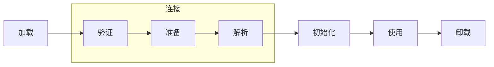
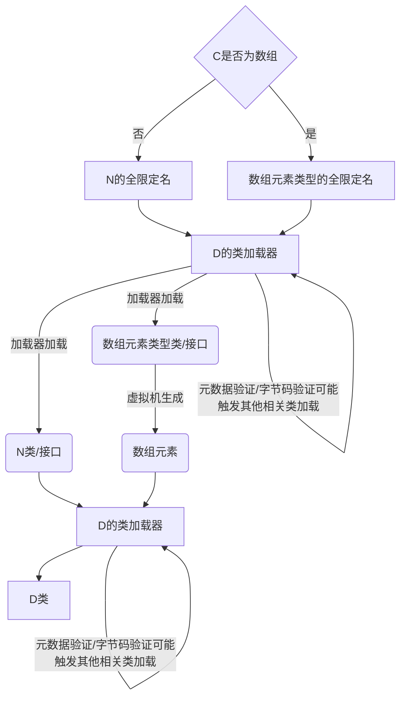
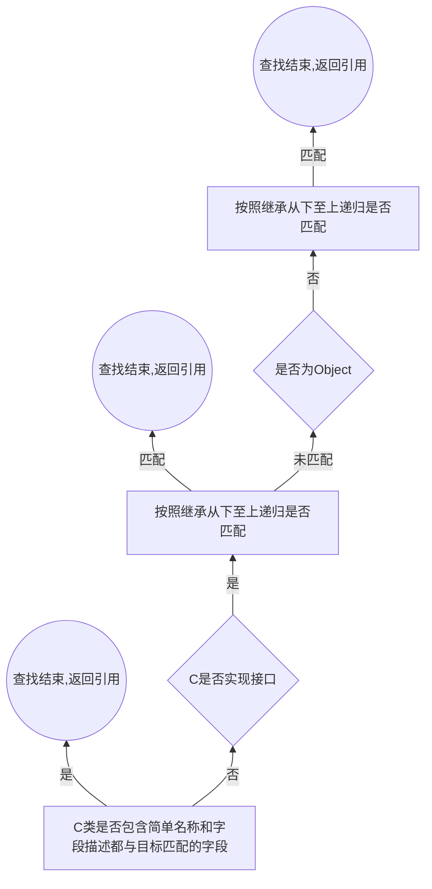
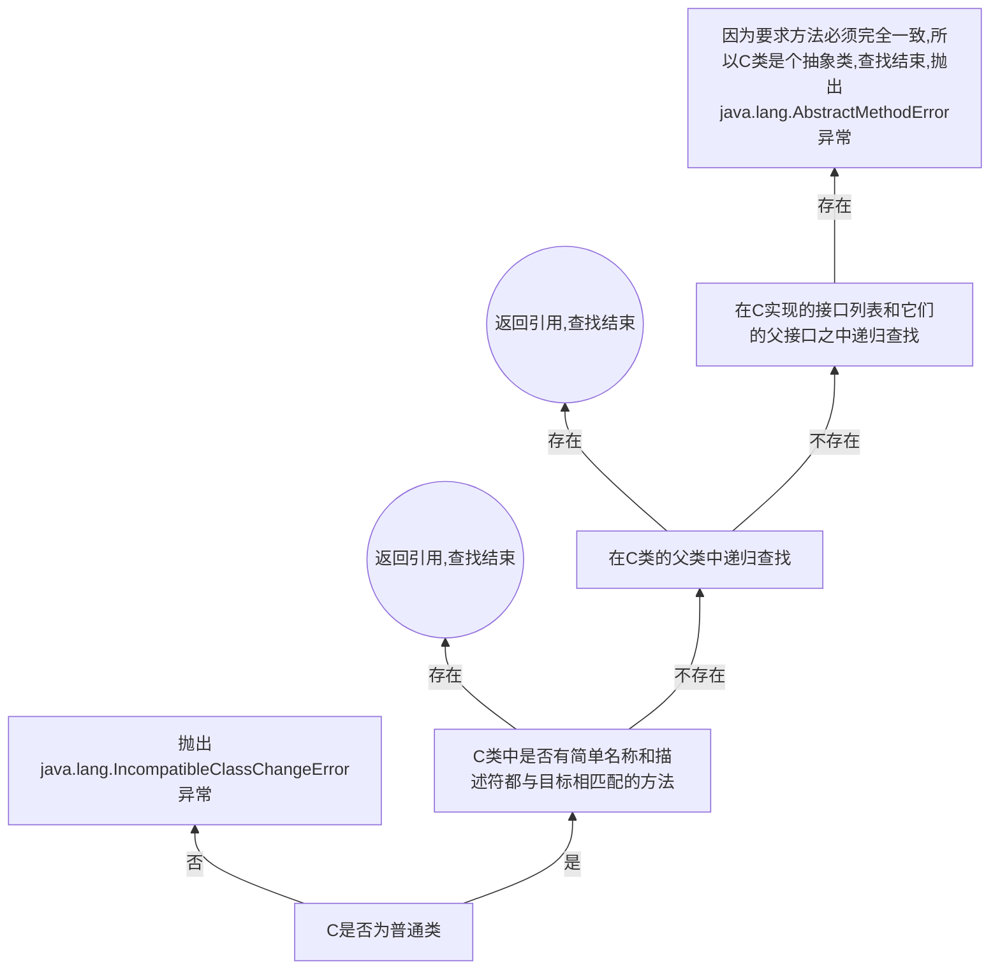
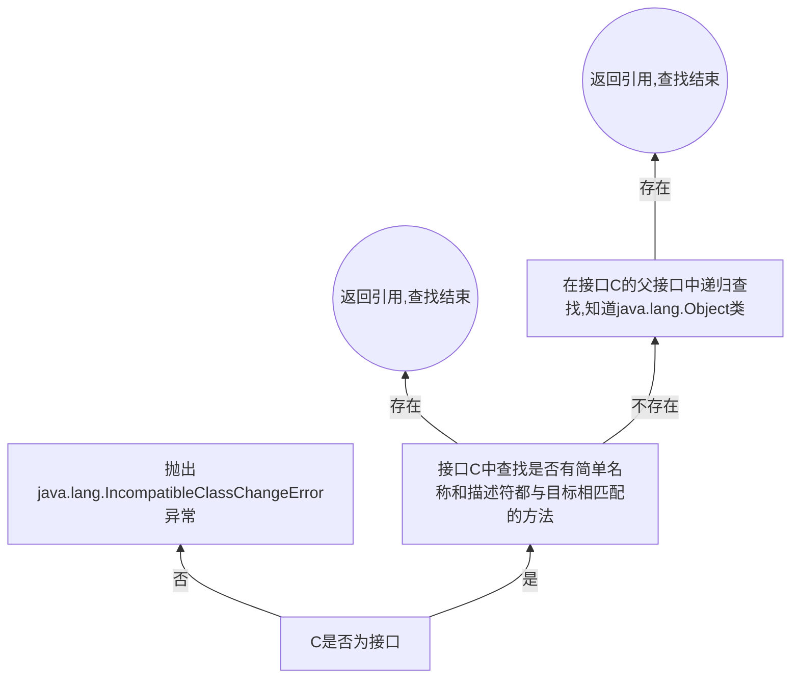
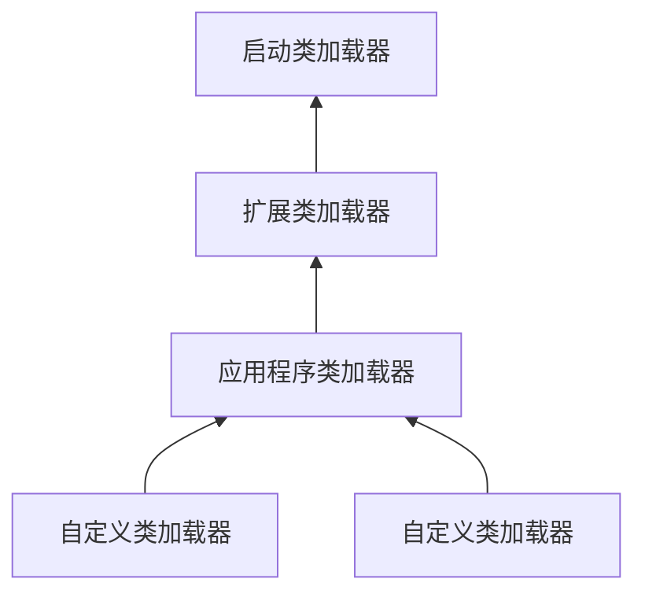

# 虚拟机类加载机制

## 概述

* 虚拟机把描述类的数据从Class文件加载到内存，并对数据进行校验、转换解析和初始化，最终形成可以被虚拟机直接使用的Java类型，这就是虚拟机的类加载机制
* 在Java语言里面，类型的加载、连接和初始化过程都是在程序运行期间完成的，这种策略会略增加性能开销，但是会为Java应用提供高度的灵活性，可以动态扩展的特性就是依赖运行期间动态加载和动态连接这个特点实现的，例如：编写一个面向接口的应用程序，可以等到运行时再指定其实际的实现类；用户可以通过Java预定义的和自定义类加载器，让一个本地的应用程序可以在运行时从网络或其他地方加载一个二进制流作为程序代码的一部分

## 类加载的时机

* 类加载的整个生命周期包括：加载（Loading）、验证（Verification）、准备（Preparation）、解析（Resolution）、初始化（Initialization）、使用（Using）和卸载（Unloading）7个阶段，其中验证、准备、解析3个部分统称为连接（Linking）



* 加载、验证、准备、初始化和卸载这5个阶段的顺序是确定的，类的加载过程必须按照这种顺序按部就班的`开始`（只是开始，并不是按部就班的“进行”或“完成”，这些阶段通常都是互相交叉地混合式进行的，会在一个阶段执行的过程中调用、激活另外一个阶段），而解析阶段则不一定：它在某些情况下可以在初始化阶段之后再开始，这是为了支持Java语言的运行时绑定（也称动态绑定和晚期绑定）

## 类加载的过程

### 加载

* JVM规范中并没有强制约束加载阶段执行的时机，这点可以交给JVM的具体实现来自由把握
* 在加载阶段，虚拟机需要完成一下3件事情：
  * 通过一个类的全限定名来获取定义此类的二进制字节流
  * 将这个字节流所代表的静态存储结构转化为方法区的运行时数据结构
  * 在内存中生成一个代表这个类的java.lang.Class对象，作为方法区这个类的各种数据的访问入口（放入方法区）
* 虚拟机规范的这3点要求其实并不算具体，针对第一条：它没有指明二进制字节流要从一个Class文件中获取，例如：
  * 从ZIP包中读取，最终成为日后的JAR、EAR、WAR格式的基础
  * 从网络中获取，典型的应用：Applet
  * 运行时计算生成，这种场景使用得最多的就是动态代理技术：在java.lang.reflect.Proxy中，就是用了ProxyGenerator.generateProxyClass来为特定接口生成形式为`*$Proxy`的代理类的二进制字节流
  * 由其他文件生成，典型场景时JSP应用，即由JSP文件生成对应的Class类
  * 从数据库中读取，例如有些中间件服务器可以选择把程序安装到数据库中来完成程序代码在集群间的分发
* 相对于类加载过程的其他阶段，一个`非数组类`的加载阶段可控性最强，因为加载阶段既可以使用系统的引导类加载器来完成，也可以由用户自定义的类加载器去完成，开发人员可以通过定义自己的类加载器去控制字节流的获取方式（重写一个类加载器的loadClass()方法）
* 对于数组类而言，数组类本身不通过类加载器创建，它是由JVM直接创建的，但数组类与类加载器仍然有很密切的关系，因为数组类的元素类型最终是要靠类加载器去创建，一个数组类创建过程就遵循以下规则：
  * 如果数组的组件类型是引用类型，那就递归采用定义的加载过程去加载这个组件类型，数据类将在加载该组件类型的类加载器的类名称空间上被标识
  * 如果数组的组件类型不是引用类型（例如：int[]数组），JVM将会把数组类标记为与引导类加载器关联
  * 数组类的可见性与它的组件类型的可见性一致，如果组件类型不是引用类型，那数组类的可见性将默认为public

### 验证

* 验证是连接阶段的第一步，这一阶段的目的是为了确保Class文件的字节流中包含的信息符合当前虚拟机的要求，并且不会危害虚拟机自身安全
* Java语言本身是相对安全的语言，但Class文件并不一定要求用Java源码编译出来，可以使用其他途径产生，虚拟机如果不检查输入的字节流，对其完全信任的话，很可能会因为载入了有害的字节流而导致系统崩溃，所以验证是虚拟机对自身保护的一项重要工作
* 验证阶段大致上会完成下面4个阶段的检验动作：文件格式验证、元数据验证、字节码验证、符号引用验证，文件格式验证是基于二进制字节流进行的，只有通过了这个阶段的验证后，字节流才会进入内存的方法区中进行存储，后面的3个验证阶段全部是基于方法区的存储结构进行的
  * 文件格式验证：验证字节流是否符合Class文件格式的规范，并且能被当前版本的虚拟机处理
    * 是否以魔数0xCAFEBABE开头
    * 主、次版本号是否在当前虚拟机处理范围之内
    * 常量池的常量中是否有不被支持的常量类型
    * 指向常量的各种索引值中是否有指向不存在的常量或不符合类型的常量
    * CONSTANT_Uft8_info型的常量中是否有不符合UTF8编码的数据
    * Class文件中各个部分及文件本身是否有被删除的或附加的其他信息
  * 元数据验证：对字节码描述的信息进行语义分析，保证其描述的信息符合Java语言规范的要求
    * 这个类是否有父类
    * 这个类的父类是否继承了不允许被继承的类
    * 如果这个类不是抽象类，是否实现了其父类或接口之中要求实现的所有方法
    * 类中的字段、方法是否与父类产生矛盾
  * 字节码验证：通过数据流和控制流分析，确定程序语义是否合法、符合逻辑的
    * 保证任意时刻操作数栈的数据类型与指令代码序列都能配合工作
    * 保证跳转指令不会跳转到方法体之外的字节码指令上
    * 保证方法体中的类型转换是有效的
  * 符号引用验证：对类自身以外（常量池中的各种符号引用）的信息进行匹配性校验
    * 符号引用中通过字符串描述的全限定名是否能找到对应的类
    * 在指定类中是否存在符合方法的字段描述符以及简单名称所描述的方法和字段
    * 符号引用中的类、字段、方法的访问性是否可被当前类访问
* 对于虚拟机的类加载机制来说，验证阶段是一个非常重要的、但不是一定必要的阶段，如果所有运行的全部代码都已经被反复使用和验证过，那么在实施阶段就可以考虑使用`-Xverify:none`参数来关闭大部分的类验证措施，以缩短虚拟机类加载的时间

### 准备

* 准备阶段是正式为类变量分配内存并设置类变量初始值的阶段，这些变量所使用的内存都将在方法区中进行分配，这时候进行内存分配的仅包括类变量（被static修饰的变量），而不包括实例变量，实例变量将会在对象实例化时随着对象一起分配在Java堆中，这里所说的初始值"通常情况"下是数据类型的零值

基本数据类型的零值：

|数据类型|零值|
|---|---|
|int|0|
|long|0L|
|short|(short)0|
|char|'\u0000'|
|byte|(byte)0|
|boolean|false|
|float|0.0f|
|double|0.0d|
|reference|null|

* 如果类字段的字段属性表中存在`ConstantValue`属性，那么在准备阶段变量value就会被初始化为ConstantValue属性所指定的值

### 解析

* 解析阶段是虚拟机将常量池内的符号引用替换为直接引用的过程
  * 符号引用（Symbolic Reference）：符号引用以一组符号来描述所引用的目标，符号可以是任何形式的字面量，只要使用时能无歧义地定位到目标即可。符号引用与虚拟机实现的内存布局无关，引用的目标并不一定已经加载到内存中，各种虚拟机实现的内存布局可以各不相同，但是他们能接受的符号引用必须都是一致的，因为符号引用的字面量形式明确定义在JVM规范的Class文件格式中
  * 直接引用（Direct Reference）：直接引用可以是直接指向目标的指针、相对偏移量或是一个能间接定位到目标的句柄，直接引用是和虚拟机实现的内存布局相关的，同一个符号引用在不同虚拟机实例上翻译出来的直接引用一般不会相同，如果有了直接引用，那引用的目标必须已经在内存中存在
* 虚拟机规范之中并未规定解析阶段发生的具体时间，只要求了在执行`anewarray`、`checkcast`、`getfield`、`getstatic`、`instanceof`、`invokedynamic`、`invokeinterface`、`invokespecial`、`invokestatic`、`invokevirtual`、`ldc`、`ldc_w`、`multianewarray`、`new`、`putfield`和`putstatic`这16个用于操作符号引用的字节码指令之前，先对它们所使用的符号引用进行解析，所以虚拟机实现可以根据需求来判断到底是在类被加载器加载时就对常量池中的符号引用进行解析，还是等到一个符合引用将要被使用前才去解析它
* 对同一个符号引用进行多次解析请求是很常见的事情，除`invokedynamic`指令以外，虚拟机实现可以对第一次解析的结果进行缓存（在运行时常量池中记录直接引用，并把常量标识为已解析状态）从而避免解析动作重复进行
* 对于`invokedynamic`指令，上面规则则不成立，当碰到某个前面已经由invokedynamic指令触发过解析的符号引用时，并不意味着这个解析结果对于其他invokedynamic指令也同样生效，因为invokedynamic指令的目的本来就是用于动态语言支持，它所对应的引用称为`动态调用点限定符`，这里`动态`的含义就是必须等到程序实际运行到这条指令的时候，解析动作才能进行，相对的，其余可触发解析的指令都是`静态的`，可以在刚刚完成加载阶段，还没有开始执行代码时就进行解析
* 解析动作主要针对类或接口、字段、类方法、接口方法、方法类型、方法句柄和调用点限定符7类符号引用进行，分别对应与常量池的`CONSTANT_Class_info`、`CONSTANT_Fieldref_info`、`CONSTANT_Methodref_info`、`CONSTANT_InterfaceMethodref_info`、`CONSTANT_MethodType_info`、`CONSTANT_MethodHandle_info`和`CONSTANT_InvokeDynamic_info`7中常量类型

#### 类或接口的解析

假设当前代码所处的类为D，如果要把一个从未解析过的符号引用N解析为一个类或接口C的直接引用



* 一旦这个加载过程出现了任何异常，解析过程就宣告失败
* 解析完成之前还要进行符号引用验证，确认D是否具备对C的访问权限，如果发现不具备访问权限，将抛出`java.lang.IllegalAccessError`异常

#### 字段解析

首先将会对字段表内class_index项索引的CONSTANT_Class_info符号引用进行解析，也就是字段所属的类或接口的符号引用，如果在解析这个类或接口符号引用的过程中出现了任何异常，都会导致字段符号引用解析的失败，如果解析成功完成，那将这个字段所属的类或接口用C表示



* 如果查找失败，则抛出`java.lang.NoSuchFieldError`异常
* 如果查找成功返回了引用，将会对这个字段进行权限验证，如果发现不具备对字段的访问权限，将抛出`java.lang.IllegalAccessError`异常

#### 类方法解析

先解析出类方法表的class_index项中索引的方法所属的类或接口的符号引用，如果解析成功，用C表示这个类



* 方法查找失败，抛出`java.lang.NoSuchMethodError`
* 如果查找过程成功返回了直接引用，将会对这个方法进行权限验证，如果发现不具备对此方法的访问权限，将抛出`java.lang.IllegalAccessError`异常

#### 接口方法解析

接口方法也需要先解析出接口方法表的class_index项中索引的方法所属的类或接口的符号引用，如果解析成功，依然用C表示这个接口



### 初始化

* 类初始化阶段是类加载过程的最后一步，前面的类加载过程中，除了在加载阶段用户应用程序可以通过自定义类加载器参与之外，其余动作完全由虚拟机主导和控制，到了初始化阶段，才真正开始执行类中定义的Java程序代码（或者说是字节码）
* 主动引用：虚拟机规范严格规范了有且只有5种情况必须立即对类进行“初始化”
  * 遇到`new`、`getstatic`、`putstatic`或`invokestatic`这4条字节码指令时，如果类没有进行过初始化，则需要先触发其初始化，生成这4条指令的最常见的Java代码场景是：使用new关键字实例化对象的时候、读取或设置一个类的静态字段（被final修饰、已在编译期把结果放入常量池的静态字段除外）的时候，以及调用一个类的静态方法的时候
  * 使用`java.lang.reflect`包的方法对类进行反射调用的时候，如果类没有进行过初始化，则需要先触发其初始化
  * 当初始化一个类的时候，如果发现其父类还没有进行过初始化，则需要先触发其父类的初始化，但是一个接口在初始化时，并不要求其父类接口全部都完成了初始化，只有真正使用到父接口的时候（如引用接口中定义的常量）才会初始化
  * 当虚拟机启动时，用户需要指定一个要执行的主类（包含main()方法的那个类），虚拟机先会初始化这个主类
  * 如果一个`java.lang.invoke.MethodHandle`实例最后的解析结果REF_getStatic、REF_putStatic、REF_invokeStatic的方法句柄，并且这个方法句柄所对应的类没有进行过初始化，则需要先触发其初始化
* 被动引用：除以上5种主动初始化情况外，所有引用类的方式都不会触发初始化
  * 对于静态字段，只有直接定义这个字段的类才会被初始化，因此通过其子类来引用父类中定义的静态字段，只会触发父类的初始化而不会触发子类的初始化，但也可通过`-XX:+TraceClassLoading`参数来使子类的加载
  * 通过数组定义来引用类，不会触发此类的初始化 
  * 常量在编译阶段会存入调用类的常量池中，本质上并没有直接引用到定义常量的类，因此不会触发定义常量的类的初始化
* 初始化阶段是执行类构造器`<clinit>()`方法的过程
  * `<clinit>()`方法是由编译器自动收集类中的所有类变量的赋值动作和静态代码块（static{}块）中的语句合并产生的，顺序与源文件中的一致，静态代码块中只能访问到定义在静态代码块之前的变量
  * `<clinit>()`方法与类的构造函数（或者说实例构造器`<init>()`方法）不同，它不需要显式地调用父类构造器，虚拟机会保证在子类的`<clinit>()`方法执行之前，父类的`<clinit>()`方法已经执行完毕，因此在虚拟机中第一个被执行的`<clinit>()`方法的类肯定是`java.lang.Object`
  * 由于父类的`<clinit>()`方法先执行，也就意味着父类中定义的静态代码块要优先于子类的变量赋值操作
  * `<clinit>()`方法对于类或接口来说并不是必需的，如果一个类没有静态代码块，也没有对变量的赋值操作，那么编译器可以不为这个类生成`<clinit>()`方法
  * 接口中不能使用静态代码块，但仍然有变量初始化的赋值操作，因此接口与类一样都会生成`<clinit>()`方法，但接口与类不同的是，执行接口的`<clinit>()`方法不需要先执行父接口的`<clinit>()`方法，只有当父接口中定义的变量使用时，父接口才会初始化，另外，接口的实现类在初始化时也一样不会执行接口的`<clinit>()`方法
  * 虚拟机会保证一个类的`<clinit>()`方法在多线程环境中被正确地加锁、同步，如果多个线程同时去初始化一个类，那么只会有一个线程去执行这个类的`<clinit>()`方法，其他线程都需要阻塞等待，直到活动线程执行`<clinit>()`方法完毕，如果一个类的`<clinit>()`方法中有耗时很长的操作，就可能造成多个进程阻塞

## 类加载器

`通过一个类的全限定名来获取描述此类的二进制字节流`这个动作放到JVM外部去实现，以便让应用程序自己决定如何去获取需要的类，实现这个动作的代码模块称为`类加载器`

### 类与类加载器

对于任意一个类，都需要由加载它的类加载器和这个类本身一同确立其在JVM中的唯一性，每一个类加载器，都拥有一个独立的类名称空间，即：比较两个类是否“相等”，只有在这两个类是由同一个类加载器加载的前提下才有意义，这里所指的“相等”，包括代表类的Class对象的equals()方法、isAssignableFrom()方法、isInstance()方法的返回结构，也包括使用instanceof关键字做对象所属关系判定等情况

```java
package com.xiaoxin008.jvmexecute.loader;
/**
 * 如果一个类由两个不同的类加载器加载进来，这两个类是否相同
 *
 * @author xiaoxin008(313595055 @ qq.com)
 * @since 1.0.0
 */
public class DifferentClassloader {

public static void main(String[] args) throws Exception{
        ClassLoader classLoader = new ClassLoader(){
            @Override
            public Class<?> loadClass(String name) throws ClassNotFoundException {
                try {
                    String filename = name.substring(name.lastIndexOf(".") + 1) + ".class";
                    InputStream is = getClass().getResourceAsStream(filename);
                    if(is == null){
                        return super.loadClass(name);
                    }
                    byte[] b = new byte[is.available()];
                    is.read(b);
                    return defineClass(name,b,0,b.length);
                } catch (IOException e) {
                    e.printStackTrace();
                    throw new ClassNotFoundException(name);
                }
            }
        };
        Object obj = classLoader.loadClass("com.xiaoxin008.jvmexecute.loader.DifferentClassloader").newInstance();
        ClassLoader systemClassLoader = ClassLoader.getSystemClassLoader();
        Object systemObj = systemClassLoader.loadClass("com.xiaoxin008.jvmexecute.loader.DifferentClassloader").newInstance();
        System.out.println(obj.getClass());
        System.out.println(obj instanceof com.xiaoxin008.jvmexecute.loader.DifferentClassloader);
        System.out.println(systemObj instanceof com.xiaoxin008.jvmexecute.loader.DifferentClassloader);
    }
}
```

执行结果：

```txt
class com.xiaoxin008.jvmexecute.loader.DifferentClassloader
false
true
```

### 双亲委派模型

从Java虚拟机的角度来讲，只存在两种不同的类加载器：一种是启动类加载器（Bootstrap ClassLoader），这个类加载器使用C++语言实现，是虚拟机自身的一部分；另一种就是所有其他的类加载器，这些类加载器都由Java语言实现，独立于虚拟机外部，并且全部继承自抽象类java.lang.ClassLoader

* 启动类加载器（Bootstrap ClassLoader）：这个类加载器负责将存放在`<JAVA_HOME>\lib `目录的，或者被`-Xbootclasspath`参数所指定的路径中的，并且是虚拟机识别的（仅按照文件名识别，如`rt.jar`，名字不符合的类库即使放在lib目录中也不会被加载）类库加载到虚拟机内存中。启动类加载器无法被Java程序直接引用，用户在编写自定义类加载器时，如果需要把加载请求委派给引导类加载器，那直接使用null代替即可
* 扩展类加载器（Extension ClassLoader）：这个加载器由`sun.misc.Launcher$ExtClassLoader`实现，它负责加载`<JAVA_HOME>\lib\ext `目录中的，或者被`java.ext.dirs`系统变量所指定的路径中的所有类库，开发者可以直接使用扩展类加载器
* 应用程序类加载器（Application ClassLoader）：这个类加载器由`sun.misc.Launcher$App-ClassLoader`实现，由于这个类加载器是ClassLoader中的getSystemClassLoader()方法的返回值，所以一般也称它为系统类加载器，它负责加载用户类路径（ClassPath）上所指定的类库，开发者可以直接使用这个类加载器，如果应用程序中没有自定义过自己的类加载器，一般情况下这个就是程序中默认的类加载器



* 流程图中展示的类加载之间的这种层次关系，称为类加载器的`双亲委派模型（Parents Delegation Model）`，双亲委派模型要求除了顶层的启动类加载器之外，其余的加载器都应当有自己的父类加载器，这里类加载器之间的父子关系一般不会以继承的关系来实现，而是都使用组合关系来复用父加载器的代码
* 双亲委派模型的工作过程是：如果一个类加载器收到了类加载的请求，它首先不会自己去尝试加载这个类，而是把这个请求委派给父类加载器去完成，每一个层次的类加载器都是如此，因此所有的加载请求最终都应该传送到顶层的启动类加载器中，只有当父加载器反馈自己无法完成这个加载请求（它的搜索范围中没有找到所需的类）时，子加载器才会尝试自己去加载
* 使用双亲委派模型来组织类加载器之间的关系，有一个显而易见的好处就是Java类随着它的类加载器一起具备了一种带有优先级的层次关系，例如类`java.lang.Object`，它存放在`rt.jar`之中，无论哪一个类加载器要加载这个类，最终都是委派给处于模型最顶端的启动类加载器进行加载，因此Object类在程序的各种类加载环境中都是同一个类，相反，如果没有使用双亲委派模型，由各个类加载器自行去加载的话，那系统中将会出现多个不同的Object类
* 双亲委派模型对于保证Java程序的稳定运作很重要，但它的实现却非常简单，实现双亲委派的代码都集中在`java.lang.ClassLoader`的`loadClass()`方法中

```java
protected Class<?> loadClass(String name, boolean resolve)
        throws ClassNotFoundException
    {
        synchronized (getClassLoadingLock(name)) {
            //首先，检查请求的类是否已经被加载过了
            Class c = findLoadedClass(name);
            if (c == null) {
                long t0 = System.nanoTime();
                try {
                    if (parent != null) {
                        c = parent.loadClass(name, false);
                    } else {
                        c = findBootstrapClassOrNull(name);
                    }
                } catch (ClassNotFoundException e) {
                    // 如果父类加载器抛出ClassNotFoundException
                    // 说明父类加载器无法完成加载请求
                }

                if (c == null) {
                    // 在父类加载器无法加载的时候再调用本身的findClass方法进行类加载
                    long t1 = System.nanoTime();
                    c = findClass(name);
                    sun.misc.PerfCounter.getParentDelegationTime().addTime(t1 - t0);
                    sun.misc.PerfCounter.getFindClassTime().addElapsedTimeFrom(t1);
                    sun.misc.PerfCounter.getFindClasses().increment();
                }
            }
            if (resolve) {
                resolveClass(c);
            }
            return c;
        }
    }
```

### 破坏双亲委派模型

双亲委派模型并不是一个强制性的约束模型，而是Java设计者推荐给开发者的类加载器实现方式，在Java的世界中大部分的类加载器都遵循这个模型，但也有例外：
* JDK1.2之前未引入双亲委派模型时，用户去继承java.lang.ClassLoader的唯一目的就是为了重写loadClass方法，调用用户自己的loadClass()
* JNDI、JDBC、JCE、JAXB、JBI等，要使用线程上下文类加载器去加载所需要的自定义代码
* 代码热替换、模块热部署