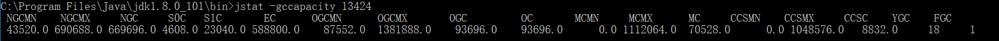
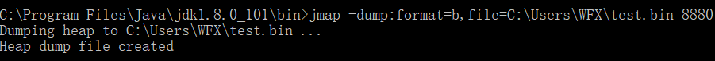
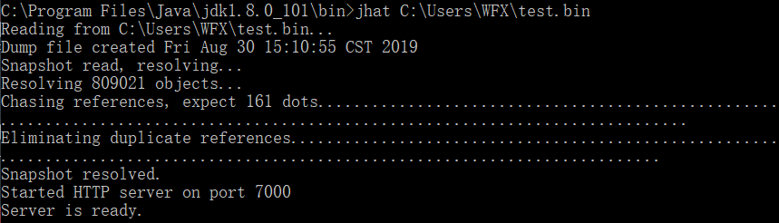
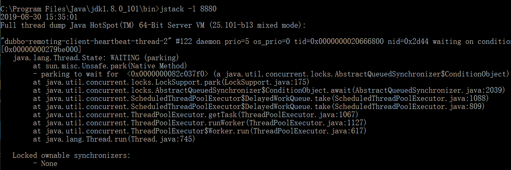
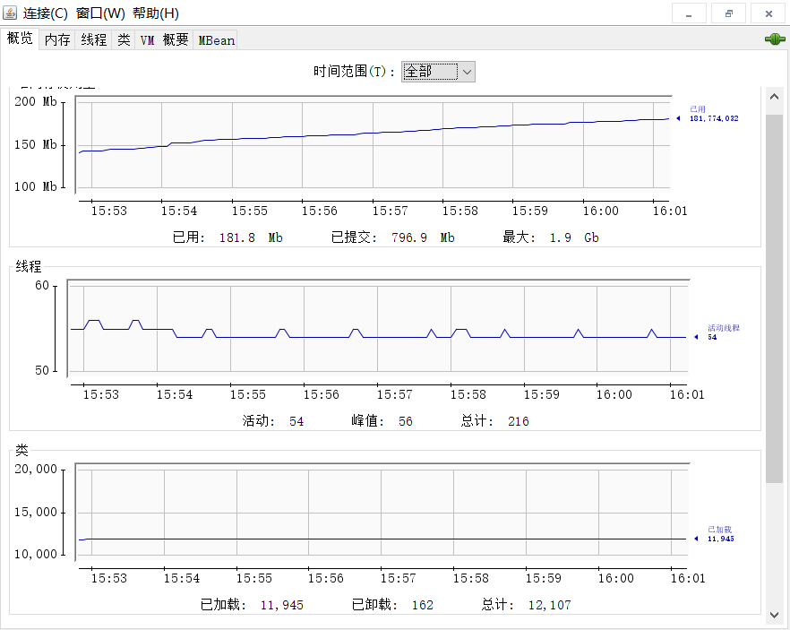
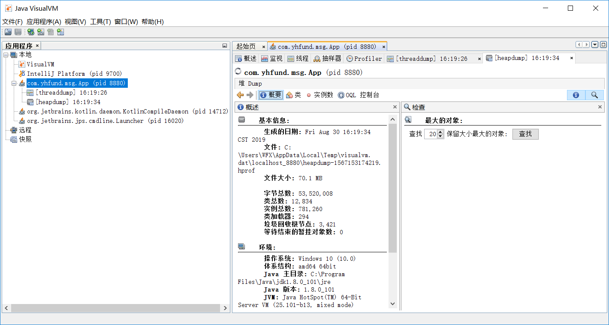

# JVM性能监控与故障处理工具

## JDK的命令行工具

|名称|主要作用|
|---|---|
|jps|JVM Process Status Tool，显示指定系统内所有的JVM进程|
|jstat|JVM Statistics Monitoring Tool，用于手机JVM各方面的运行数据|
|jinfo|Configuration Info for Java，显示虚拟机配置信息|
|jmap|Memory Map for Java，生成JVM的内存转储快照（heapdump文件）|
|jhat|JVM Heap Dump Browser，用于分析heapdump文件，它会建立一个HTTP/HTML服务器，让用户可以在浏览器上查看分析结果|
|jstack|Stack Trace for Java，显示JVM的线程快照|

### jps：JVM进行状况工具

可以列出正在运行的JVM进程，并显示JVM执行主类（Main Class，main()函数所在类）名称以及这些进程的本地虚拟机唯一ID（Local Virtual Machine Identifier，LVMID）

命令格式：jps [ option ]

|选项|作用|
|---|---|
|-q|只输出LVMID，省略主类的名称|
|-m|输出JVM进程启动时传递给主类main()函数的参数|
|-l|输出主类的全名，如果进程执行的是Jar包，输出Jar路径|
|-v|输出JVM进程启动时JVM参数|

### jstat：JVM统计信息监视工具

用于监视JVM各种运行状态信息的命令行工具，它可以显示本地或者远程JVM进程中的类装载、内存、垃圾收集、JIT编译等运行数据

命令格式：jstat [ option vmid [interval[s|ms] [count]] ]

vmid：如果是本地JVM进程，VMID与LVMID是一致的，如果是远程JVM进程，那VMID的格式应当是：`[protocol:][//]lvmid[@hostname[:port]/servername]`

* E：表示Eden
* S0，S1：表示Survivor0，Survivor1
* O：表示老年代
* M：表示元空间
* CCS：表示压缩使用比例
* YGC：表示Young GC 发生Minor GC
* FGC：表示Full GC 发生Full GC
* FGCT：表示Full GC Time
* GCT：表示GC Time

* Loaded：加载class的数量
* Bytes：所占用空间的大小
* Unloaded：未加载数量
* Bytes：未加载占用空间
* Time：时间

* NGCMN：新生代最小容量
* NGCMX：新生代最大容量
* NGC：当前新生代容量
* S0C：第一个Survivor区大小
* S1C：第二个Survivor区的大小
* EC：Eden区的大小
* OGCMN：老年代最小容量
* OGCMX：老年代最大容量
* OGC：当前老年代大小
* OC：当前老年代带下
* MCMN：最小元数据容量
* MCMX：最大元数据容量
* MC：当前元数据空间大小
* CCSMN：最小压缩类空间大小
* CCSMX：最大压缩类空间大小
* CCSC：当前压缩类空间大小
* YGC：Minor GC次数
* FGC：Full GC次数

|选项|作用|
|---|---|
|-class|监视类装载、卸载数量、总空间以及类装载所耗费的时间|
|-gc|监视Java堆状况、包括Eden区、两个Survivor区、老年代、永久代等的容量、已用空间、GC时间合计等信息|
|-gccapacity|监视内容与-gc基本相同，但输出主要关注Java堆各个区域使用到的最大、最小空间|
|-gcutil|监视内容与-gc基本相同，但输出主要关注已使用空间占总空间的百分比|
|-gccause|与-gcutil功能一样，但是会额外输出导致上一次GC产生的原因|
|-gcnew|监视新生代GC状况|
|-gcnewcapacity|监视内容与-gcnew基本相同，输出主要关注使用到的最大、最小空间|
|-gcold|监视老年代GC状况|
|-gcoldcapacity|监视内容与-gcold基本相同，输出主要关注使用到的最大、最小空间|
|-gcpermcapacity|输出永久代使用到的最大、最小空间|
|-compiler|输出JFT编译器编译过的方法、耗时等信息|
|-printcompilation|输出已经被JFT编译的方法|

### jinfo：Java配置信息工具

实时地查看和调整JVM各项参数

命令格式：jinfo [option] pid

### jmap：Java内存映像工具

jmap（Memory Map for Java）命令用于生成堆存储快照（一般称为heapdump或dump文件），还可以查询finalize执行队列、Java堆和永久代的详细信息，如空间使用率、当前用的是哪种收集器等

命令格式：jmap [option] vmid

|选项|格式|
|---|---|
|-dump|生成Java堆转储快照。格式为：-dump:live,format=b,file=<filename>，其中live子参数说明是否只dump出存活的对象|
|-finalizerinfo|显示在F-Queue中等待Finalizer线程执行finalize方法的对象。只在Linux/Solaris平台下有效|
|-heap|显示Java堆详细信息，如使用哪种回收器、参数配置、分代状况等。只在Linux/Solaris平台下有效|
|-histo|显示堆中对象统计信息，包括类、实例数量、合计容量|
|-permstat|以ClassLoader为统计口径显示永久代内存状态。只在Linux/Solaris平台下有效|
|-F|当JVM进程对-dump选项没有响应时，可使用这个选项强制生成dump快照。只在Linux/Solaris平台下有效|

### jhat：JVM堆转储快照分析工具

JDK提供jhat命令与jmap搭配使用，来分析jmap生成的堆转储快照。jhat内置了一个微型的HTTP/HTML服务器，生成dump文件的分析结果后，可以在浏览器中查看，但一般不会使用，原因：

* 一般不会在部署应用程序的服务器上直接分析dump文件，因为分析工作是一个耗时且消耗硬件资源的过程，既然都要在其他机器进行，就没有必要受到命令行工具的限制了
* jhat分析功能比较简陋

命令格式：jhat [dump文件路径]

### jstack：Java堆栈跟踪工具

jstack（Stack Trace for Java）命令用于生成JVM当前时刻的线程快照（一般称为threaddump或者javacore文件），线程快照就是当前JVM内每一条线程正在执行的方法堆栈的集合，生成线程快照的主要目的是定位线程出现长时间停顿的原因。

命令格式：jstack [option] vmid

|选项|作用|
|---|---|
|-F|当正常输出的请求不被响应时，强制输出线程堆栈|
|-l|除堆栈外，显示关于锁的附加信息|
|-m|如果调用到本地方法的话，可以显示C/C++的堆栈|

## JDK的可视化工具

## JConsole：Java监视与管理控制台

JConsole是一种基于JMX的可视化监视管理工具。它管理部分的功能是针对JMX MBean进行管理，由于MBean可以使用代码、中间件服务器的管理控制台或者所有符合JMX规范的软件进行访问

1. 启动JConsole：双击JDK/bin目录下的`jconsole.exe`
2. 内存监控：`内存`页相当于可视化的jstat命令
3. 线程监控：`线程`页相当于可视化的jstack命令

## VisualVM：多合一故障处理工具

VisualVM是目前为止随JDK发布的功能最强大的运行监视和故障处理程序，具有运行监视、故障处理、性能分析等功能

1. 启动VisualVM：双击JDK/bin目录下的`jvisualvm.exe`
2. 插件的使用：BTrace（后面单独解析）

