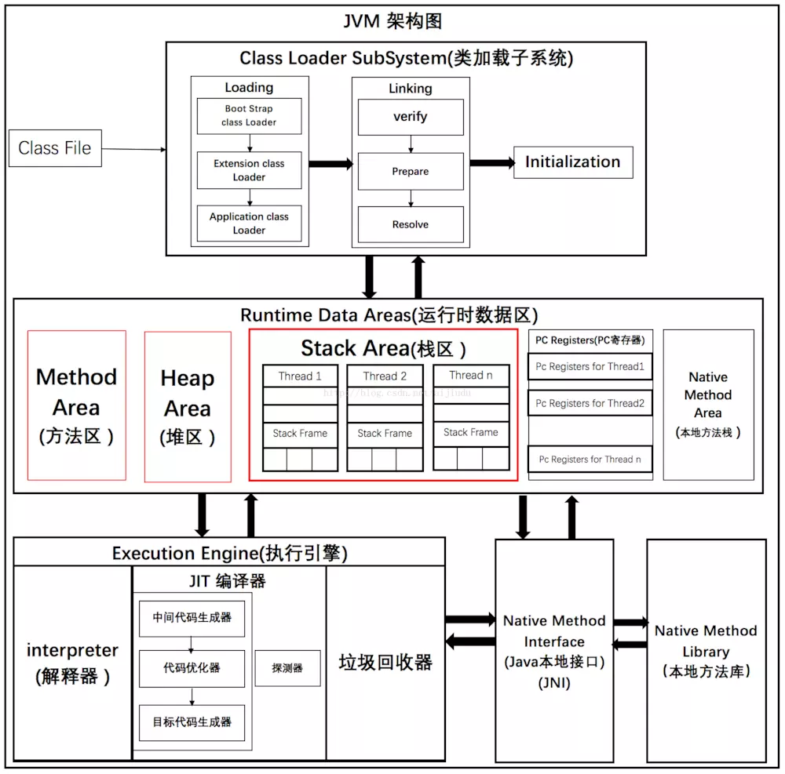
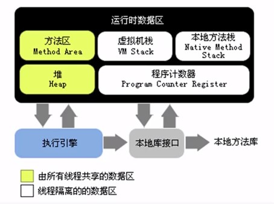
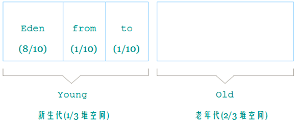
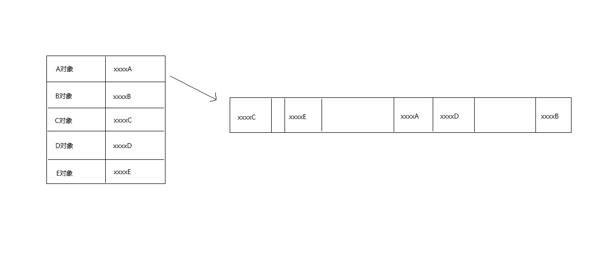
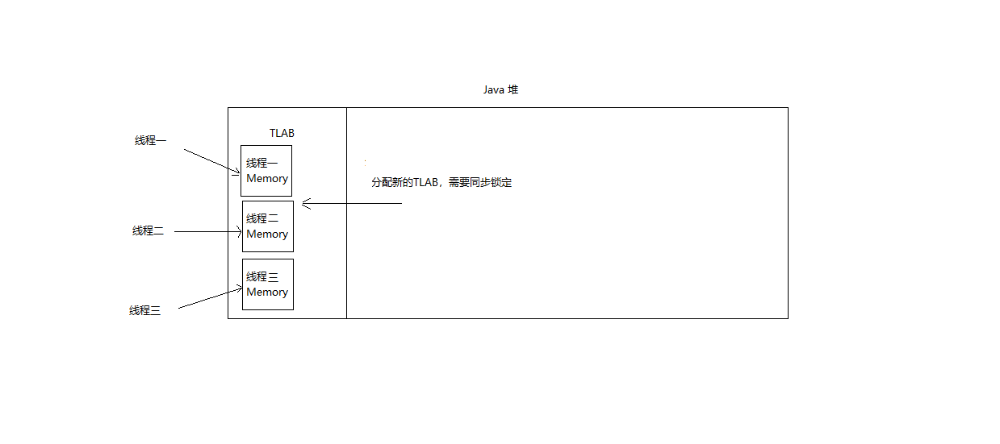
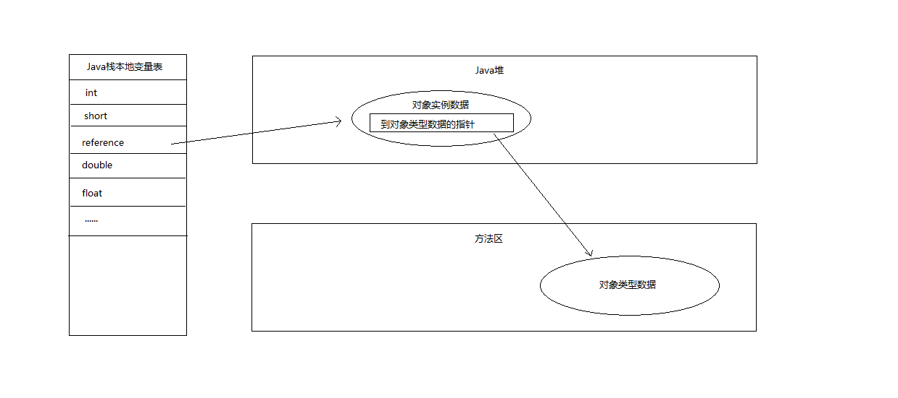

# 运行时数据区域

## 总览





### 程序计数器

程序计数器（Program Counter Register）也称：PC寄存器。

* 是一块较小的内存空间，可看作是当前线程所执行的字节码的行号指示器（实质上是指针偏移量）
* 由于JVM多线程是通过线程轮流切换并分配处理器执行时间的方式来实现的，为了线程切换后能恢复到正确的执行位置
* 是线程私有的内存（各线程之间计数器互不影响，独立存储），并随线程创建而被创建，随线程销毁而被销毁
* 若当前线程执行的是Java方法，记录的是正在执行的虚拟机字节码指令地址，若为本地方法，计数器值为undefined
* 此内存区域是唯一一个在Java虚拟机规范中没有规定任何OOM异常的区域（因为计数器一直都在做更新操作，不会占用新的内存空间）

### Java虚拟机栈

Java虚拟机栈（Java Virtual Machine Stacks），使用`-Xss<size>`来设置Java线程堆栈大小

* 线程私有，生命周期与线程相同
* 描述的是Java方法执行的内存模型，每个方法在执行的同时都会创建一个栈帧，用于存储局部变量表、操作数栈、动态链接、方法出口等信息。每一个方法从调用直至执行完成的过程，都对应着一个栈帧在虚拟机栈中入栈到出栈的过程
* 局部变量表存放了：基本数据类型、对象引用类型（不等同于对象本身，可能是一个指向对象起始地址的引用指针）、returnAddress类型（字节码指令地址）
* 当线程请求的栈深度大于虚拟机所允许的深度，抛出StackOverflowError
* 若虚拟机栈可动态扩展，扩展时无法申请到足够内存，抛出OOM异常

### 本地方法栈

本地方法栈（Native Method Stack）

* 与虚拟机栈作用类似
* 虚拟机栈为字节码服务，本地方法栈为虚拟机使用到的Native方法服务

### Java堆

Java堆（Java Heap），使用`-Xmx<size>`,`-Xms<size>`来设置Java堆的初始最大、最小值



|指令|含义|
|---|---|
|-Xms|初始堆大小。如：-Xms256m|
|-Xmx|最大堆大小。如：-Xmx512m|
|-Xmn|新生代大小。通常为 Xmx 的 1/3 或 1/4。新生代 = Eden + 2 个 Survivor 空间。实际可用空间为 = Eden + 1 个 Survivor，即 90%|
|-XX:NewRatio|新生代与老年代的比例，如 –XX:NewRatio=2，则新生代占整个堆空间的1/3，老年代占2/3|
|-XX:SurvivorRatio|新生代中 Eden 与 Survivor 的比值。默认值为 8。即 Eden 占新生代空间的 8/10，另外两个 Survivor 各占 1/10|
|-XX:+PrintGCDetails|打印 GC 信息|
|-XX:+HeapDumpOnOutOfMemoryError|让虚拟机在发生内存溢出时 Dump 出当前的内存堆转储快照，以便分析用|

* 在虚拟机启动时创建，被所有线程共享，且只有一个，是Java虚拟机所管理的内存中最大的一块
* 目的是存放对象实例，`几乎`所有的对象实例都在这里分配内存
* Java堆是GC管理的主要区域，采用分代收集算法
* Java堆还可细分为：新生代（Young Generation）、老生代（Old Generation）。其中，新生代又分为Eden空间、From Survivor空间和To Survivor空间，而Survivor空间和To Survivor空间又统称为幸存区(Survivor Spaces)，正常情况下，对象从创建到销毁，先由Eden开始，然后到Survivor Spaces，再到Old Generation，最后在某次GC下消失
* Java堆可以处于物理上不连续的内存空间中，只要逻辑是连续的即可
* 如果在堆中没有内存完成实例分配，并且堆也无法再扩展时，抛出OOM异常

### 方法区

方法区（Method Area），又称：Non-Heap（非堆），使用`-XX:MaxPermSize=<size>`，`-XX:PermSize=<size>`（元空间使用：`-XX:MaxMetaspaceSize=<size>`，`-XX:MetaspaceSize=<size>`）来设定永久代/元空间扩容时触发Full GC的初始化阈值

* 在虚拟机启动时创建，被所有线程共享，且只有一个
* 用于存储已被虚拟机加载的类信息、常量、静态变量、即时编译器编译后的代码等数据
* JDK1.7之前，HotSpot虚拟机把GC分代收集扩展至方法区，使用永久代来实现方法区，但这样更容易遇到内存溢出问题。在JDK1.7之后，使用了元空间来实现方法区，区别在于：元空间属于本地内存，且只存储类的元信息，静态变量和常量池并入堆中，相当于永久代的数据被分到了堆和元空间中
* 当方法区无法满足内存分配需求时，将抛出OOM异常

### 运行时常量池

运行时常量池（Runtime Constant Pool）

* 是方法区的一部分，Class文件中除版本、字段、方法、接口等描述信息外，还有一项信息是常量池，用于存放编译期生成的各种字面量和符号引用
* 具备动态性，Java语言并不要求常量一定只有编译期才能产生，即并非预置入Class文件中常量池的内容才能进入方法区运行时常量池，运行期间也可能将新的常量放入池中，如：String类的intern()方法
* 当常量池无法再申请到内存时会抛出OOM异常

### 直接内存

直接内存（Direct Memory）,使用`-XX:MaxDirectMemorySize=<size>`来设置内存大小，如不指定则与Java堆最大值（-Xmx指定）一样

* 直接内存并不是虚拟机运行时数据区的一部分，但也可能导致OOM异常出现
* 各个内存区域总和大于物理内存限制，从而导致动态扩展时出现OOM异常

## 简单对象的创建

简单对象：仅限于普通Java对象，不包括数组和Class对象等

### 创建过程

1. 虚拟机遇到一条new指令时，先判断这个对象所引用（依赖）的类是否被加载，如果没被加载，则先执行相应的类加载过程

2. 为新对象分配内存（从堆中划分），分配方式有：指针碰撞，空闲列表，保持原子性：TLAB
    * 指针碰撞：Java堆内存绝对规整
    
    * 空闲列表：Java堆内存不规整
    
    * TLAB（Thread Local Allocation Buffer）：可通过`-XX:+/-UseTLAB`启用或禁用
    
3. 将新对象中的字段都初始化为零值

4. 虚拟机对对象进行必要的设置，如：这个对象是哪个类的实例、如何才能找到类的元数据信息、对象的HASH码、对象的GC分代年龄等信息，将这些信息存放在对象的对象头中

5. 执行`<init>`方法，把对象按照程序员的意愿进行初始化

### 内存布局

* 对象头（Header）
  * 存储对象自身的运行时数据：HashCode、GC分代年龄、锁状态标志、线程持有的锁、偏向线程ID...
  * 类型指针：对象指向它的类元数据的指针，虚拟机通过这个指针来确定这个对象是哪个类的实例
* 实例数据（Instance Data）:程序代码中所定义的各种类型的字段内容
* 对齐填充（Padding）:不是必然存在的，没有特别含义，仅起着占位符的作用，由于虚拟机自动内存管理系统要求对象起始地址必须是8字节的整数倍，即对象的大小必须是8字节的整数倍。因此，当对象实例数据部分没有对齐时，就需要通过对齐填充来补全

### 访问定位

Java程序需要通过栈上的reference数据来操作堆上的具体对象，访问方式主要有两种：

* 句柄：Java堆中会划分出一块内存来作为句柄池，reference中存储的就是对象的句柄地址，而句柄中包含了对象实例数据与类型数据各自的具体地址信息
  
* 直接指针：reference中存储的直接就是对象地址
  
两种访问方式各有优劣：

* 句柄：在对象被移动时只会改变句柄中的实例数据指针，而reference本身不需要修改
* 直接指针：速度更快，节省了一次指针定位的时间开销

## OOM异常解析

### Java堆溢出

```java
/**
 * Java堆-OOM异常
 * VM Args：-Xms20M -Xmx20M -XX：+HeapDumpOnOutOfMemoryError
 *
 * @author xiaoxin008(313595055 @ qq.com)
 * @since 1.0.0
 */
public class HeapOOM {

    static class OOMObject{
    }

    public static void main(String[] args) {
        List<OOMObject> list = new ArrayList<>();
        while (true){
            list.add(new OOMObject());
        }
    }
}
```

运行结果：

```txt
java.lang.OutOfMemoryError: Java heap space
Dumping heap to java_pid7904.hprof ...
Heap dump file created [28178849 bytes in 0.103 secs]
```

### 虚拟机栈和本地方法栈溢出

```java
/**
 * Java栈-SOF异常
 * VM Args: -Xss108k
 *
 * @author xiaoxin008(313595055 @ qq.com)
 * @since 1.0.0
 */
public class StackSOF {

    public static class StackSOFObject{

        private int stackLength = 1;

        public void stackLeak(){
            stackLength++;
            stackLeak();
        }
    }

    public static void main(String[] args) {
        StackSOFObject stackSOFObject = new StackSOFObject();
        try {
            stackSOFObject.stackLeak();
        } catch (Throwable e) {
            System.out.println(" stack length: "+stackSOFObject.stackLength);
            throw e;
        }
    }
}
```

运行结果：

```txt
stack length: 992
Exception in thread "main" java.lang.StackOverflowError
```

```java
/**
 * Java栈-创建线程SOF异常(不推荐尝试，会卡死)
 * VM Args：-Xss2M
 *
 * @author xiaoxin008(313595055 @ qq.com)
 * @since 1.0.0
 */
public class StackThreadSOF {

    public static class StackThread extends Thread{
        @Override
        public void run() {
            while (true){
            }
        }
    }

    public static void main(String[] args) {
        while (true){
            StackThread stackThread = new StackThread();
            stackThread.start();
        }  
    }
}
```

### 方法区和运行时常量池溢出

```java
/**
 * 方法区-OOM异常
 * VM Args：-XX:PermSize=3M -XX:MaxPermSize=3M
 *
 * @author xiaoxin008(313595055 @ qq.com)
 * @since 1.0.0
 */
public class MethodOOM {

    public static void main(String[] args) {
        int i = 0;
        List<String> methodList = new ArrayList<>();
        while (true){
            methodList.add(String.valueOf(i++).intern());
        }
    }
}
```

运行结果：

```txt
Error occurred during initialization of VM
java.lang.OutOfMemoryError: PermGen space
```

### 本机直接内存溢出

```java
/**
 * 直接内存-OOM异常
 * VM Arg：-XX:MaxDirectMemorySize=10M
 *
 * @author xiaoxin008(313595055 @ qq.com)
 * @since 1.0.0
 */
public class DirectOOM {

    private static final int _1MB = 1024 * 1024;

    public static void main(String[] args) throws Exception {
        Field field = Unsafe.class.getDeclaredFields()[0];
        field.setAccessible(true);
        Unsafe unsafe = (Unsafe)field.get(null);
        while (true){
            unsafe.allocateMemory(_1MB);
        }
    }
}
```

运行结果：

```txt
Exception in thread "main" java.lang.OutOfMemoryError
at sun.misc.Unsafe.allocateMemory(Native Method)
```
