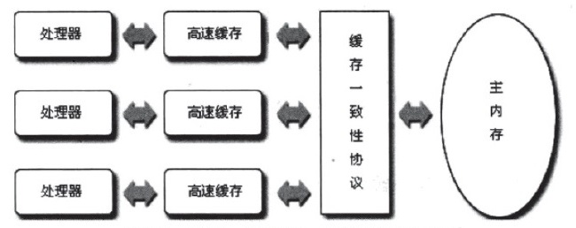
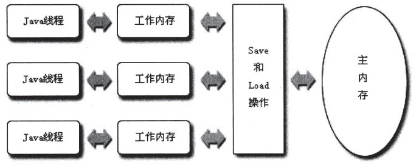
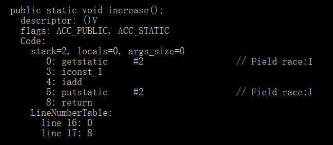
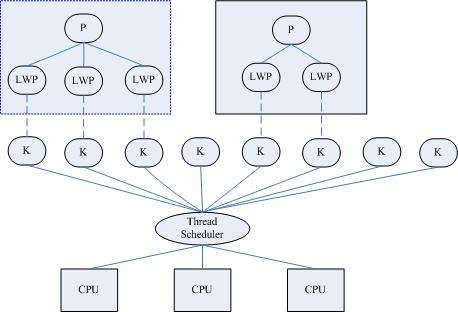
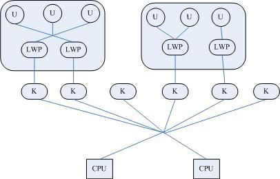
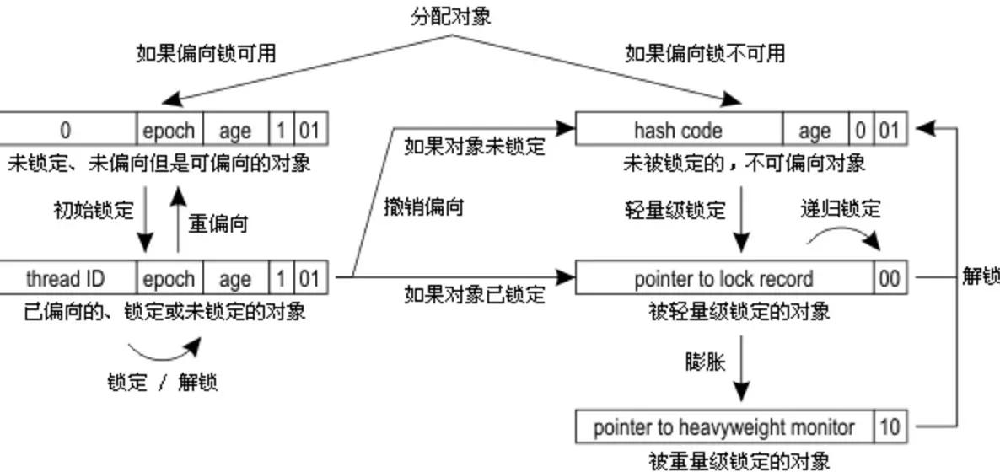

# 高效并发

## Java内存模型与线程

### 概述

衡量一个服务器性能的高低好坏，每秒事务处理数（Transactions Per Second，TPS）是最重要的指标之一，它代表着一秒内服务端平均能响应的请求总数，而TPS值与程序的并发能力又有着非常密切的关系，对于计算量相同的任务，程序线程并发协调得越有条不紊，效率自然就会越高；反之，线程之间频繁阻塞甚至死锁，将会大大降低程序的并发能力

### 硬件的效率与一致性

“让计算机并发执行若干个运算任务”与“更充分地利用计算机处理器的效能”之间的关系并不是简单的因果关系，其中一个重要的复杂性来源是绝大多数的运算任务都不可能只靠处理器“计算”就能完成，处理器至少要与内存交互，如：读取运算数据、存储运算结果等，这个I/O操作时很难消除的，由于计算机的存储设备与处理器的运算速度有几个数量级的差距，我们不得不加入一层读写速度尽可能接近处理器运算速度的高速缓存来作为内存与处理器之间的缓冲：将运算需要使用到的数据复制到缓存中，让运算能快速进行，当运算结束后再从缓存同步回内存之中，这样处理器就无须等待缓慢的内存读写了

基于高速缓存的存储交互很好地解决了处理器与内存的速度矛盾，但它引入了一个新问题：`缓存一致性`问题，在多处理器系统中，每个处理器都有自己的告诉缓存，而它们又共享同一主内存，当多个处理器的运算任务都涉及同一块主内存区域时，将可能导致各自的缓存数据不一致：为了解决一致性的问题，需要各个处理器访问缓存时都遵循一些协议，在读写时要根据协议来操作，这类协议有MSI、MESI、MOSI、Synapse、Firefly及Dragon Protocol等



除了增加高速缓存之外，为了使得处理器内部的运算单元能尽量被充分利用，处理器可能会对输出代码进行乱序执行优化，因此，如果存在一个计算任务依赖另外一个计算任务的中间结果，那么其顺序性并不能靠代码的先后顺序来保证，与处理器的乱序执行优化类似，JVM的即时编译器中也有类似的指令重排序优化

### java内存模型

JVM规范中试图定义一种Java内存模型（Java Memory Model，JMM）来屏蔽掉各种硬件和操作系统的内存访问差异，以实现让Java程序在各种平台下都能达到一致的内存访问效果

Java内存模型与Java内存区域（运行时数据区域）的区别：

* Java内存模型：是定义了线程与主内存之间的抽象关系，即JMM定义了JVM在计算机内存（RAM）中的工作方式
* Java内存区域：是指JVM运行时将数据分区域存储，强调对内存空间的划分

#### 主内存和工作内存

Java内存模型的主要目标是定义程序中各个变量的访问规则，即在虚拟机中将变量存储到内存和从内存中取出变量这样的底层细节，此处的变量是指：实例字段、静态字段和构成数组对象的元素，不包括局部变量与方法参数，因为后者是线程私有的，不会被共享，自然就不会存在竞争问题

Java内存模型规定了所有的变量都存储在主内存（Main Memory）中，每条线程还有自己的工作内存（Working Memory），线程的工作内存中保存了被该线程使用到的变量的主内存副本拷贝，线程对变量的所有操作都必须在工作内存中进行，而不能直接读写主内存中的变量，不同的线程之间也无法直接访问对方工作内存中的变量，线程间变量值的传递均需要通过主内存来完成



这里划分的主内存、工作内存，可以类比于Java堆中的对象实例数据部分和虚拟机栈中的部分数据 ，从本质上说，主内存就直接对应于物理硬件的内存，而为了获取更好的运行速度，虚拟机可能会让工作内存优先存储与寄存器和高速缓存中，因为程序运行时主要访问读写的是工作内存

#### 内存间交互操作

虚拟机实现时必须保证下面提及的每一种操作都是原子的、不可再分的（对于double和long类型的变量来说，`load`、`store`、`read`和`write`操作在某些平台上允许有例外）

  * `lock（锁定）`：作用于主内存的变量，它把一个变量标识为一条线程独占的状态
  * `unlock（解锁）`：作用于主内存的变量，它把一个处于锁定状态的变量释放出来，释放后的变量才可以被其他线程锁定
  * `read（读取）`：作用于主内存的变量，它把一个变量的值从主内存传输到线程的工作内存中，以便随后的load动作使用
  * `load（载入）`：作用于工作内存的变量，它把read操作从主内存中得到的变量值放入工作内存的变量副本中
  * `use（使用）`：作用于工作内存的变量，它把工作内存中一个变量的值传递给执行引擎，每当虚拟机遇到一个需要使用到变量的值的字节码指令时将会执行这个操作
  * `assign（赋值）`：作用于工作内存的变量，它把一个从执行引擎接收到的值赋给工作内存的变量，每当虚拟机遇到一个给变量赋值的字节码指令时执行这个操作
  * `store（存储）`：作用于工作内存的变量，它把工作内存中一个变量的值传送到主内存中，以便随后的write操作使用
  * `write（写入）`：作用于主内存的变量，它把store操作从工作内存中得到的变量的值放入主内存的变量中

注意，Java内存模型只要求上述两个操作必须按顺序执行，而没有保证是连续执行，也就是说，read和load之间、store和write之间是可以插入其他指令的，除此之外，Java内存模型还规定了在执行上述8种基本操作时必须满足如下规则：

* 不允许read和load、store和write操作之一单独出现，即不允许一个变量从主内存读取了但工作内存不接受，或者从工作内存发起回写了但主内存不接受的情况出现
* 不允许一个线程丢弃它的最近的assign操作，即变量在工作内存中改变了之后必须把该变化同步回主内存
* 不允许一个线程无原因地（没有发生过任何assign操作）把数据从线程的工作内存同步回主内存中
* 一个新的变量只能在主内存中“诞生”，不允许在工作内存中直接使用一个未被初始化（load或assign）的变量，换句话说，就是对一个变量实施use、store操作之前，必须先执行过了assign和load操作
* 一个变量在同一个时刻只允许一条线程对其进行lock操作，但lock操作可以被同一条线程重复执行多次，多次执行lock后，只有执行相同次数的unlock操作，变量才会被解锁
* 如果对一个变量执行lock操作，那将会清空工作内存中此变量的值，在执行引擎使用这个变量前，需要重新执行load或assign操作初始化变量的值
* 如果一个变量事先没有被lock操作锁定，那就不允许对它执行unlock操作，也不允许去unlock一个被其他线程锁定住的变量
* 对一个变量执行unlock操作之前，必须先把此变量同步回主内存中（执行store、write操作）

这8种内存访问操作以及上述规则限定，再加上对`volatile`的一些特殊规定，就已经完全确定了Java程序中哪些内存访问操作在并发下是安全的，由于这种定义相当严谨但又十分繁琐，所以就定义了一个等效判断原则——先行发生原则，用来确定一个访问在并发环境下是否安全

#### 对于volatile型变量的特殊规则

关键字`volatile`可以说是JVM提供的最轻量级的同步机制，当一个变量定义为`volatile`之后，它将具备两种特性：

* 第一是保证此变量对所有线程的可见性：这里的“可见性”是指当一条线程修改了这个变量的值，新值对于其他线程来说是可以立即得知的，换句话说，volatile变量在各个线程中是一致的（在各个线程的工作内存中，volatile变量也可以存在不一致的情况，但由于每次使用之前都要先刷新，执行引擎看不到不一致的情况，因此可以认为不存在不一致的情况），但是在Java里面的运算并非原子操作，导致volatile变量的运算在并发下一样是不安全的

```java
package com.xiaoxin008.jvmexecute.thread;

/**
 * 测试volatile修饰符
 *
 * @author xiaoxin008(313595055 @ qq.com)
 * @since 1.0.0
 */
public class VolatileTest {

    public static volatile int race = 0;

    public static final int THREADS_COUNT = 20;

    public static void increase(){
        race++;
    }

    public static void main(String[] args) {
        Thread[] threads = new Thread[THREADS_COUNT];
        for(int i = 0;i<THREADS_COUNT;i++){
            threads[i] = new Thread(new Runnable() {
                @Override
                public void run() {
                    for(int i = 0;i<10000;i++){
                        increase();
                    }
                }
            });
            threads[i].start();
        }

        while (Thread.activeCount() > 1){
            Thread.yield();
            System.out.println(race);
        }
    }
}
```

执行结果：

```txt
182914
182914
182914
```

结果分析：

结果小于200000的原因：自增运算`race++`导致线程不安全



当`getstatic`指令把race的值取到操作栈时，volatile关键字保证了race的值在此时是正确的，但是在执行`iconst_1`、`iadd`这些指令的时候，其他线程可能已经把race的值加大了，而在操作栈顶的值就变成了过期的数据，所以`putstatic`指令执行后就可能把较小的race值同步回主内存之中

由于volatile变量只能保证可见性，在不符合以下两条规则的运算场景中，我们仍然要通过加锁（使用`synchronized`或者`java.util.concurrent`中的原子类）来保证原子性

  * 运算结果并不依赖变量的当前值，或者能够确保只有单一的线程修改变量的值
  * 变量不需要与其他的状态变量共同参与不变约束 

* 使用volatile变量的第二个语义是禁止指令重排序优化，普通的变量仅仅会保证在该方法的执行过程中所有依赖赋值结果的地方都能获取到正确的结果，而不能保证变量赋值操作的顺序与程序代码中的执行顺序一致，因为在一个线程的方法执行过程中无法感知到这点，这也就是Java内存模型中描述的所谓的“线程内表现为串行的语义”

```java
Map configOptions;
char[] configText;
//此变量必须定义为volatile
volatile boolean initialized = false;

//假设以下代码在线程A中执行
//模拟读取配置信息，当读取完成后将initialized设置为true以通知其他线程配置可用
configOptions = new HashMap();
configText = readConfigFile(fileName);
processConfigOptions(configText,configOptions);
initialized = true;

//假设以下代码在线程B中执行
//等待initialized为true，代表线程A已经把配置信息初始化完成
while(!initialized){
	sleep();
}

//使用线程A中初始化好的配置信息
doSomethingWithConfig();
```

如果定义`initialized`变量时没有使用`volatile`修饰，就可能会由于指令重排序的优化，导致位于线程A最后一句代码`initialized=true`被提前执行，这样在线程B中使用配置信息的代码就可能出现错误，而volatile关键字则可以避免此类情况的发生

在某些情况下，volatile的同步机制的性能确实要优于锁（使用synchronized关键字或java.util.concurrent包里面的锁），但是由于虚拟机对锁实行的许多消除和优化，使得我们很难量化地认为volatile就会比synchronized快多少，volatile变量读操作的性能消耗与普通变量几乎没有什么差别，但是写操作则可能会慢一些，因为它需要在本地代码中插入许多内存屏障指令来保证处理器不发生乱序执行，不过即使如此，大多数场景下volatile的总开销仍然要比锁低，我们在volatile与锁之中选择的唯一依据仅仅是volatile的语义是：volatile的语义能否满足使用场景的需求

Java内存模型中对volatile变量定义的特殊规则，假定T表示一个线程，V和W分别表示两个volatile变量，那么在进行read、load、use、assign、store和write操作时需要满足如下规则：

  * 只有当线程T对变量V执行的前一个动作是load的时候，线程T才能对变量V执行use动作，并且只有当线程T对变量V执行的后一个动作是use的时候，线程T才能对变量V执行load动作。线程T对变量V的use动作可以认为是和线程T对变量V的load、read动作相关联，必须连续一起出现（这条规则要求在工作内存中，每次使用V前都必须先从主内存刷新最新的值，用于保证能看见其他线程对变量V所做的修改后的值） 
  * 只有当线程T对变量V执行的前一个动作是assign的时候，线程T才能对变量V执行store动作，只有当线程T对变量V执行的后一个动作是store的时候，线程T才能对变量V执行assign动作。线程T对变量V的assign动作可以认为是和线程T对变量V的store、write动作相关联，必须连续一起出现（这条规则要求在工作内存中，每次修改V后都必须立刻同步回主内存中，用于保证其他线程可以看到自己对变量V所做的修改）
  * 假定动作A是线程T对变量V实施的use或assign动作，假定动作F是动作A相关联的load或store动作，假定动作P是和动作F响应的对变量V的read和write动作；类似的，假定动作B是线程T对变量W实施的use和assign动作，假定动作G是和动作B相关联的load和store动作，假定动作Q是动作G相应的对变量W的read和write动作，如果A先于B，那么P先于Q（这条规则要求volatile修饰的变量不会被指令重排序优化，保证代码的执行顺序与程序的顺序相同）

#### 对于long和double型变量的特殊规则

Java内存模型要求`lock`、`unlock`、`read`、`load`、`assign`、`use`、`store`、`write`这8个操作都具有原子性，但是对于64位的数据类型（long和double）在模型中特别定义了一条相对宽松的规定：允许虚拟机将没有被`volatile`修饰的64位数据的读写操作划分为两次32位的操作，即允许虚拟机实现选择可以不保证64位数据类型的`load`、`store`、`read`和`write`这4个操作的原子性，这点就是所谓的long和double的非原子协定

但在实际开发中，商用虚拟机几乎都选择把64位数据的读写操作作为原子操作来对待，因此我们在编写代码时，一般不需要把用到的long和double变量专门声明为`volatile`

#### 原子性、可见性与有序性

* 原子性（Atomicity）：由Java内存模型来保证的原子性变量操作包括：`read`、`load`、`assign`、`use`、`store`和`write`，我们大致可以认为基本数据类型的访问读写是具备原子性的，如果应用场景需要一个更大范围的原子性保证，Java内存模型还提供了`lock`和`unlock`操作来满足这种需求，尽管虚拟机未把`lock`和`unlock`操作直接开放给用户使用，但是却提供了更高层次的字节码指令`monitorenter`和`monitorexit`来隐式地使用这两个操作，这两个字节码指令反映到Java代码中就是同步块——`synchronized`关键字，因此在synchronized块之间的操作也具备原子性
* 可见性（Visibility）：可见性是指当一个线程修改了共享变量的值，其他线程能够立即得知这个修改，Java内存模型是通过在变量修改后将新值同步回主内存，在变量读取前从主内存刷新变量值这种依赖主内存作为传递媒介的方式来实现可见性的，无论是普通变量还是volatile变量都是如此，普通变量与volatile变量的区别是，volatile的特殊规定保证了新值能立即同步到主内存，以及每次使用前立即从主内存刷新，因此，可以说volatile保证了多线程操作时变量的可见性，而普通变量则不能保证这一点，除了volatile之外，Java还有两个关键字能实现可见性，即`synchronized`和`final`，同步块的可见性是由“对一个变量执行unlock操作之前，必须先把此变量同步回主内存中（执行store、write操作）”这条规则获得的，而final关键字的可见性是指：被final修饰的字段在构造器中一旦初始化完成，并且构造器没有把“this”的引用传递除去（this引用逃逸是一件很危险的事情，其他线程有可能通过这个引用访问到“初始化了一半”的对象），那在其他线程中就能看见final字段的值

```java

public static final int i;

public final int j;

static{
	i = 0;
	// do something
}

{
	//也可以选择在构造函数中初始化
	j = 0;
	// do something
}
```

* 有序性（Ordering）：如果在本线程内观察，所有的操作都是有序的；如果在一个线程中观察另一个线程，所有操作都是无序的，前面指的是“线程内表现为串行的语义”，后面指的是“指令重排序”现象和“工作内存与主内存同步延迟”现象，Java语言提供了`volatile`和`synchronized`两个关键字来保证线程之间操作的有序性，volatile关键字本身就包含了禁止指令重排序的语义，而synchronized则是由“一个变量在同一个时刻只允许一条线程对其进行lock操作”这条规则获得的，这条规则决定了持有同一个锁的两个同步块只能串行地进入

#### 先行发生原则

先行发生原则，它是判断数据是否存在竞争、线程是否安全的主要依据，依靠这个原则，我们可以通过几条规则解决并发环境下两个操作之间是否可能存在冲突的所有问题，“先行发生”是Java内存模型中定义的两项操作之间的偏序关系，如果说操作A先行发生于操作B，其实就是说在发生操作B之前，操作A产生的影响能被操作B观察到，“影响”包括修改了内存中共享变量的值、发送了消息、调用了方法等

```java
//以下操作在线程A中执行
i = 1;

//以下操作在线程B中执行
j = i;

//以下操作在线程C中执行
i = 2;
```

假设线程A中的操作“i=1”先行发生于线程B的操作“j=i”，那么可能确定在线程B的操作执行后，变量j的值一定等于1，得出这个结论的依据有两个：一个根据先行发生原则，“i=1”的结果可以被观察到；二是线程C还没“登场”，线程A操作结束之后没有其他线程会修改变量i的值，现在再来考虑线程C，我们依然保持线程A和线程B之间的先行发生关系，而线程C出现在线程A和线程B的操作之间，但是线程C与线程B没有先行发生关系，那j的值就会不确定，1和2都有可能，因为线程C对变量i的影响可能会被线程B观察到，也可能不会，这时候线程B就存在读取到过期数据的风险，不具备多线程安全性

下面是Java内存模型下一些“天然的”先行发生关系，这些先行发生关系无须任何同步器协助就已经存在，可以在编码中直接使用，如果两个操作之间的关系不在此列，并且无法从下列规则推导出来的话，它们就没有顺序性保障，虚拟机可以对它们随意地进行重排序

* 程序次序规则：在一个线程内，按照程序代码顺序，书写在前面的操作先行发生于书写在后面的操作，准确地说，应该是控制流顺序而不是程序代码顺序，因为要考虑分支、循环等结构
* 管程锁定规则：一个unlock操作先行发生于后面对同一个锁的lock操作，这里必须强调的是同一个锁，而“后面”是指时间上的先后顺序
* volatile变量规则：对一个volatile变量的写操作先行发生于后面对这个变量的读操作，这里的“后面”同样是指时间上的先后顺序
* 线程启动规则：Thread对象的start()方法先行发生于线程的每一个动作
* 线程终止规则：线程中的所有操作都先行发生于对此线程的终止检测，我们可以通过Thread.join()方法结束、Thread.isAlive()的返回值等手段检测到线程已经终止执行
* 线程中断规则：对线程interrupt()方法的调用先行发生于被中断线程的代码检测到中断事件的发生，可以通过Thread.interrupted()方法检测到是否有中断发生
* 对象终结规则：一个对象的初始化完成（构造函数执行结束）先行发生于它的finalize()方法的开始
* 传递性：如果操作A先行发生于操作B，操作B先行发生于操作C，那就可以得出操作A先行发生于操作C的结论

```java
private int value = 0;

public void setValue(int value){
	this.value = value;
}
public int getValue(){
	return value;
}
```

线程A先调用了`setValue(1)`，然后线程B调用了同一个对象的`getValue()`，那么线程B收到的返回值是什么？

由于两个方法分别由线程A和线程B调用，不在一个线程中，所以程序次序规则在这里不适用；由于没有同步块，自然就不会发生lock和unlock操作，所以管程锁定规则不适用；由于value变量没有被volatile关键字修饰，所以volatile变量规则不适用；后面的线程启动、终止、中断规则和对象终结规则也和这里完全没有关系，因为没有一个适用的先行发生规则，所以最后一条传递性也无从谈起，因此我们可以判定尽管线程A在操作时间上先于线程B，但是无法确定线程B中“getValue()”方法的返回结果，换句话说，这里面的操作不是线程安全的

解决方法：1、把这两个方法都定义为synchronized方法，这样就可以套用管程锁定规则；2、把value定义为volatile变量，由于setter方法对value的修改不依赖value的原值，满足volatile关键字使用场景，这样就可以套用volatile变量规则来实现先行发生关系

通过上面的例子，我们可以得出结论：一个操作“时间上的先发生”不代表这个操作会使“先行发生”

```java
//以下操作在同一个线程中执行
int i = 1;
int j = 2;
```

两条赋值语句在同一个线程之中，根据程序次序规则，“int i = 1”的操作先行发生于“int j = 2”但是“int j = 2”的代码完全可能先被处理器执行，这并不影响先行发生原则的正确性，因为我们在这条线程中没有办法感知到这点

通过上面的例子，我们可以得出结论：一个操作“先行发生”不能推导出这个操作必定是“时间上的先发生”

综合上面的两个例子，我们得出了一个结论：时间先后顺序与先行发生原则之间基本没有太大的关系，所以我们衡量并发安全问题的时候不要受到时间顺序的干扰，一切必须以先行发生原则为准

### java与线程

#### 线程的实现

线程是比进程更轻量级的调度执行单位，线程的引入，可以把一个进程的资源分配和执行调度分开，各个线程既可以共享进程资源（内存地址、文件I/O等），又可以独立调度（线程是CUP调度的基本单位），主流的OS都提供了线程实现，Java语言则提供了在不同硬件和OS平台下对线程操作的统一处理，每个已经执行了start()且还未结束的java.lang.Thread类的实例就代表了一个线程，Thread类中所有关键方法都是声明为Native的，在Java API中，一个Native方法往往意味着这个方法没有使用或无法使用平台无关的手段来实现

实现线程主要有3种方式：使用内核线程实现、使用用户线程实现和使用用户线程加轻量级进程混合实现：

使用内核线程实现：内核线程就是直接由操作系统内核支持的线程，这种线程由内核来完成线程切换，内核通过操纵调度器对线程进行调度，并负责将线程的任务映射到各个处理器上，每个内核线程可以视为内核的一个分身，这样OS就有能力同时处理多件事情，支持多线程的内核就叫做多线程内核，程序一般不会直接去使用内核线程，而是去使用内核线程的一种高级接口——轻量级进程（Light Weight Process，LWP），由于每个LWP都由一个内核线程支持，因此只有先支持内核线程，才有轻量级进程，这种轻量级进程与内核线程之间1:1的关系称为一对一的线程模型



由于内核线程的支持，每个轻量级进程都成为一个独立的调度单元，即使有一个轻量级进程在系统调用中阻塞了，也不会影响整个进程继续工作，但是轻量级进程具有它的局限性：首先，由于是基于内核线程实现的，所以各种线程操作，如创建、析构及同步，都需要进行系统调用，而系统调用的代价相对较高，需要在用户态和内核态中来回切换，其次，每个轻量级进程都需要有一个内核线程的支持，因此轻量级进程要消耗一定的内核资源（如内核线程的栈空间），因此一个系统支持轻量级进程的数量是有限的

使用用户线程实现：从广义上来讲，一个线程只要不是内核线程，就可以认为是用户线程，因此，从这个定义上来讲，轻量级进程也属于用户线程，但轻量级进程的实现始终是建立在内核之上的，许多操作都要进行系统调用，效率会受到限制。而狭义上的用户线程指的是完全建立在用户空间的线程库上，系统内核不能感知线程存在的实现，用户线程的建立、同步、销毁和调度完全在用户态中完成，不需要内核的帮助，因此操作可以是非常快速且低消耗的，也可以支持规模更大的线程数量，部分高性能数据库中的多线程就是由用户线程实现的，这种进程与用户之间1:N的关系称为一对多的线程模型


使用用户线程的优势在于不需要系统内核支援，劣势也在于没有系统内核的支援，所有的线程操作都需要用户程序自己处理，线程的创建、切换和调度都是需要考虑的问题，而且由于操作系统只把处理器资源分配到进程，那诸如“阻塞如何处理”、“多处理器系统中如何将线程映射到其他处理器上”这类问题解决起来将会异常困难，甚至不可能完成，因而使用用户线程实现的程序一般都比较复杂，除了以前在不支持多线程的操作系统中（如DOS）的多线程程序与少数有特殊需求的程序外，现在使用用户线程的程序越来越少，Java、Ruby等语言都曾经使用过用户线程，最终又都放弃使用它

使用用户线程加轻量级进程混合实现：在这种混合实现下，既存在用户线程，也存在轻量级进程。用户线程还是完全建立在用户空间中，因此用户线程的创建、切换、析构等操作依然廉价，并且可以支持大规模的用户线程并发，而OS提供支持的轻量级进程则作为用户线程和内核线程之间的桥梁，这样可以使用内核提供的线程调度功能及处理器映射，并且用户线程的系统调用要通过轻量级线程来完成，大大降低了整个进程被完全阻塞的风险，在这种混合模式中，用户线程与轻量级进程的数量比是不定的，即为N:M的关系，多对多的线程模型



Java线程的实现：Java线程在JDK1.2之前，是基于称为“绿色线程”的用户线程实现的，而在JDK1.2中，线程模型替换为基于操作系统原生线程模型来实现，因此，在目前的JDK版本中，OS支持怎样的线程模型，很大程度上决定了JVM的线程是怎样映射的，这点在不同的平台上没有办法达成一致，虚拟机规范中也并未限定Java线程需要使用哪种线程模型来实现，线程模型只对线程的并发规模和操作成本产生了影响，对Java程序的编码和运行过程来说，这些差异都是透明的，对于Sun JDK来说，它的Windows版与Linux版都是使用一对一的线程模型实现的，一条Java线程就映射到一条轻量级进程之中，因为Windows和Linux系统提供的线程模型就是一对一的，而在Solaris平台中，由于操作系统的线程特性可以同时支持一对一及多对多的线程模型，因此在Solaris版的JDK中也对应提供了两个平台专有的JVM参数，`-XX:+UseLWPSynchronization`(默认)和`-XX:+UseBoundThreads`来明确指定JVM使用哪种线程模型

#### java线程的调度

线程调度是指系统为线程分配处理器使用权的过程，主要调度方式有两种：协同式线程调度和抢占式线程调度

* 使用协同式调度的多线程系统：线程的执行时间由线程本身来控制，线程把自己的工作执行完了之后，要主动通知系统切换到另外一个线程上，协同式多线程的最大好处是实现简单，而且由于线程要把自己的事情干完后才会进行线程切换，切换操作对线程自己是可知的，所以没有什么线程同步的问题，Lua语言中的“协同例程”就是这类实现，它的坏处也很明显：线程执行时间不可控，甚至如果线程编写有问题，一直不告知系统进行线程切换，那么程序就会一直阻塞在那里，一个进程坚持不让出CPU执行时间就可能会导致整个系统崩溃
* 使用抢占式调度的多线程系统：每个线程将由系统来分配执行时间，线程的切换不由线程本身来决定，在这种实现线程调度的方式下，线程的执行时间是系统可控的，也不会有一个线程导致整个进程阻塞的问题，Java使用的线程调度方式就是抢占式调度，当一个进程出了问题，我们还可以使用任务管理器把这个进程“杀掉”，而不至于导致系统崩溃

虽然Java线程调度是系统自动完成的，但是我们还是可以“建议”系统给某些线程多分配一点执行时间，另外的一些线程则可以少分配一点——这项操作可以通过设置线程优先级来完成，Java一共设置了10个级别的线程优先级，两个线程同时处于Ready状态时，优先级越高的线程越容易被系统选择执行

但是，线程优先级并不一定会奏效，原因是Java线程是通过映射到系统的原生线程上来实现的，所以线程调度最终还是取决于OS，虽然现在很多OS都提供线程优先级的概念，但并不见得能与Java线程的优先级一一对应

Java线程优先级与Windows线程优先级之间的对应关系：

|Java线程优先级|Windows线程优先级|
|---|---|
|（Thread.MIN_PRIORITY）|THREAD_PRIORITY_LOWEST|
||THREAD_PRIORITY_LOWEST|
||THREAD_PRIORITY_BELOW_NORMAL|
||THREAD_PRIORITY_BELOW_NORMAL|
|（Thread.NORM_PRIORITY）|THREAD_PRIORITY_NORMAL|
||THREAD_PRIORITY_ABOVE_NORMAL|
||THREAD_PRIORITY_ABOVE_NORMAL|
||THREAD_PRIORITY_HIGHEST|
||THREAD_PRIORITY_HIGHEST|
|（Thread.MAX_PRIORITY）|THREAD_PRIORITY_CRITICAL|

还有其他情况让我们不能太依赖优先级：优先级可能会被OS自行改变，如：Windows系统中存在一个称为“优先级推进器”，它的大致作用就是当系统发现一个线程执行得特别“勤奋努力”的话，可能会越过线程优先级去为它分配执行时间，所以，我们不能在程序中通过优先级来完全准确地判断一组状态都为Ready的线程将会先执行哪一个

#### 状态转换

Java定义了5种线程状态，在任意一个时间点，一个线程只能有且只有其中的一种状态：

* 新建（New）：创建后尚未启动的线程处于这种状态
* 运行（Runable）：Runable包括了OS线程状态中的Running和Ready，也就是处于此状态的线程有可能正在执行，也有可能正在等待着CPU为它分配执行时间
* 无限期等待（Waiting）：处于这种状态的线程不会被分配CPU执行时间，它们要等待被其他线程显式地唤醒，以下方法会让线程陷入无限期的等待状态：
  * 没有设置Timeout参数的Object.wait()方法
  * 没有设置Timeout参数的Thread.join()方法
  * LockSupport.park()方法
* 限期等待（Timed Waiting）：处于这种状态的线程也不会被分配CPU执行时间，不过无须等待被其他线程显式地唤醒，在一定时间后它们会由系统自动唤醒，一下方法会让线程进入限期等待状态：
  * Thread.sleep()方法
  * 设置了Timeout参数的Object.wait()方法
  * 设置了Timeout参数的Thread.join()方法
  * LockSupport.parkNanos()方法
  * LockSupport.parkUntil()方法
* 阻塞（Blocked）：线程被阻塞了，“阻塞状态”与“等待状态”的区别是：“阻塞状态”在等待着获取到一个排他锁，这个事件将会在另外一个线程放弃这个锁的时候发生；而“等待状态”则是在等待一段时间或者唤醒动作发生，在程序等待进入同步区域的时候，线程将进入这种状态
* 结束（Terminated）：已终止线程的线程状态，线程已经结束执行

上述5种状态在遇到特定事件发生的时候将会互相转换


## 线程安全与锁优化

* 面向过程的编程思想：把数据和过程分别作为独立的部分来考虑，数据代表问题空间中的客体，程序代码则用于处理这些数据，这种思维方式直接站在计算机的角度去抽象问题和解决问题，称为面向过程的编程思想
* 面向对象的编程思想：站在现实世界的角度去抽象和解决问题，它把数据和行为都看作是对象的一部分，这样可以让程序员能以符合现实世界的思维方式来编写和组织程序

### 线程安全

* 线程安全：当多个线程访问一个对象时，如果不用考虑这些线程在运行时环境下的调度和交替执行，也不需要进行额外的同步，或者在调用方进行任何其他的协调操作，调用这个对象的行为都可以获得正确的结果，那这个对象是线程安全的

* 线程安全的代码特征：代码本身封装了所有必要的正确性保障手段（如互斥同步等），令调用者无须关心多线程的问题，更无须自己采取任何措施来保证多线程的正确调用

#### Java语言中的线程安全

我们可以将Java语言中各种操作共享的数据分为以下5类：不可变、绝对线程安全、相对线程安全、线程兼容和线程对立

* 不可变：不可变（Immutable）的对象一定是线程安全的，无论是对象的方法实现还是方法的调用者，都不需要再采取任何的线程安全保障措施，只要一个不可变的对象被正确地构建出来（没有发生this引用逃逸的情况），那其外部的可见状态永远也不会改变，永远也不会看到它在多个线程之中处于不一致的状态，“不可变”带来的安全性是最简单和最纯粹的，如果共享数据是一个基本数据类型，那么只要在定义时使用`final`关键字修饰它就可以保证它是不可变的，如果共享数据是一个对象，那就需要保证对象的行为不会对其状态产生任何影响才行，如：`java.lang.String`类的对象，它是一个典型的不可变对象，调用它的`substring()`、`replace()`和`concat()`这些方法都不会影响它原来的值，只会返回一个新构造的字符串对象，保证对象行为不影响自己状态的途径有很多种。其中最简单的就是把对象中带有状态的变量都声明为`final`，这样在构造函数结束之后，它就是不可变的
* 绝对线程安全：一个类要达到“不管运行时环境如何，调用者都不需要任何额外的同步措施”，这样做的话通常需要付出很大代价，甚至有时候是不切实际的代价，在Java API中标注自己是线程安全的类，大多数都不是绝对的线程安全，比如：`java.util.Vector`这个类中所有的方法都被synchronized修饰的，但是这并不意味着调用它的时候永远都不再需要同步手段了，在多线程的环境中，如果不在方法调用端做额外的同步措施的话，这些代码仍然是不安全的
* 相对线程安全：相对的线程安全就是我们通常意义上所讲的线程安全，它需要保证这个对象单独的操作是线程安全的，我们在调用的时候不需要做额外的保障措施，但是对于一些特定顺序的连续调用，就可能需要在调用端使用额外的同步手段来保证调用的正确性，在Java语言中，大部分的线程安全类都属于这种类型，例如Vector、HashTable、Collections的synchronizedCollection()方法包装的集合等
* 线程兼容：线程兼容是指对象本身并不是线程安全的，但是可以通过在调用端正确地使用同步手段来保证对象在并发环境中可以安全地使用，我们平常说一个类不是线程安全的，绝大多数时候指的是这一种情况，Java API中大部分的类都是属于线程兼容的，如与前面的Vector和HashTable相对应的集合类AarrayList和HashMap等
* 线程对立：线程对立是指无论调用端是否采取了同步措施，都无法在多线程环境中并发使用的代码，由于Java语言天生就具备多线程特性，线程对立这种排斥多线程的代码时很少出现的，而且通常都是有害的，应当尽量避免，一个线程对立的例子是Thread类的`suspend()`和`resume()`方法，如果有两个线程同时持有一个线程对象，一个尝试去中断线程，另一个尝试去恢复线程，如果并发进行的话，无论调用时是否进行了同步，目标线程都是存在死锁风险的，如果suspend()中断的线程就是即将要resume()的那个线程，那就肯定要产生死锁了，常见的线程对立的操作还有`System.setIn()`、`System.setOut()`和`System.runFinalizersOnExit()`等

#### 线程安全的实现方法

* 互斥同步（阻塞同步）：
  * 互斥同步是常见的一种并发正确性保障手段，同步是指在多个线程并发访问共享数据时，保证共享数据在同一个时刻只被一个线程使用，而互斥是实现同步的一种手段，临界区、互斥量和信号量都是主要的互斥实现方式，互斥是因，同步是果；互斥是方法，同步是目的。
  * 在Java中，最基本的互斥同步手段就是`synchronized`关键字，`synchronized`关键字经过编译后，会在同步块的前后分别形成`monitorenter`和`monitorexit`这两个字节码指令，这两个字节码指令都需要一个reference类型的参数来指明要锁定和解锁的对象，如果Java程序中指定了对象参数，那就是这个对象的reference；如果没有明确指定，那就根据synchronized修饰的是实例方法还是类方法，去取对应的对象实例或Class对象来作为锁对象
  * 根据虚拟机规范的要求，在执行`monitorenter`指令时，首先要尝试获取对象的锁，如果这个对象没被锁定，或者当前线程已经拥有了那个对象的锁，把锁的计数器加1，相应的，在执行`monitorexit`指令时会将锁计数器减1，当计数器为0时，锁就被释放，如果获取对象锁失败那当前线程就要阻塞等待，直到对象锁被另外一个线程释放为止
  * 虚拟机规范对`monitorenter`和`monitorexit`的行为描述中，有两点是需要特别注意的：
    * synchronized同步块对同一条线程来说是可重入的，不会出现自己把自己锁死的问题
    * 同步块在已进入的线程执行完之前，会阻塞后面其他线程的进入，Java的线程是映射到操作系统的原生线程之上的，如果要阻塞或唤醒一个线程，都需要OS来帮忙完成，这就需要从用户态转换到核心态中，因此状态转换需要耗费很多的处理器时间，对于代码简单的同步块，状态转换消耗的时间有可能比用户代码执行的时间还要长，所以synchronized是Java语言中一个重量级的操作，必须在确实有必要的情况下再使用这种操作，而虚拟机本身也会进行一些优化，譬如在通知OS阻塞线程之前加入一段自旋等待过程，避免频繁地切入到核心态之中
  * 除了synchronized之外，我们还可以使用`java.util.concurrent`包中的重入锁（ReentrantLock）来实现同步，在基本用法上，ReentrantLock与synchronized很相似，它们都具备一样的线程重入特性，只是代码写法上有点区别，一个表现为API层面的互斥锁（lock()和unlock()方法配合try/finally语句块来完成），另一个表现为原生语法层面的互斥锁，不过，相比与synchronized，ReentrantLock增加了一些高级功能：等待可中断、可实现公平锁，以及锁可以绑定多个条件
    * 等待可中断：是指当持有锁的线程长期不释放锁的时候，正在等待的线程可以选择放弃等待，改为处理其他事情，可中断特性对处理执行时间非常长的同步块很有帮助
    * 公平锁：是指多个线程在等待同一个锁时，必须按照申请锁的时间顺序来依次获取锁，而非公平锁则不保证这一点，在锁被释放时，任何一个等待锁的线程都有机会获得锁，synchronized中的锁是非公平的，ReentrantLock默认情况下也是非公平的，但可以通过带布尔值的构造函数要求使用公平锁
    * 锁绑定多个条件： 是指一个ReentrantLock对象可以同时绑定多个Condition对象，而在synchronized中，锁对象的wait()和notify()或notifyAll()方法可以实现一个隐含的条件，如果要和多于一个的条件关联的时候，就不得不额外地添加一个锁，而ReentrantLock则无须这样做，只需要多次调用`new Condition()`方法即可
    * 在JDK1.6发布后，synchronized和ReentrantLock的性能基本上完全持平，所以在能实现需求的情况下，优先考虑使用synchronized来进行同步
  * 从处理问题的方式上说，互斥同步属于一种悲观的并发策略，总是认为只要不去做正确的同步措施（例如加锁），那就肯定会出现问题，无论共享数据是否真的会出现竞争，它都要进行加锁、用户态核心态转换、维护锁计数器和检查是否有被阻塞的线程需要唤醒等操作
* 非阻塞同步：
  * 随着硬件指令集的发展，我们有了另外一个选择：基于冲突检测的乐观并发策略，通俗地说，就是先进行操作，如果没有其他线程争用共享数据，那操作就成功了；如果共享数据有争用，产生了冲突，那就再采取其他的补偿措施（最常见的补偿措施就是不断地重试，直到成功为止），这种乐观的并发策略的许多实现都不需要把线程挂起，因此这种同步操作称为非阻塞同步
  * 为什么乐观并发策略需要依赖“硬件指令集的发展”才能进行呢？因为我们需要操作和冲突检测这两个步骤具备原子性，但不能使用互斥同步来保证，所以就只能通过硬件来完成这件事，硬件保证一个从语义上看起来需要多次操作的行为只通过一条处理器指令就能完成，这类指令常用的有：
    * 测试并设置（Test-and-Set）
    * 获取并增加（Fetch-and-Increment）
    * 交换（Swap）
    * 比较并交换（Compare and Swap，CAS）
      * CAS指令需要有3个操作数，分别是内存位置、旧的预期值和新值，CAS指令执行时，当且仅当内存中的变量值符合旧预期值时，处理器用新值更新内存中的变量值，否则它就不执行更新，但无论是否更新，上述的处理过程是一个原子操作
      * 在JDK1.5之后，Java程序中才可以使用CAS操作，该操作由`sun.misc.Unsafe`类里面的`compareAndSwapInt()`和`compareAndSwapLong()`等几个方法包装提供，虚拟机在内部对这些方法做了特殊处理，即时编译出来的结果就是一条平台相关的处理器CAS指令，没有方法调用的过程，或者可以认为是无条件内联进去了
      * CAS的缺陷：CAS这种操作无法涵盖互斥同步的所有使用场景，并且CAS从语义上来说并不是完美的，存在这样一个逻辑漏洞：如果一个变量V初次读取的时候是A值，并且在准备赋值的时候检查到它仍然为A值，如果在这段期间它的值曾经被改成了B，后来又被改回为A，那CAS操作就会认为它从来没有改变过，这个漏洞称为CAS操作的“ABA”问题，大部分情况下ABA问题不会影响程序并发的正确性，如果需要解决ABA问题，改用传统的互斥同步可能会比原子类更高效
    * 加载链接/条件存储（Load Linked/Store Conditional，LL/SC）
* 无同步方案：要保证线程安全，并不一定就要进行同步，两者没有因果关系，同步只是保证共享数据争用时的正确性的手段，如果一个方法本来就不涉及共享数据，那它自然就无须任何同步措施去保证正确性，因此会有一些代码天生就是线程安全的：
  * 可重入代码（Reentrant Code）：这种代码也叫做纯代码（Pure Code），可以在代码执行的任何时刻中断它，转而去执行另外一段代码（包括递归调用它本身），而在控制权返回后，原来的程序不会出现任何错误。相对线程安全来说，可重入性是更基本的特性，它可以保证线程安全，即所有的可重入的代码都是线程安全的，但是并非所有的线程安全的代码都是可重入的，可重入代码有一些共同的特征，如：不依赖存储在堆上的数据和公用的系统资源，用到的状态量都由参数中传入、不调用非可重入的方法等，我们可以通过一个简单的原则来判断代码是否具备可重入性：如果一个方法，它的返回结果是可以预测的，只要输入了相同的数据，就都能返回相同的结果，那它就满足可重入性的要求，当然也是线程安全的
  * 线程本地存储（Thread Local Storage）： 如果一段代码中所需要的数据必须与其他代码共享，那就看看这些共享数据的代码是否能保证在同一个线程中执行，如果能保证，我们就可以把共享数据的可见范围限制在同一个线程之内，这样无须同步也能保证线程之间不出现数据争用的问题，符合这种特点的应用并不少见，大部分使用消费队列的架构模式都会将产品的消费过程尽量在一个线程中消费完，其中最重要的一个应用实例就是经典Web交互模型中的“一个请求对应一个服务器线程”的处理方式，这种处理方式的广泛应用使得很多Web服务器应用都可以使用线程本地存储来解决线程安全问题：通过`java.lang.ThreadLocal`类来实现线程本地存储的功能，每一个线程的Thread对象都有一个ThreadLocalMap对象，这个对象存储了一组以`ThreadLocal.threadLocalHashCode`为键，以本地线程变量为值的K-V键值对，ThreadLocal对象就是当前线程的ThreadLocalMap的访问入口，每一个ThreadLocal对象都包含了一个独一无二的threadLocalHashCode值，使用这个值就可以在线程K-V值中找回对应的本地线程变量
	
### 锁优化

#### 自旋锁与自适应自旋

* 互斥同步对性能最大的影响就是阻塞的实现，挂起线程和恢复线程的操作都需要转入内核态中完成，这些操作给系统的并发性能带来了很大的压力，同时，共享数据的锁定状态只会持续很短的一段时间，为了这段时间去挂起和恢复线程并不值得，如果物理机有一个以上的处理器，能让两个或以上的线程同时并行执行，我们就可以让后面请求锁的那个线程“稍等一下”，但不放弃处理器的执行时间，看看持有锁的线程是否很快就会释放锁，为了让线程等待，我们只需让线程执行一个忙循环（自旋），这就是所谓的自旋锁
* 在JDK1.6自旋锁默认就已经开启了，但是自旋等待不能代替阻塞，且不说对处理器数量的要求，自旋等待本身虽然避免了线程切换的开销，但它是要占用处理器时间的，因此，如果锁被占用的时间很短，自旋等待的效果就会非常好，反之，如果锁被占用的时间很长，那么自旋的线程只会白白消耗处理器资源，而不会做任何有用的工作，反而会带来性能上的浪费，因此，自旋等待的时间必须要有一定的限度，如果自旋超过了限定的次数仍然没有成功获得锁，就应当使用传统的方式去挂起线程了，用户可以使用参数`-XX:PreBlockSpin`来修改
* 在JDK1.6中引入了自适应的自旋锁，自适应意味着自旋的时间不再固定了，而是由前一次在同一个锁上的自旋时间及锁的拥有者的状态来决定，如果在同一个锁对象上，自旋等待刚刚成功获得过锁，并且持有锁的线程正在运行中，那么JVM就会认为这次自旋也很有可能再次成功，进而它将允许自旋等待持续相对更长的时间，而如果对于某个锁，自旋很少成功获得过，那在以后要获取这个锁时将可能省略掉自旋过程，以避免浪费处理器资源

#### 锁消除

锁消除是指虚拟机即时编译器在运行时，对一些代码上要求同步，但是被检测到不可能存在共享数据竞争的锁进行消除，锁消除的主要判定依据来源于逃逸分析的数据支持，如果判断在一段代码中，堆上的所有数据都不会逃逸出去从而被其他线程访问到，那就可以把它们当做栈上数据对待，认为它们是线程私有的，同步加锁自然就无须进行

#### 锁粗化

原则上，我们编写代码的时候，总是推荐将同步块的作用范围限制得尽量小——只在共享数据的实际作用域中才进行同步，这样是为了是的需要同步的操作数量尽可能变小，如果存在锁竞争，那等待锁的线程也能尽快拿到锁，大部分情况下，上面的原则都是正确的，但是如果一系列的连续操作都对同一个对象反复加锁和解锁，甚至加锁操作是出现在循环体中的，那即使没有线程竞争，频繁地进行互斥同步操作也会导致不必要的性能损耗

#### 轻量级锁

* 轻量级锁是JDK1.6之中加入的新型锁机制，它名字中的“轻量级”是相对于使用操作系统互斥量来实现的传统锁而言的，因此传统的锁机制就称为“重量级”锁，首先需要强调一点的是，轻量级锁并不是用来代替重量级锁的，它的本意是在没有多线程竞争的前提下，减少传统的重量级锁使用操作系统互斥量产生的性能消耗
* 要理解轻量级锁，以及偏向锁的原理和运作过程，必须从虚拟机的对象（对象头部分）的内存布局开始介绍，JVM的对象头分为两部分信息，第一部分用于存储对象自身的运行时数据，如HashCode、GC分代年龄等，这部分数据的长度在32位和64位的虚拟机中分别为32bit和64bit，官方称它为“Mark Word”，它是实现轻量级锁和偏向锁的关键，另外一部分用于存储指向方法区对象类型数据的指针，如果是数组对象的话，还会有一个额外的部分用于存储数组长度
* 对象头信息是与对象自身定义的数据无关的额外存储成本，考虑到JVM的空间效率，Mark Word被设计成一个非固定的数据结构以便在极小的空间内存储尽量多的信息，它会根据对象的状态复用自己的存储空间

HotSpot虚拟机对象头Mark Word：

|存储内容|标志位|状态|
|---|---|---|
|对象哈希码、对象分代年龄|01|未锁定|
|指向锁记录的指针|00|轻量级锁定|
|指向重量级锁的指针|10|膨胀（重量级锁定）|
|空，不需要记录信息|11|GC标记|
|偏向线程ID、偏向时间戳、对象分代年龄|01|可偏向|

* 在代码进入同步块的时候，如果此同步对象没有被锁定（锁标志位为“01”状态），虚拟机首先将在当前线程的栈帧中建立一个名为锁记录的空间，用于存储锁对象目前的Mark Word拷贝，即：Displaced Mark Word，然后虚拟机将使用CAS操作尝试将对象的Mark Word更新为指向Lock Record的指针，如果这个更新动作成功了，那么这个线程就拥有了该对象的锁，并且对象Mark Word的锁标志位（Mark Word的最后2bit）将转变为“00”，即表示此对象处于轻量级锁定状态


* 如果这个更新操作失败了，虚拟机首先会检查对象的Mark Word是否指向当前线程的栈帧，如果只说明当前线程已经拥有了这个对象的锁，那就可以直接进入同步块继续执行，否则说明这个锁对象已经被其他线程抢占了。如果有两条以上的线程争用同一个锁，那轻量级锁就不再有效，要膨胀为重量级锁，锁标志的状态值变为“10”，Mark Word中存储的就是指向重量级锁（互斥量）的指针，后面等待锁的线程也要进入阻塞状态
* 轻量级解锁过程也是通过CAS操作来进行的，如果对象的Mark Word仍然指向着线程的锁记录，那就用CAS操作把对象当前的Mark Word和线程中复制的Displaced Mark Word替换回来，如果替换成功，整个同步过程就完成了，如果替换失败，说明有其他线程尝试过获取该锁，那就要在释放锁的同时，唤醒被挂起的线程
* 轻量级锁能提升程序同步性能的依据是“对于绝大部分的锁，在整个同步周期内都是不存在竞争的”，这是一个经验数据，如果没有竞争，轻量级锁使用CAS操作避免了使用了互斥量的开销，但如果存在锁竞争，除了互斥量的开销外，还额外发生了CAS操作，因此在有竞争的情况下，轻量级锁会比传统的重量级锁更慢

#### 偏向锁

* 偏向锁也是JDK1.6中引入的一项锁优化，它的目的是消除数据在无竞争情况下的同步原语，进一步提高程序的运行性能，如果说轻量级锁是在无竞争的情况下使用CAS操作去消除同步使用的互斥量，那偏向锁就是在无竞争的情况下把整个同步都消除掉，连CAS操作都不做了
* 偏向锁的“偏”，意思是这个锁会偏向于第一个获得它的线程，如果在接下来的执行过程中，该锁没有被其他的线程获取，则持有偏向锁的线程将永远不需要再进行同步，假设当前虚拟机启用了偏向锁（`-XX:+UseBiasedLocking`），那么，当锁对象第一次被线程获取的时候，虚拟机将会把对象头中的标志位设为“01”，即偏向模式，同时使用CAS操作把获取到这个锁的线程的ID记录在对象的Mark Word之中，如果CAS操作成功，持有偏向锁的线程以后每次进入这个锁相关的同步块时，虚拟机都可以不再进行任何同步操作
* 当有另外一个线程去尝试获取这个锁时，偏向模式就宣告结束，根据锁对象目前是否处于被锁定的状态，撤销偏向后恢复到未锁定（标志位为“01”）或轻量级锁定（标志位为“00”）的状态；后续的同步操作就如轻量级锁那样执行



* 偏向锁可以提高带有同步但无竞争的程序性能，它同样是一个带有效益权衡性质的优化，也就是说，它并不一定总是对程序运行有利，如果程序中大多数的锁总是被多个不同的线程访问，那偏向模式就是多余的，在具体问题具体分析的前提下，有时候使用参数`-XX:-UseBiasedLocking`来禁止偏向锁优化反而可以提升性能

